

 <h1>Universidad Peruana de Ciencias Aplicadas</h1>
 
  <h2>Carrera: Ingeniería de Software</h2>
  <h2>Periodo: 2026-10</h2>
 
  <h2>Curso: Diseño de Experimentos de Ingeniería de Software</h2>
  <h2>Codigo del Curso: 1ASI0732</h2>
  <h2>NRC: 12316</h2>
  <h2>Profesor: Julio Manuel Noriega Melendez</h2>
 
 <h1>Informe del Trabajo Parcial</h1>
  <h2>Startup: Frostshield </h2>
  <h2>Producto: IceTrack </h2>
 
  <h2>Integrantes</h2>
 

 
| 
Alumno
 | 
Código
 |
| :-----------------------------------: | :-----------------------------------: |
|  Gonzales Alvarado, Javier Sebastian  |  U202312966                           |
|  Gordon Salas, Gabriel Fernando       |  U20221E229                           |
|  Guillen Galindo, Julio Adolfo    	  |  U20241a352                           |
|  Jiménez Guerra, Gianmarco Fabian     |  U202123843                           |
|  Melgarejo Gomez, Marcia Victoria     |  U20231C505                           |
|  Quijada Magro, Jeremy Alexander      |  U202219657                           |

 

   <h3>Abril 2026</h3>

## Registro de Versiones del Informe

 
| Versión | Fecha      | Autor             | Descripción de modificación                        	|
| :-----: | :--------: | :---------------: | :----------------------------------------------------- |
| 1.1     | 15/04/2026 | Julio Guillen     | Desarrollo BackEnd para Assets-Management y Monitoring |
| 1.2     | 30/04/2026 | Jeremy Quijada    | Refactorizacion de la aplicación                       |
| 2.1     | 04/05/2026 | Julio Guillen     | Revision de los Capitulos III al V                     |
| 2.2     | 05/05/2026 | Jeremy Quijada    | Desarollo del Capitulo VI                              |
| 2.2     | 12/05/2026 | Jeremy Quijada    | Desarollo del Capitulo VII                             |

## Project Report Collaboration Insights

- **URL de la organización del proyecto:** 
  https://github.com/1ASI0732-FrostShield
   

- **URL del repositorio del reporte:** 
  https://github.com/1ASI0732-FrostShield/Report-IceTrack
   
  
- **URL del repositorio de la Landing Page:**
  https://github.com/1ASI0732-FrostShield/Landing-Page-IceTrack
   

- **URL del repositorio del Frontend:** 
  https://github.com/1ASI0732-FrostShield/Frontend-IceTrack
   

- **URL del repositorio del Backend:** 
  https://github.com/1ASI0732-FrostShield/Platform-IceTrack

Durante la fase de preparación del informe, se llevaron a cabo las siguientes actividades:

**Avance 1:** Las tareas asignadas a la TB1 han sido finalizadas y se encuentran correctamente documentadas en el repositorio de GitHub:

- Se redactaron y crearon los contenidos asignados a cada miembro utilizando formato Markdown, y se realizaron "Conventional Commits" para documentar el avance en el repositorio.
- Se generaron los recursos necesarios y se añadieron las imágenes al repositorio en la carpeta "assets" correspondiente a cada rama del informe.
- Se organizaron reuniones para coordinar el progreso de los componentes del informe y del Sprint 1, que estuvo enfocado en el desarrollo de la Landing Page.
  

**TP:** Las tareas asignadas a la TP han sido finalizadas y se encuentran correctamente documentadas en el repositorio de GitHub:

- Se redactaron y crearon los contenidos asignados a cada miembro utilizando formato Markdown, y se realizaron "Conventional Commits" para documentar el avance en el repositorio.
- Se generaron los recursos necesarios y se añadieron las imágenes al repositorio en la carpeta "assets" correspondiente a cada rama del informe.
- Se organizaron reuniones para coordinar el progreso de los componentes del informe y del Sprint 1, que estuvo enfocado en el desarrollo de la Landing Page.

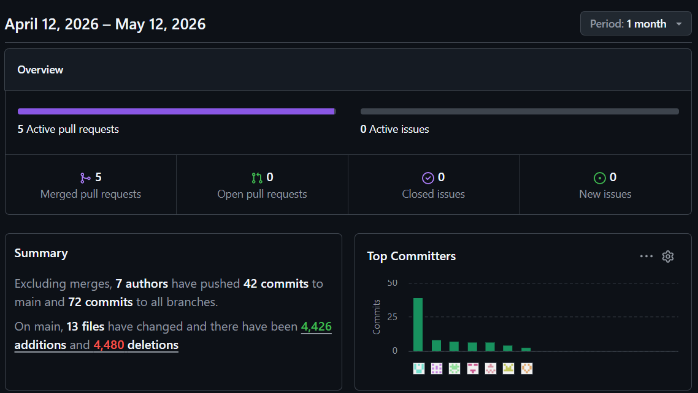

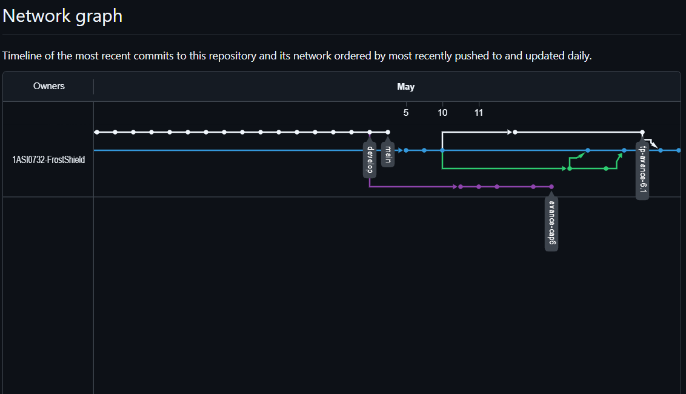

## Contenido

- [Capítulo I: Introducción](#c1)
  - [1.1. Startup Profile](#11-startup-profile)
    - [1.1.1. Descripción de la Startup](#111-descripción-de-la-startup)
    - [1.1.2. Perfiles de integrantes del equipo](#112-perfiles-de-integrantes-del-equipo)
  - [1.2. Solution Profile](#12-solution-profile)
    - [1.2.1 Antecedentes y problemática](#121-antecedentes-y-problematica)
    - [1.2.2 Lean UX Process](#122-lean-ux-process)
      - [1.2.2.1. Lean UX Problem Statements](#1221-lean-ux-problem-statements)
      - [1.2.2.2. Lean UX Assumptions](#1222-lean-ux-assumption)
      - [1.2.2.3. Lean UX Hypothesis Statements](#1223-lean-ux-hypothesis-statements)
      - [1.2.2.4. Lean UX Canvas](#1224-lean-ux-canvas)
  - [1.3. Segmentos objetivo](#13-segmentos-objetivos)

- [Capítulo II: Requirements Elicitation & Analysis](#c2)
  - [2.1. Competidores](#21-competidores)
    - [2.1.1. Análisis competitivo](#211-análisis-competitivo)
    - [2.1.2. Estrategias y tácticas frente a competidores](#212-estrategias-y-tácticas-frente-a-competidores)
  - [2.2. Entrevistas](#22-entrevistas)
    - [2.2.1. Diseño de entrevistas](#221-diseño-de-entrevistas)
    - [2.2.2. Registro de entrevistas](#222-registro-de-entrevistas)
    - [2.2.3. Análisis de entrevistas](#223-análisis-de-entrevistas)
  - [2.3. Needfinding](#23-needfinding)
    - [2.3.1. User Personas](#231-user-personas)
      - [2.3.2. User Task Matrix](#232-user-task-matrix)
      - [2.3.3. User Journey Mapping](#233-user-journey-mapping)
      - [2.3.4. Empathy Mapping](#234-empathy-mapping)
  - [2.4. Ubiquitous Language](#24-ubiquitous-language)

- [Capítulo III: Requirements Specification](#c3)
  - [3.1. To-Be Scenario Mapping](#31-to-be-scenario-mapping)
  - [3.2. User Stories](#32-user-stories)
  - [3.3. Impact Mapping](#33-impact-mapping)
  - [3.4. Product Backlog](#34-product-backlog)

- [Capítulo IV: Product Design](#c4)
  - [4.1. Style Guidelines](#41-style-guidelines)
    - [4.1.1. General Style Guidelines](#411-general-style-guidelines)
    - [4.1.2. Web Style Guidelines](#412-web-style-guidelines)
  - [4.2. Information Architecture](#42-information-architecture)
    - [4.2.1. Organization Systems](#421-organization-systems)
    - [4.2.2. Labeling Systems](#422-labeling-systems)
    - [4.2.3. SEO Tags and Meta Tags](#423-seo-tags-and-meta-tags)
    - [4.2.4. Searching Systems](#424-searching-systems)
    - [4.2.5. Navigation Systems](#425-navigation-systems)
  - [4.3. Landing Page UI Design](#43-landing-page-ui-design)
    - [4.3.1. Landing Page Wireframe](#431-landing-page-wireframe)
    - [4.3.2. Landing Page Mock-up](#432-landing-page-mock-up)
  - [4.4. Web Applications UX/UI Design](#44-web-applications-uxui-design)
    - [4.4.1. Web Applications Wireframes](#441-web-applications-wireframes)
    - [4.4.2. Web Applications Wireflow Diagrams](#442-web-applications-wireflow-diagrams)
    - [4.4.3. Web Applications Mock-ups](#443-web-applications-mock-ups)
    - [4.4.4. Web Applications User Flow Diagrams](#444-web-applications-user-flow-diagrams)
  - [4.5. Web Applications Prototyping](#45-web-applications-prototyping)
  - [4.6. Domain-Driven Software Architecture](#46-domain-driven-software-architecture)
    - [4.6.1. Design-Level EventStorming](#461-design-level-eventstorming)
    - [4.6.2. Software Architecture Context Diagram](#462-software-architecture-context-diagram)
    - [4.6.3. Software Architecture Container Diagrams](#463-software-architecture-container-diagrams)
    - [4.6.4. Software Architecture Components Diagrams](#464-software-architecture-components-diagrams)
  - [4.7. Software Object-Oriented Design](#47-software-object-oriented-design)
    - [4.7.1. Class Diagrams](#471-class-diagrams)
  - [4.8. Database Design](#48-database-design)
    - [4.8.1. Database Diagrams](#481-database-diagrams)

- [Capítulo V: Product Implementation, Validation & Deployment](#c5)
	- [5.1. Software Configuration Management](#51-software-configuration-management)
    - [5.1.1. Software Development Environment Configuration](#511-software-development-environment-configuration)
    - [5.1.2. Source Code Management](#512-source-code-management)
    - [5.1.3. Source Code Style Guide & Conventions](#513-source-code-style-guide--conventions)
    - [5.1.4. Software Deployment Configuration](#514-software-deployment-configuration)
  - [5.2. Landing Page, Services & Applications Implementation](#52-landing-page-services--applications-implementation)
    - [5.2.1. Sprint 1](#521-sprint-1)
      - [5.2.1.1. Sprint Planning 1](#5211-sprint-planning-1)
      - [5.2.1.2. Aspect Leaders and Collaborators](#5212-aspect-leaders-and-collaborators)
      - [5.2.1.3. Sprint Backlog 1](#5213-sprint-backlog-1)
      - [5.2.1.4. Development Evidence for Sprint Review](#5214-development-evidence-for-sprint-review)
      - [5.2.1.5. Execution Evidence for Sprint Review](#5215-execution-evidence-for-sprint-review)
      - [5.2.1.6. Services Documentation Evidence for Sprint Review](#5216-services-documentation-evidence-for-sprint-review)
      - [5.2.1.7. Software Deployment Evidence for Sprint Review](#5217-software-deployment-evidence-for-sprint-review)
      - [5.2.1.8. Team Collaboration Insights during Sprint](#5218-team-collaboration-insights-during-sprint)
    - [5.2.2. Sprint 2](#522-sprint-2)
      - [5.2.2.1. Sprint Planning 2](#5221-sprint-planning-2)
      - [5.2.2.2. Aspect Leaders and Collaborators](#5222-aspect-leaders-and-collaborators)
      - [5.2.2.3. Sprint Backlog 2](#5223-sprint-backlog-2)
      - [5.2.2.4. Development Evidence for Sprint Review](#5224-development-evidence-for-sprint-review)
      - [5.2.2.5. Execution Evidence for Sprint Review](#5225-execution-evidence-for-sprint-review)
      - [5.2.2.6. Services Documentation Evidence for Sprint Review](#5226-services-documentation-evidence-for-sprint-review)
      - [5.2.2.7. Software Deployment Evidence for Sprint Review](#5227-software-deployment-evidence-for-sprint-review)
      - [5.2.2.8. Team Collaboration Insights during Sprint](#5228-team-collaboration-insights-during-sprint)
    - [5.2.3. Sprint 3](#523-sprint-3)
      - [5.2.3.1. Sprint Planning 3](#5231-sprint-planning-3)
      - [5.2.3.2. Aspect Leaders and Collaborators](#5232-aspect-leaders-and-collaborators)
      - [5.2.3.3. Sprint Backlog 3](#5233-sprint-backlog-3)
      - [5.2.3.4. Development Evidence for Sprint Review](#5234-development-evidence-for-sprint-review)
      - [5.2.3.5. Execution Evidence for Sprint Review](#5235-execution-evidence-for-sprint-review)
      - [5.2.3.6. Services Documentation Evidence for Sprint Review](#5236-services-documentation-evidence-for-sprint-review)
      - [5.2.3.7. Software Deployment Evidence for Sprint Review](#5237-software-deployment-evidence-for-sprint-review)
      - [5.2.3.8. Team Collaboration Insights during Sprint](#5238-team-collaboration-insights-during-sprint)
    - [5.2.4. Sprint 4](#524-sprint-4)
      - [5.2.4.1. Sprint Planning 4](#5241-sprint-planning-4)
      - [5.2.4.2. Aspect Leaders and Collaborators](#5232-aspect-leaders-and-collaborators)
      - [5.2.4.3. Sprint Backlog 4](#5243-sprint-backlog-4)
      - [5.2.4.4. Development Evidence for Sprint Review](#5244-development-evidence-for-sprint-review)
      - [5.2.4.5. Execution Evidence for Sprint Review](#5245-execution-evidence-for-sprint-review)
      - [5.2.4.6. Services Documentation Evidence for Sprint Review](#5246-services-documentation-evidence-for-sprint-review)
      - [5.2.4.7. Software Deployment Evidence for Sprint Review](#5247-software-deployment-evidence-for-sprint-review)
      - [5.2.4.8. Team Collaboration Insights during Sprint](#5248-team-collaboration-insights-during-sprint)
  - [5.3. Acuerdo de Servicio - SaaS](#53-acuerdo-de-servicio---saas)
  - [5.4. Video About-the-Product](#54-video-about-the-product-)

- [Capítulo VI: Product Verification & Validation](#c6)
  - [6.1 Testing Suites & Validation](#61-testing-suites--validation)
    - [6.1.1 Core Entities Unit Tests](#611-core-entities-unit-tests)
	  - [6.1.2 Core Integration Tests](#612-core-integration-tests)
	  - [6.1.3 Core Behavior-Driven Development](#613-core-behavior-driven-development)
	  - [6.1.4 Core System Tests](#614-core-system-tests)
  - [6.2 Static testing & Verification](#62-static-testing--verification)
	  - [6.2.1 Static Code Analysis](#621-static-code-analysis)
	    - [6.2.1.1 Coding Standard & Code Conventions](#6211-coding-standard--code-conventions)
	    - [6.2.1.2 Code Quality & Code Security](#6212-code-quality--code-security)
	  - [6.2.2 Reviews](#622-reviews)
  - [6.3 Validation Interviews](#63-validation-interviews)
	  - [6.3.1 Diseño de Entrevistas](#631-diseño-de-entrevistas)
	  - [6.3.2 Registro de Entrevistas](#632-registro-de-entrevistas)
	  - [6.3.3 Evaluaciones según heurísticas](#633-evaluaciones-según-heurísticas)
      
- [Capítulo VII: DevOps Practices](#c7)
	- [7.1 Continuous Integration](#71-continuous-integration)
	  - [7.1.1 Tools and Practices](#711-tools-and-practices)
	  - [7.1.2 Build \& Test Suite Pipeline Components](#712-build--test-suite-pipeline-components)
  - [7.2 Continuous Delivery](#72-continuous-delivery)
	  - [7.2.1 Tools and Practices](#721-tools-and-practices)
	  - [7.2.2 Stages Deployment Pipeline Components](#722-stages-deployment-pipeline-components)
  - [7.3 Continuous deployment](#73-continuous-deployment)
	  - [7.3.1 Tools and Practices](#731-tools-and-practices)
	  - [7.3.2 Production Deployment Pipeline Components](#732-production-deployment-pipeline-components)
  - [7.4 Continuous Monitoring](#74-continuous-monitoring)
	  - [7.4.1 Tools and Practices](#741-tools-and-practices)
	  - [7.4.2 Monitoring Pipeline Components](#742-monitoring-pipeline-components)
	  - [7.4.3 Alerting Pipeline Components](#743-alerting-pipeline-components)
	  - [7.4.4 Notification Pipeline Components](#744-notification-pipeline-components)
- [Capítulo VIII: Experiment-Driven Development](#c8)
  - [8.1 Experiment Planning ](#81-experiment-planning)
- [Conclusiones](#conclusiones)
	- [Conclusiones y recomendaciones](#conclusiones-y-recomendaciones)
	- [Video App Validation](#video-app-validation)
	- [Video About the Team](#video-about-the-team)
- [Conclusiones](#conclusiones-1)
  	- [Conclusiones y recomendaciones](#conclusiones-y-recomendaciones-1)
- [Bibliografía](#bibliografía)
- [Anexos](#anexos)
  	- [Recursos y enlaces del proyecto](#recursos-y-enlaces-del-proyecto)

## Student Outcome
El curso contribuye al cumplimiento del Student Outcome ABET:

**ABET – EAC - Student Outcome 5**

**Criterio**: *La capacidad de funcionar efectivamente en un equipo cuyos miembros juntos proporcionan liderazgo, crean un entorno de colaboración e inclusivo, establecen objetivos, planifican tareas y cumplen objetivos.*

En el siguiente cuadro se describe las acciones realizadas y enunciados de conclusiones por parte del grupo, que permiten sustentar el haber alcanzado el logro del ABET – EAC - Student Outcome 5.

| Criterio específico | Acciones realizadas | Conclusiones |
| :------------------ | :------------------ | :----------- |
| Trabaja en equipo para proporcionar liderazgo en forma conjunta | <ul><li><b>Quijada Magro, Jeremy Alexander:</b> **Avance 1:** Lideró la arquitectura del sistema y la fase de QA, asegurando que las variables de monitoreo estuvieran correctamente validadas y que el prototipo tuviera trazabilidad técnica. **TP:** Actuó como analista QA, diseñando y ejecutando pruebas de validación sobre los componentes críticos, garantizando la calidad del pipeline de integración y pruebas.</li><li><b>Guillen Galindo, Julio Adolfo:</b> **Avance 1:** Lideró el desarrollo del Backend API y la gestión de la base de datos distribuida, asegurando consistencia en la lógica de negocio. **TP:** Se encargó del análisis estático de código y la implementación de seguridad JWT, aportando prácticas de integración continua y control de calidad para robustecer el backend.</li><li><b>Gonzales Alvarado, Javier:</b> **Avance 1:** Lideró el diseño de la Landing Page y la estrategia de comunicación del producto. **TP:** Elaboró documentación técnica y coordinó revisiones de código, asegurando que la comunicación del producto estuviera alineada con las prácticas de entrega continua.</li><li><b>Jiménez Guerra, Gianmarco:</b> **Avance 1:** Lideró el análisis de requerimientos y la validación de escenarios de usuario. **TP:** Diseñó y registró entrevistas de validación, además de definir métricas de monitoreo y alertas para garantizar la trazabilidad de la experiencia del usuario.</li><li><b>Melgarejo Gomez, Marcia Victoria:</b> **Avance 1:** Lideró el diseño visual (UI) y la creación de prototipos de alta fidelidad. **TP:** Realizó evaluaciones heurísticas de accesibilidad y usabilidad, validando la interfaz en entornos de despliegue continuo.</li><li><b>Gordon Salas, Gabriel Fernando:</b> **Avance 1:** Lideró la planificación de Sprints y la organización del equipo mediante el Lean UX Canvas. **TP:** Coordinó revisiones y validaciones, gestionando el backlog y supervisando el pipeline de despliegue por etapas.</li></ul> | <ul> **Avance 1:** El equipo distribuyó el liderazgo de forma equitativa según la especialidad de cada integrante, logrando la integración exitosa del proyecto y asegurando calidad tanto en pruebas como en automatización. **TP:** Los capítulos de Testing/Validación y DevOps/Automatización resumen el esfuerzo del equipo en dos frentes complementarios: por un lado, se aseguraron la calidad y confiabilidad del sistema mediante pruebas unitarias, análisis estático, entrevistas de validación y evaluaciones heurísticas; y por otro, se implementaron prácticas de integración y despliegue continuo, pipelines de construcción y pruebas, automatización de entregas y monitoreo con alertas.</ul> |
| Crea un entorno colaborativo e inclusivo, establece metas, planifica tareas y cumple objetivos. | <ul><li><b>Quijada Magro, Jeremy Alexander:</b> **Avance 1:** Lideró la arquitectura del sistema y la fase de QA, asegurando que las variables de monitoreo estuvieran correctamente validadas y que el prototipo tuviera trazabilidad técnica. **TP:** Actuó como analista QA, diseñando y ejecutando pruebas de validación sobre los componentes críticos, garantizando la calidad del pipeline de integración y pruebas.</li><li><b>Guillen Galindo, Julio Adolfo:</b> **Avance 1:** Lideró el desarrollo del Backend API y la gestión de la base de datos distribuida, asegurando consistencia en la lógica de negocio. **TP:** Se encargó del análisis estático de código y la implementación de seguridad JWT, aportando prácticas de integración continua y control de calidad para robustecer el backend.</li><li><b>Gonzales Alvarado, Javier:</b> **Avance 1:** Lideró el diseño de la Landing Page y la estrategia de comunicación del producto. **TP:** Elaboró documentación técnica y coordinó revisiones de código, asegurando que la comunicación del producto estuviera alineada con las prácticas de entrega continua.</li><li><b>Jiménez Guerra, Gianmarco:</b> **Avance 1:** Lideró el análisis de requerimientos y la validación de escenarios de usuario. **TP:** Diseñó y registró entrevistas de validación, además de definir métricas de monitoreo y alertas para garantizar la trazabilidad de la experiencia del usuario.</li><li><b>Melgarejo Gomez, Marcia Victoria:</b> **Avance 1:** Lideró el diseño visual (UI) y la creación de prototipos de alta fidelidad. **TP:** Realizó evaluaciones heurísticas de accesibilidad y usabilidad, validando la interfaz en entornos de despliegue continuo.</li><li><b>Gordon Salas, Gabriel Fernando:</b> **Avance 1:** Lideró la planificación de Sprints y la organización del equipo mediante el Lean UX Canvas. **TP:** Coordinó revisiones y validaciones, gestionando el backlog y supervisando el pipeline de despliegue por etapas.</li></ul>  | <ul> **Avance 1:** Se estableció un flujo de trabajo ágil y colaborativo que permitió cumplir con el 100% de los objetivos planteados para el avance inicial, integrando prácticas de validación y automatización en cada etapa. **TP:** Los capítulos de Testing/Validación y DevOps/Automatización resumen el esfuerzo del equipo en dos frentes complementarios: por un lado, se aseguraron la calidad y confiabilidad del sistema mediante pruebas unitarias, análisis estático, entrevistas de validación y evaluaciones heurísticas; y por otro, se implementaron prácticas de integración y despliegue continuo, pipelines de construcción y pruebas, automatización de entregas y monitoreo con alertas.</ul> |

# Capitulo 1: Introducción

## 1.1 Startup Profile

### 1.1.1 Descripción de la Startup

Nuestra startup ofrece una plataforma SaaS de Inteligencia de Datos para optimizar la gestión y el mantenimiento de equipos de refrigeración en negocios que dependen de la cadena de frío. Nuestra plataforma se integra con los controladores y sistemas de monitoreo ya existentes en los negocios, transformando datos aislados en decisiones estratégicas.
Las funcionalidades clave de la plataforma incluyen el monitoreo en tiempo real de temperatura, consumo energético y tiempo de uso. Además, ofrece alertas automáticas ante fallos, informes técnicos detallados, historiales de rendimiento y programación inteligente de mantenimientos. Estas herramientas permiten a empresas, técnicos y proveedores mejorar la eficiencia operativa, prevenir costosas pérdidas por fallos inesperados y mantener un registro completo del estado y uso de sus equipos.

Misión: Queremos ofrecer una solución tecnológica inteligente que ayude a las empresas a proteger su inventario y a optimizar la gestión de sus equipos de refrigeración. Al mismo tiempo, proporcionamos herramientas especializadas para mejorar la eficiencia operativa de los técnicos y proveedores del sector.
Visión: Ser la empresa líder en la gestión y el mantenimiento de equipos de refrigeración en el mercado peruano, comenzando por consolidar nuestra posición en Lima.

### 1.1.2 Perfiles de integrantes del equipo

| **Integrante**            | **Quijada Magro Jeremy Alexander**        									                   |
| :------------------------ | :----------------------------------------------------------------------------- |
| **Código del Estudiante** | u202219657                                   									            	   |
| **Carrera**               | Ingeniería de Software                       									                 |
| **Descripción**           | Mi nombre es Jeremy Alexander Quijada Magro, tengo 21 años y curso la carrera de Ingeniería de Software. Me considero una persona ordenada y responsable. En mis tiempos libres me gusta aprender cosas nuevas. En este proyecto apoyaré con todos los conocimientos que he adquirido en los cursos pasados con la meta de aprender a realizar pruebas de calidad sobre este proyecto  										                                                                            		|
| **Foto**                  |  |

---

| **Integrante**            | **Guillen Galindo Julio Adolfo**                                     						 |
| :------------------------ | :------------------------------------------------------------------------------- |
| **Código del Estudiante** | u20241a352                       						                      				  	   |
| **Carrera**               | Ingeniería de Software                                                           |
| **Descripción**           | Actualmente curso la carrera de Ingeniería de Software en la UPC. Me considero una persona discreta, pero responsable y enfocada en cumplir los proyectos dentro de los plazos establecidos. Poseo conocimientos en C++ y Python; disfruto trabajar en equipo cuando existe colaboración y apoyo mutuo. Además, me motiva aplicar lo aprendido para afrontar los desafíos que puedan surgir en los próximos ciclos.                                                                          |
| **Foto**                  |  |

---

| **Integrante**            | **Gianmarco Fabian Jiménez Guerra**                                        	            |
| :------------------------ | :-------------------------------------------------------------------------------------- |
| **Código del Estudiante** | u202123843																	                                            |
| **Carrera**               | Ingeniería de Software														                                      |
| **Descripción**           | Estudiante de Ingeniería de Software con conocimiento sobre desarrollo de aplicaciones web y análisis de datos. Estoy motivado por aprender nuevos temas relacionados a Software y por trabajar en equipo. Considero que mi conocimiento sobre las tecnologías: Java, Python, Angular y C# me permitirá desempeñarme de manera correcta para apoyar en este proyecto.|
| **Foto**                  |      |

---

| **Integrante**            | **Javier**                                  	                                       |
| :------------------------ | :----------------------------------------------------------------------------------- |
| **Código del Estudiante** | U202312966                                                                           |
| **Carrera**               | Ingeniería de Software                                                               |
| **Descripción**           | Mi nombre es Javier Gonzales, soy estudiante de Ingeniería de Software de séptimo ciclo. Tengo conocimientos en diversos lenguajes de programación como C++, Python y JavaScript, entre otros. Además, he desarrollado proyectos de software utilizando distintos frameworks como Angular y Vue. Me considero una persona responsable, empática y analítica. Mi objetivo personal es desarrollar soluciones tecnológicas que contribuyan a mejorar la calidad de vida de las personas y aportar a la construcción de un mundo más innovador y conectado                                                                              |
| **Foto**                  |  |

---

| **Integrante**            | **Marcia Victoria Melgarejo Gomez**                                                  |
| :------------------------ | :----------------------------------------------------------------------------------- |
| **Código del Estudiante** | U20231C505                                                                           |
| **Carrera**               | Ingeniería de Software                                                               |
| **Descripción**           | Actualmente estoy cursando el séptimo ciclo de la carrera de Ingeniería de Software en la UPC. Opté por esta carrera debido a mi interés en el mundo de la tecnología y todo lo que este campo puede ofrecer a la sociedad. Me caracterizo por ser una persona curiosa, persistente y colaborativa. Tengo conocimientos en C++, HTML, CSS, JS, Pyhton             |
| **Foto**                  |  |

---

| **Integrante**            | **Gabriel Fernando Gordon Salas**                                                    |
| :------------------------ | :----------------------------------------------------------------------------------- |
| **Código del Estudiante** | U20221E229                                                                           |
| **Carrera**               | Ingeniería de Software                                                               |
| **Descripción**           | Me considero una persona responsable, me gusta ayudar a mis compañeros en los trabajos y sé organizarme bien al momento de realizar mis cosas. Con esto mi objetivo es poder dar lo mejor en un ambiente de cooperación entre todos para que el proyecto dé una muy buena presentación													                                                   |
| **Foto**                  |  |

## 1.2 Solution Profile

### 1.2.1 Antecedentes y Problematica

| **5W & 2H**                                                 | **Descripcion**                                                                 |
| :---------------------------------------------------------- | :------------------------------------------------------------------------------ |
| **What: ¿Cuál es el problema?**                 			      | Los negocios que dependen de la refrigeración se enfrentan a una vulnerabilidad operativa significativa. La falta de control en sus equipos de congelación lleva a fallas inesperadas, alto consumo energético y falta de un mantenimiento proactivo. Como resultado, sufren grandes pérdidas económicas, tanto por productos dañados como por la interrupción de su servicio. 	   	                                                 |
| **When: ¿Cuándo sucede este problema?**         			      | Este problema es una amenaza constante, especialmente durante la operación continua de los negocios. Se vuelve más crítico cuando no hay técnicos disponibles para una revisión inmediata o cuando se ha descuidado el seguimiento regular del estado de los equipos.																										   		   	                                                                           |
| **Where: ¿Dónde se produce este suceso?**      			        | El problema está presente en todo el país, afectando a negocios en diversas ciudades. Sin embargo, su impacto es particularmente notable en Lima, donde la cadena de frío es vital para sectores como la alimentación y la medicina. Las empresas de servicios que atienden a estos clientes también se ven afectadas al no tener una forma centralizada de gestionar sus operaciones.                                                       |
| **Who: ¿Quiénes están involucrados?**          			        | Este problema afecta a una amplia gama de actores. Por un lado, están los dueños y administradores de negocios que sufren las consecuencias directas de las fallas. Por otro, los técnicos y empresas de servicio que se ven obligados a responder a emergencias sin las herramientas adecuadas. 																					   	                                                                                        |
| **Why: ¿Cuál es la causa del problema?**        			      | La causa principal es la fragmentación de datos técnicos en sistemas aislados. La información crítica está atrapada en controladores que no se comunican entre sí, lo que impide una visión centralizada y obliga a los negocios a operar bajo una gestión reactiva e ineficiente, actuando solo cuando la falla ya ocurrió.									   				                                                                           |
| **How: ¿Qué llevó a la persona a llegar a esta situación?** | La situación actual es el resultado de la gestión reactiva y la falta de digitalización. Los negocios han dependido de una estrategia de "apagar incendios", esperando a que ocurra un problema crítico para actuar. Esta mentalidad ha generado un ciclo de costos elevados, tiempos de respuesta lentos y un desgaste operativo que se podría haber evitado con una planificación adecuada.                                            |
| **How Much: ¿Cuánto es el impacto financiero?** 			      | El impacto económico es devastador y multidimensional. En el mercado peruano, una falla no detectada a tiempo en una cámara de frío puede generar pérdidas de inventario de entre S/ 5,000 y S/ 50,000 en una sola noche, dependiendo del sector. A esto se suman los costos de las reparaciones de emergencia y el daño a largo plazo en la reputación y la confianza del cliente, lo que hace que el costo total sea mucho mayor. |

### 1.2.2 Lean UX Process

#### 1.2.2.1 Lean UX Problem Statements

En el sector de la refrigeración, las empresas se enfrentan a un desafío recurrente: la falta de una gestión inteligente para sus equipos. Los negocios que dependen de la cadena de frío operan con un alto riesgo de pérdidas económicas y desperdicio de energía, ya que su mantenimiento es reactivo. Aunque muchos ya cuentan con sensores y controladores, los datos permanecen aislados y son difíciles de interpretar para una toma de decisiones rápida.

Existe un vacío en el mercado que las soluciones actuales no han llenado: la falta de una capa de inteligencia que unifique los datos ya existentes. No hay una plataforma que centralice la información de distintos fabricantes y ofrezca una visibilidad completa. Esta ausencia de análisis predictivo y de un historial unificado dificulta la respuesta ante fallas y degrada la calidad del servicio técnico.

FrostShield ha sido creada para superar estos obstáculos. IceTrack establece una conexión digital entre los negocios y sus equipos, permitiendo un monitoreo constante de la temperatura y el consumo energético. Esto no solo previene fallas, sino que también optimiza el rendimiento y prolonga la vida útil de los equipos. Además, proporcionamos a los técnicos una herramienta centralizada para organizar sus tareas, acceder al historial de cada equipo y responder de manera más eficiente.
Inicialmente, nos enfocamos en los negocios de Lima que buscan una solución confiable para sus sistemas de refrigeración, así como en los proveedores de servicio que desean modernizar sus operaciones. 

Sabremos que hemos tenido éxito cuando se reduzcan las fallas críticas, mejore la eficiencia energética y aumente en la satisfacción y lealtad de nuestros clientes, demostrando así el valor de la tecnología en el sector.

#### 1.2.2.2 Lean UX Assumption

# Business Outcomes

-	**Reducir las pérdidas de inventario:** La plataforma de FrostShield previene fallas térmicas, minimizando el descarte de productos y aumentando la rentabilidad de los negocios.
- **Aumentar la eficiencia operativa:** Los técnicos pueden gestionar sus tareas de forma más inteligente y atender a más clientes en menos tiempo, lo que se traduce en una mayor productividad.
- **Mejorar la fidelización de clientes:** Un servicio proactivo y transparente fortalece la confianza con los clientes, lo que lleva a una mayor retención y a relaciones comerciales a largo plazo.
- **Optimizar los costos de mantenimiento:** La plataforma permite pasar de un modelo de mantenimiento reactivo, costoso e impredecible, a uno predictivo, que reduce los gastos en reparaciones de emergencia.
- **Posicionar el liderazgo en el mercado:** Al ofrecer una solución tecnológica innovadora, el proyecto permite a los proveedores de servicio diferenciarse de su competencia y captar nuevos clientes de manera más efectiva.
- **Generar ingresos recurrentes:** El modelo de negocio, basado en suscripciones y servicios de valor añadido, asegura un flujo de ingresos constante y escalable para la empresa.
- **Disminuir el consumo energético:** El monitoreo en tiempo real del consumo de energía permite identificar y corregir ineficiencias, lo que se traduce en ahorros significativos para los negocios.
- **Facilitar la toma de decisiones:** Los dueños de negocios tienen acceso a datos precisos y en tiempo real sobre el rendimiento de sus equipos, lo que les permite tomar decisiones más informadas para optimizar su operación.

# User Outcomes

## ¿Quién será nuestro usuario?

Nuestros usuarios clave son de tres tipos:
- Negocios que dependen de la cadena de frío, como restaurantes, supermercados y laboratorios, para quienes una falla es una amenaza directa a su rentabilidad.
- Técnicos especializados en refrigeración que necesitan herramientas para gestionar su trabajo de manera más eficiente.
- Proveedores de equipos que buscan diferenciarse ofreciendo un servicio postventa de vanguardia.

## ¿Dónde encaja nuestro producto en su vida?

La plataforma se integra como una herramienta esencial para la gestión diaria de nuestros usuarios. 
- Para los negocios, es una capa de seguridad que les garantiza la continuidad operativa y previene pérdidas. 
- Para los técnicos, se convierte en su asistente personal para organizar clientes y visitas. 
- Sirve como un registro centralizado y accesible que facilita auditorías y la toma de decisiones.

## ¿Qué problemas tiene nuestro producto y cómo se pueden resolver?

- Un desafío crítico es la precisión de los datos. Si las lecturas no son confiables, la plataforma pierde su valor. 
- Para resolverlo, implementaremos sensores certificados y algoritmos de validación de datos que corrijan lecturas erróneas. 
- Otro problema es la resistencia inicial de usuarios no tecnológicos. 
- Esto se abordará con una interfaz simple y un proceso de “onboarding” intuitivo, además de tutoriales en video para facilitar la adopción.

## ¿Cómo y Cuándo es usado nuestro producto?

- La plataforma es multiplataforma (web y móvil), lo que la hace accesible tanto desde una oficina como en el campo. 
- Negocios la consultan para monitorear el estado de sus equipos
- Los técnicos la utilizan para gestionar sus tareas.
- También funciona de manera automática en segundo plano, enviando alertas inmediatas al detectar una anomalía, lo que permite una respuesta rápida incluso fuera del horario laboral.

## ¿Qué características son importantes para la app?

Las características clave incluyen: 
- Monitoreo en tiempo real, alertas automatizadas y un historial técnico detallado. 
- La plataforma también integra un calendario de mantenimiento y un módulo exclusivo para técnicos. 
- Integración de IA para recomendaciones predictivas. 
- Sistema de gestión de roles para múltiples usuarios y ubicaciones son esenciales.

## ¿Cómo debe verse nuestro producto y cómo comportarse?

- El diseño de la plataforma debe transmitir confianza y claridad. 
- La interfaz será minimalista y centrada en la acción, mostrando la información más relevante de un vistazo. 
- La experiencia de usuario debe ser fluida, con una navegación intuitiva y notificaciones inmediatas que no saturen al usuario, sino que lo mantengan siempre informado y en control.

## ¿Qué valor busca el cliente?

- El cliente busca simplificar la gestión de sus equipos y pasar de ser un gestor reactivo a uno proactivo. 
- Los negocios desean seguridad operativa, saber que sus equipos están protegidos de fallas inesperadas y pérdidas. 
- También buscan optimizar sus costos a través de la eficiencia energética y una mejor trazabilidad del rendimiento de sus sistemas.

## ¿Qué beneficios adicionales obtendrá el cliente?

- Obtendrán visibilidad total y remota de sus activos.
- Soporte técnico más ágil gracias a la información centralizada
- Reducción significativa de los costos operativos.
- La plataforma proporcionará reportes personalizados que no podrían generar de forma manual.

## ¿Cómo atraeremos usuarios?

- Se implementará una estrategia de marketing de nicho que se dirija a la audiencia correcta a través de LinkedIn y correos.
- Exploraremos alianzas estratégicas con proveedores de equipos para ofrecer la plataforma como un valor añadido en sus ventas. 
- Prueba gratuita de 14 días para que los usuarios experimenten el valor del producto de primera mano, sin compromiso.

## ¿Cómo generaremos ingresos?

- Suscripción mensual, escalonada según el número de equipos y el nivel de funcionalidad. 
- Modelo freemium para captar a usuarios más pequeños
- Publicidad dirigida para marcas que deseen llegar a nuestra base de usuarios.

## ¿Cuál es nuestra competencia y cómo la superamos?

- Nuestra competencia son soluciones genéricas de gestión de mantenimiento y nuestra ventaja es la especialización. 
- La plataforma está diseñada exclusivamente para la refrigeración, lo que nos permite ofrecer funciones avanzadas como la detección de anomalías en tiempo real y la automatización de acciones, que ninguna otra herramienta genérica puede igualar.

## ¿Cuál es nuestro mayor riesgo?

- Resistencia al cambio del personal tradicional.
- Lentitud en la adopción inicial.
- Desconfianza en la precisión de los datos.

## ¿Cómo lo resolveremos?

- Implementaremos algoritmos de validación robustos para asegurar la precisión de los datos.
- Ofreceremos capacitación continua y soporte dedicado para facilitar la adopción.
- comenzaremos con una estrategia de integración progresiva, enfocándonos en los equipos más comunes y trabajando con sensores certificados para generar una base de confianza sólida.

#### 1.2.2.3 Lean UX Hypothesis Statements

**Hipótesis 1: Adopción del Producto**

Creemos que los negocios de alimentos y bebidas adoptarán nuestra plataforma para gestionar sus equipos de refrigeración, utilizándola regularmente para el monitoreo y la gestión de tareas.
Sabremos que hemos tenido éxito cuando la mayoría de nuestros usuarios activos semanales utilicen tanto la función de monitoreo en tiempo real como la de gestión de servicios durante los primeros meses de suscripción.

---

**Hipótesis 2: Mitigación de Pérdidas**

Creemos que, al proporcionar monitoreo en tiempo real y alertas tempranas, reduciremos significativamente las pérdidas de inventario de nuestros clientes relacionadas con fallos en la refrigeración.
Sabremos que hemos tenido éxito cuando una gran parte de nuestros clientes que reporten pérdidas de inventario confirmen que la alerta de nuestra plataforma les permitió actuar a tiempo para mitigar el daño, reflejándose en una notable reducción de pérdidas en sus registros.

---

**Hipótesis 3: Eficiencia del Servicio**

Creemos que nuestra plataforma optimizará la cadena de servicio, reduciendo sustancialmente el tiempo promedio de respuesta y resolución de un problema de refrigeración.
Sabremos que hemos tenido éxito cuando los técnicos de servicio registren que el tiempo desde la solicitud hasta la finalización de un servicio se ha acortado notablemente en comparación con sus procesos manuales, y esta mejora se refleje en los informes generados por nuestra plataforma.

---

**Hipótesis 4: Satisfacción del Cliente**

Creemos que la centralización de la gestión y la transparencia del proceso de servicio mejorarán la satisfacción de los clientes con el mantenimiento de sus equipos.
Sabremos que hemos tenido éxito cuando obtengamos una alta puntuación promedio en las encuestas de satisfacción del cliente relacionadas con la coordinación de servicios, y recibamos testimonios que resalten la facilidad y la claridad del proceso.

---

**Hipótesis 5: Retención y Valor a Largo Plazo**

Creemos que la propuesta de valor de nuestra plataforma, centrada en la automatización y el ahorro, incentivará la retención a largo plazo de los clientes.
Sabremos que hemos tenido éxito cuando la gran mayoría de nuestros clientes continúen utilizando la plataforma después de los primeros meses, y veamos que renuevan sus suscripciones de forma recurrente.

#### 1.2.2.4 Lean UX Canvas

<figure style="page-break-inside: avoid; text-align: center;">
  
  <figcaption style="font-size: 0.9em; color: #555;">
    <strong>Figura 1:</strong> Lean UX Canvas.
  </figcaption>
</figure>

## 1.3 Segmentos objetivos

**Segmento Objetivo 1: Negocios con equipos de refrigeración**

**Aspectos demográficos:**
- **Tipo de negocio:** Pequeñas y  medianas empresas.
- **Rubro:** Alimentario, farmacéutico, restauración y comercio minorista.
- **Nivel de necesidad:** Alta dependencia de sistemas de refrigeración.

**Aspectos geográficos:**
- **Nacionalidad:** Peruana.
- **Zona geográfica:** Urbana.
- **Departamento:** Lima.

**Aspectos psicográficos:**
- **Motivación:** Evitar pérdidas económicas por fallas en la refrigeración y reducir costos operativos.
- **Valores:** La eficiencia, la calidad del inventario y el control de las operaciones.
- **Intereses:** La adopción de tecnología para optimizar la gestión y asegurar la tranquilidad en la operación diaria.

---

**Segmento Objetivo 2: Técnicos y empresas de mantenimiento**

**Aspectos demográficos:**
- **Tipo de negocio:** Profesionales independientes y compañías de servicio técnico.
- **Rubro:** Mantenimiento y reparación de equipos de refrigeración.
- **Nivel de necesidad:** Alta demanda de organización y eficiencia en sus procesos.

**Aspectos geográficos:**
- **Nacionalidad:** Peruana.
- **Zona geográfica:** Urbana.
- **Departamento:** Lima.

**Aspectos psicográficos:**
- **Motivación:** Incrementar la productividad, reducir el tiempo en tareas administrativas y mejorar la calidad de su servicio.
- **Valores:** La profesionalidad, la eficiencia y la tecnología como herramienta para facilitar su trabajo.
- **Intereses:** Contar con una plataforma que centralice la información, automatice la generación de reportes y mejore la comunicación con sus clientes.

# Capítulo II: Requirements Elicitation & Analysis

## 2.1. Competidores

**Competidor 1: ServiceTitan**
ServiceTitan es una plataforma de gestión de servicios basada en la nube que ofrece soluciones de software para empresas de servicios, incluidos técnicos de HVAC, fontaneros y electricistas. Proporciona funcionalidades de programación, gestión de trabajos, facturación y más. Esta plataforma es conocida por su facilidad de uso y por ayudar a las empresas a optimizar sus operaciones de servicio técnico en tiempo real.

---

**Competidor 2: Sensefinity**
Sensefinity es una plataforma tecnológica especializada en soluciones de IoT para la cadena de frío, que permite monitorear en tiempo real condiciones como temperatura, humedad y vibraciones en productos sensibles durante su transporte y almacenamiento. Además, ofrece alertas automáticas y reportes en la nube que ayudan a las empresas a reaccionar rápidamente ante cualquier falla. Esta plataforma es reconocida por facilitar la trazabilidad completa de los productos y por apoyar a sectores como supermercados, farmacéuticas y logística en la reducción de pérdidas y el cumplimiento de estándares de calidad.

---

**Competidor 3: TempGenius**
TempGenius es un software de monitoreo de temperatura y humedad en tiempo real para diversas industrias, incluida la de la refrigeración comercial. Permite a los usuarios realizar un seguimiento de sus equipos de refrigeración mediante sensores conectados a la nube, generar reportes y recibir alertas automáticas por variaciones en los niveles de temperatura. Su principal enfoque es mejorar la visibilidad y control de las operaciones de refrigeración para evitar pérdidas económicas.

### 2.1.1. Análisis competitivo

<table> 
  <tr>
    <th colspan="7"> Competitive Analysis Landscape </th>
  </tr>
  <tr>
    <td colspan="2" rowspan="2">¿Por qué llevar acabo este análisis? </td>
    <td colspan="5"> Con el objetivo de evaluar y comparar funcionalidades, tecnología, precios y estrategias de marketing de los principales competidores para identificar nuestras fortalezas y debilidades, detectar oportunidades negocio y identificar puntos que nos hagan diferenciar de la competencia. </td>
  </tr>
  <tr>
  </tr>
  <tr>
    <td colspan="2"> </td>
    <td> IceTrack   </img> </td>
    <td> ServiceTitan   </img> </td>
    <td> Sensefinity   </img> </td>
    <td> TempGenius   </img> </td>
  </tr>
  <tr>
    <td rowspan="2">Perfil</td>
    <td>Overview</td>
    <td> IceTrack es una plataforma integral de monitoreo y gestión para sistemas de refrigeración, que conecta negocios con técnicos especializados. Ofrece monitoreo en tiempo real, alertas automáticas, mantenimiento preventivo, y trazabilidad de cada equipo. </td>
    <td> ServiceTitan es una plataforma de gestión de servicios basada en la nube que ofrece soluciones de software para empresas de servicios, incluidos técnicos de HVAC, fontaneros y electricistas. </td>
    <td> Sensefinity es una solución IoT que combina sensores físicos con plataforma en la nube para monitoreo y trazabilidad de la cadena de frío. </td>
    <td> TempGenius es un software de monitoreo de temperatura y humedad en tiempo real para diversas industrias, incluida la refrigeración comercial. Permite a los usuarios gestionar y recibir alertas automáticas sobre sus equipos. </td>
  </tr>
  <tr>
    <td>Ventaja competitiva ¿Qué valor ofrece a los clientes?</td>
    <td> Ofrece una solución automatizada y centralizada para negocios que necesitan monitorear y gestionar sus equipos de refrigeración. Permite a los técnicos optimizar sus visitas y el mantenimiento preventivo, mejorando la eficiencia operativa. </td>
    <td> Ofrece una plataforma todo-en-uno para la gestión de servicios con características como la programación de citas, facturación y seguimiento en tiempo real de proyectos. </td>
    <td> Ofrece soluciones con foco en logística y permite monitorear productos en tiempo real durante su transporte y almacenamiento. </td>
    <td> Ofrece monitoreo preciso en tiempo real de la temperatura y humedad, con alertas automáticas, y un enfoque especial en la fiabilidad y precisión de los datos. </td>
  </tr>
  <tr>
    <td rowspan="2">Perfil de Marketing</td>
    <td> Mercado Objetivo </td>
    <td> Negocios que dependen de sistemas de refrigeración, como supermercados, minimarkets, laboratorios, restaurantes, entre otros. También incluye técnicos de refrigeración y proveedores de equipos. </td>
    <td> Empresas de servicios como HVAC, fontaneros, electricistas, y otros proveedores de servicios técnicos. </td>
    <td> Supermercados, farmacéuticas, operadores logísticos y empresas de exportación internacional. </td>
    <td> Usuarios de diversas industrias, especialmente en áreas que requieren monitoreo continuo de temperatura y humedad, como el sector alimentario y farmacéutico. </td>
  </tr>
  <tr>
    <td> Estrategias de Marketing </td>
    <td> Marketing digital, colaboraciones estratégicas con empresas del sector alimentario y farmacéutico, demostraciones gratuitas y promociones en redes sociales. </td>
    <td> Marketing digital, colaboraciones con empresas de servicios y promoción en plataformas de negocio. </td>
    <td> Marketing en ferias globales de logística y alianzas estratégicas con empresas de exportación. </td>
    <td> Marketing en redes sociales, promociones para nuevos usuarios y colaboraciones con industrias reguladas como la farmacéutica y alimentaria. </td>
  </tr>
  <tr>
    <td rowspan="3">Perfil de Producto</td>
    <td> Productos & Servicios </td>
    <td> Gestión de equipos de refrigeración en tiempo real, alertas automáticas, mantenimiento preventivo, reportes técnicos automáticos y trazabilidad de cada equipo. </td>
    <td> Plataforma de gestión de servicios que incluye programación de citas, gestión de personal, facturación, y seguimiento de proyectos en tiempo real. </td>
    <td> Plataforma de monitoreo y gestión de sistemas de refrigeración en la nube, con alertas preventivas e informes automáticos. Además ofrece sensores para monitorear temperatura, humedad, etc. </td>
    <td> Plataforma de monitoreo de temperatura y humedad en tiempo real, con alertas automáticas, reportes detallados y gestión de datos históricos. </td>
  </tr>
  <tr>
    <td> Precios & Costos </td>
    <td> Modelo basado en comisiones bajas por cada reserva o cita pagada para negocios, con una versión gratuita para usuarios. </td>
    <td> Suscripción mensual o anual, con tarifas adicionales por características avanzadas o soporte personalizado. </td>
    <td> Basado en subscripciones por conectividad y por servicios utilizados. Posible coste de instalación de hardware. </td>
    <td> Varía según la cantidad de equipos monitoreados y las características seleccionadas, con modelos de suscripción mensual o anual. </td>
  </tr>
  <tr> 
    <td>Canales de distribución (Web y/o Móvil)</td>
    <td> Plataforma en línea y aplicación móvil disponible para dispositivos iOS y Android. </td>
    <td> Plataforma en línea y aplicación móvil disponible para dispositivos iOS y Android. </td>
    <td> Plataforma en línea y aplicación móvil. </td>
    <td> Aplicación móvil disponible en tiendas de aplicaciones y plataforma en línea. </td>
  </tr>
  <tr>
    <td rowspan="4"> Análisis SWOT </td>
    <td> Fortalezas </td>
    <td> Monitoreo en tiempo real, alertas automáticas y mantenimiento preventivo para evitar fallas críticas. Función de trazabilidad completa de los equipos. </td>
    <td> Amplia funcionalidad para gestión de servicios y seguimiento en tiempo real de proyectos. </td>
    <td> Especialización en IoT y trazabilidad de la cadena de frío. Permite cumplir con normativas logísticas. Hardware propio optimizado para monitoreo en tiempo real.</td>
    <td> Precisión en el monitoreo de temperatura y humedad, con alertas automáticas y un enfoque flexible en diferentes industrias. </td>
  </tr>
  <tr>
    <td> Debilidades </td>
    <td> Dependencia de la adopción inicial por parte de los usuarios, lo que podría afectar la expansión. </td>
    <td> Puede ser más complejo de usar para pequeñas empresas sin experiencia en gestión de software. </td>
    <td> Fuerte dependencia de hardware, tiene menos presencia en el Perú. </td>
    <td> Puede resultar costoso para pequeñas empresas debido a las suscripciones y los costos adicionales por dispositivos. </td>
  </tr>
  <tr>
    <td> Oportunidades </td>
    <td> Expansión en el sector de la gestión de refrigeración, con foco en la eficiencia operativa y la reducción de costos. </td>
    <td> Expansión a nuevos mercados, introducción de nuevos servicios, mejorar la experiencia del usuario. </td>
    <td> Alianza con operadores logísticos. Aumento de regulaciones en farmaceúticas y alimentos. </td>
    <td> Expansión a nuevos mercados, introducción de nuevas características y servicios, colaboraciones estratégicas con marcas de belleza. </td>
  </tr>
  <tr>
    <td> Amenazas </td>
    <td> Competencia de aplicaciones ya establecidas en la gestión de refrigeración y mantenimiento. </td>
    <td> Competencia de otras plataformas de gestión de servicios que ofrecen características similares. </td>
    <td> Competencia con soluciones más económicas. Restricciones de conectividad por IoT en ciertas regiones. </td>
    <td> Competencia de otras plataformas de monitoreo de temperatura y humedad, con características similares y precios más bajos. </td>
  </tr>
</table>

### 2.1.2. Estrategias y tácticas frente a competidores

Hemos identificado diversas estrategias y tácticas para diferenciarnos y competir efectivamente con otros actores del mercado de la gestión y monitoreo de sistemas de refrigeración. A continuación se detallan las principales:

1. **Estrategias de Diferenciación:**

**Solución Integral para Refrigeración comercial:** A diferencia de los competidores, IceTrack se especializa exclusivamente en la gestión de sistemas de refrigeración, ofreciendo monitoreo en tiempo real, alertas automáticas, mantenimiento preventivo y trazabilidad completa. Esto permite a los negocios reducir las incidencias por fallas inesperadas y gestionar sus equipos de refrigeración de manera proactiva.

**Trazabilidad Completa de Equipos:** Ofrecemos una plataforma que proporciona un historial técnico detallado de cada equipo, algo que competidores como ServiceTitan no ofrecen de forma especializada para el sector de refrigeración. Esto garantiza un mayor control sobre los activos y la calidad del servicio.

**Interfaz Intuitiva y Fácil de Usar:** La plataforma prioriza una interfaz intuitiva y accesible para técnicos y negocios sin experiencia tecnológica.

2. **Tácticas de Marketing:**

**Marketing Digital y Demostraciones Gratuitas:** Lanzaremos campañas en redes sociales dirigidas a supermercados, laboratorios y restaurante, destacando nuestra capacidad para reducir fallas y ahorrar costos en operaciones. Esta táctica se diferencia de TempGenius, que aún no ha adoptado un enfoque digital tan agresivo.

**Fidelización de Usuarios a Largo Plazo:** Implementaremos programas de fidelización y un sistema de recompensas para los técnicos y negocios que continúen usando nuestra plataforma y colaboren con nosotros para mejorar el servicio. De esta forma, buscamos aumentar la lealtad, algo que muchos competidores no han logrado gestionar adecuadamente.

3. **Estrategias de Precios:**

**Modelo Freemium:** Ofrecemos una versión gratuita para atraer a pequeños negocios y usuarios que no están seguros de pagar por un servicio premium de inmediato. Este modelo es más flexible que el de ServiceTitan, que depende de suscripciones pagadas desde el principio.

**Comisiones Bajas por Reserva:** Para los negocios, aplicamos comisiones reducidas por cada cita reservada a través de nuestra plataforma, lo que facilita la adopción y reduce el riesgo financiero para los negocios. Esto nos diferencia de competidores con estructuras de costos más rígidas.

4. **Expansión y Adaptabilidad:**

**Enfoque Regional Inicial y Expansión Nacional:** A diferencia de competidores como TempGenius, que tiene un enfoque global, IceTrack comenzará en Lima con planes de expansión a otras ciudades del Perú. Esto nos permite adaptarnos mejor a las necesidades locales antes de expandirnos a nivel internacional.

**Colaboraciones con Proveedores Locales:** Formaremos alianzas estratégicas con proveedores de equipos de refrigeración y servicios técnicos en Perú, lo que nos diferenciará de la competencia al contar con un sistema robusto y adaptado específicamente para el mercado peruano.

## 2.2. Entrevistas

### 2.2.1. Diseño de entrevistas

En esta sección, se han planteado diversas preguntas dirigidas a nuestros segmentos objetivos con el objetivo de obtener información relevante, como opiniones o descripciones. Estos datos serán fundamentales para el desarrollo de nuestra solución.

**Preguntas para el Segmento Objetivo 1 - Negocios con equipos de refrigeración:**

1. ¿Cuál es su edad y en qué ciudad vive?

2. ¿A qué se dedica principalmente su negocio?

3. ¿Qué productos o insumos necesita mantener en frío?

4. ¿Cuántos equipos de refrigeración tiene actualmente en funcionamiento?

5. ¿Ha experimentado pérdidas debido a fallas en los equipos? ¿Cómo impactaron en su negocio?

6. Actualmente, ¿cómo supervisa el estado de sus equipos (temperatura, consumo eléctrico, posibles fallas)?

7. ¿Con qué frecuencia realiza mantenimiento y quién se encarga?

8. ¿Utiliza actualmente alguna herramienta digital para la gestión o monitoreo de estos equipos?

9. ¿Qué tan valioso le resultaría recibir alertas automáticas en caso de fallas o variaciones de temperatura?

10. ¿Le interesaría contar con un historial técnico y reportes automáticos de cada equipo?

11. ¿Estaría dispuesto a pagar una suscripción si esta solución le ayuda a evitar pérdidas y mejorar la eficiencia?

12. En su opinión, ¿qué funcionalidades son indispensables para que usted use una herramienta de este tipo?

13. ¿En que dispositivos le gustaría acceder a la herramienta?

14. ¿Qué situaciones lo llevarían a dejar de usar una aplicación de este tipo?

**Preguntas para el Segmento Objetivo 2 - Técnicos y empresas de mantenimiento:**

1. ¿Cuál es su edad y en qué ciudad vive?

2. ¿A qué se dedica específicamente y hace cuánto tiempo?

3. ¿Cuántos clientes o negocios atiende regularmente?

4. ¿Cómo organiza actualmente sus visitas técnicas y mantenimientos?

5. ¿Lleva un historial técnico de los equipos que repara? ¿Cómo lo gestiona?

6. ¿Cuáles son las principales dificultades que enfrenta al coordinar servicios técnicos con clientes?

7. ¿Cómo planifica o coordina sus rutas de visitas? ¿Utiliza alguna herramienta digital o lo hace manualmente?

8. ¿Qué tan valioso sería para usted contar con una aplicación donde pueda ver todos los equipos que atiende o provee a sus clientes?

9. ¿Le interesaría recibir alertas en tiempo real sobre fallas en los equipos de sus clientes?

10. ¿Qué tanto valora la posibilidad de generar reportes automáticos y mantener trazabilidad de cada intervención?

11. ¿Estaría dispuesto a utilizar una plataforma que le ayude a organizarse mejor y escalar su servicio?

12. ¿Ha probado anteriormente alguna plataforma similar? Si es afirmativo ¿Por qué la dejó de usar?

13. ¿qué beneficios cree que podría aportar la implementación de una solución digital a su trabajo o empresa?

14. ¿Qué características considera indispensables para que una plataforma de este tipo sea realmente útil para usted?

### 2.2.2. Registro de entrevistas
## Segmento objetivo #1: Negocios con equipos de refrigeración

### Entrevista 1:

- **Nombres y apellidos:** Sonia Rocio
- **Edad:** 59
- **Distrito:** Lima

- **Inicio:** 0:00
- **Duración:** 3:48 min
- **URL:** [`https://upcedupe-my.sharepoint.com/:v:/g/personal/u20241a352_upc_edu_pe/ETKJctLbRiVHtT6Ar-dPgXoBGK4k22YajjNwWnianXrDiw?nav=eyJyZWZlcnJhbEluZm8iOnsicmVmZXJyYWxBcHAiOiJPbmVEcml2ZUZvckJ1c2luZXNzIiwicmVmZXJyYWxBcHBQbGF0Zm9ybSI6IldlYiIsInJlZmVycmFsTW9kZSI6InZpZXciLCJyZWZlcnJhbFZpZXciOiJNeUZpbGVzTGlua0NvcHkifX0&e=44iERI`](https://upcedupe-my.sharepoint.com/:v:/g/personal/u20241a352_upc_edu_pe/ETKJctLbRiVHtT6Ar-dPgXoBGK4k22YajjNwWnianXrDiw?nav=eyJyZWZlcnJhbEluZm8iOnsicmVmZXJyYWxBcHAiOiJPbmVEcml2ZUZvckJ1c2luZXNzIiwicmVmZXJyYWxBcHBQbGF0Zm9ybSI6IldlYiIsInJlZmVycmFsTW9kZSI6InZpZXciLCJyZWZlcnJhbFZpZXciOiJNeUZpbGVzTGlua0NvcHkifX0&e=44iERI)
- **Resumen:** Sonia es una emprendedora que dirige un minimarket en Lima. Su negocio depende en gran medida del buen estado de sus equipos de refrigeración, ya que conserva productos perecibles como embutidos, lácteos y bebidas. Durante la entrevista comentó que ha sufrido pérdidas económicas por fallas imprevistas en sus congeladoras y señaló que no cuenta con herramientas digitales que le permitan anticipar estos problemas. Actualmente controla la temperatura de forma manual y realiza mantenimientos cada cierto tiempo, una rutina que considera necesaria pero vulnerable a errores humanos. Mostró gran interés en disponer de una solución tecnológica que le avise automáticamente de posibles fallas, le genere un historial técnico completo y le entregue reportes de cada servicio. Sonia afirmó que estaría dispuesta a pagar por este servicio si le garantiza una reducción significativa de sus pérdidas operativas. Para ella, una herramienta como IceTrack sería una opción innovadora que le permitiría profesionalizar la gestión de su negocio, asi esta entrevista evidencia la urgencia de digitalizar los procesos de mantenimiento en los pequeños empresarios.

---

#### Entrevista 2:

- **Nombres y apellidos:** Mauricio Mego
- **Edad:** 21
- **Distrito:** Lima

- **Inicio:** 0:00
- **Duración:** 3:44 min
- **URL:** [`https://upcedupe-my.sharepoint.com/:v:/g/personal/u20241a352_upc_edu_pe/EceJ9blY8XxCtV5UevVH-7sBMvCyM6BVY5_L9s-novpIcA?nav=eyJyZWZlcnJhbEluZm8iOnsicmVmZXJyYWxBcHAiOiJPbmVEcml2ZUZvckJ1c2luZXNzIiwicmVmZXJyYWxBcHBQbGF0Zm9ybSI6IldlYiIsInJlZmVycmFsTW9kZSI6InZpZXciLCJyZWZlcnJhbFZpZXciOiJNeUZpbGVzTGlua0NvcHkifX0&e=Wwa7i3`](https://upcedupe-my.sharepoint.com/:v:/g/personal/u20241a352_upc_edu_pe/EceJ9blY8XxCtV5UevVH-7sBMvCyM6BVY5_L9s-novpIcA?nav=eyJyZWZlcnJhbEluZm8iOnsicmVmZXJyYWxBcHAiOiJPbmVEcml2ZUZvckJ1c2luZXNzIiwicmVmZXJyYWxBcHBQbGF0Zm9ybSI6IldlYiIsInJlZmVycmFsTW9kZSI6InZpZXciLCJyZWZlcnJhbFZpZXciOiJNeUZpbGVzTGlua0NvcHkifX0&e=Wwa7i3)
- **Resumen:** Mauricio administra un negocio que almacena carnes, pescados y alimentos que requieren refrigeración. Necesita que sus equipos de refrigeración estén en buen estado para así poder generar ganancias. En la entrevista, él comentó que una vez sufrió una perdida considerable ya que sus equipos de refrigeración fallaron por falta de mantenimiento. También nos comenta que cada semana tiene que estar verificando que sus equipos estén en buen estado y tiene que llamar a un tercero para que arregle los errores, si es que hay. Menciona que sería de suma importancia recibir alertas automáticas ya que no estaría tan preocupado por revisar sus equipos, le daría confianza a la aplicación. En conclusión, Mauricio estaría dispuesto a adquirir una aplicación como IceTrack, ya que satisface las necesidades que tiene y le ayudaría a poder mantener sus equipos de refrigeración sin preocupaciones.

---

#### Entrevista 3:

- **Nombre:** Henrry
- **Edad:** 28 años
- **Distrito:** Lima

- **Inicio:** 0:00
- **Duración:** 6:14 min
- **URL:** [`https://upcedupe-my.sharepoint.com/:v:/g/personal/u202113432_upc_edu_pe/EUpgnK1QktxBuAwnwQ0w84YBz2dqNPvYY2qZF9vHKmjtUg?e=jXqqPX&nav=eyJyZWZlcnJhbEluZm8iOnsicmVmZXJyYWxBcHAiOiJTdHJlYW1XZWJBcHAiLCJyZWZlcnJhbFZpZXciOiJTaGFyZURpYWxvZy1MaW5rIiwicmVmZXJyYWxBcHBQbGF0Zm9ybSI6IldlYiIsInJlZmVycmFsTW9kZSI6InZpZXcifX0%3D`](https://upcedupe-my.sharepoint.com/:v:/g/personal/u202113432_upc_edu_pe/EUpgnK1QktxBuAwnwQ0w84YBz2dqNPvYY2qZF9vHKmjtUg?e=jXqqPX&nav=eyJyZWZlcnJhbEluZm8iOnsicmVmZXJyYWxBcHAiOiJTdHJlYW1XZWJBcHAiLCJyZWZlcnJhbFZpZXciOiJTaGFyZURpYWxvZy1MaW5rIiwicmVmZXJyYWxBcHBQbGF0Zm9ybSI6IldlYiIsInJlZmVycmFsTW9kZSI6InZpZXcifX0%3D)
- **Resumen:** Henry, de 28 años y residente en Lima, dirige un negocio de producción y distribución de yogures y helados que depende de equipos de refrigeración. Ha sufrido pérdidas por fallas en la cadena de frío, realiza supervisión semanal y mantenimiento mensual, y ya usa herramientas digitales para monitorear temperatura por lote. Valora altamente recibir alertas automáticas ante anomalías, desea historial técnico y reportes por equipo, prefiere acceder desde tablet/PC, y consideraría pagar (idealmente pago único) si la solución reduce pérdidas; dejaría de usarla ante fallas recurrentes, mal soporte o costos injustificados.

---

## Segmento Objetivo 2 - Técnicos y empresas de mantenimiento:

#### **Entrevista 1:**

- **Nombres y apellidos:** Diego Ivan Cabrera Buitrón
- **Edad:** 26
- **Distrito:** Los Olivos
- **Inicio:** 0:15 min
- **Duración:** 5:01 min
- **Url:** [`https://upcedupe-my.sharepoint.com/:v:/g/personal/u202215462_upc_edu_pe/EVNBPAe0oLJJt9Z25_ztjjwB-BcIJIUhWsD3XCvjQJsKDQ?e=YNt2wV&nav=eyJyZWZlcnJhbEluZm8iOnsicmVmZXJyYWxBcHAiOiJTdHJlYW1XZWJBcHAiLCJyZWZlcnJhbFZpZXciOiJTaGFyZURpYWxvZy1MaW5rIiwicmVmZXJyYWxBcHBQbGF0Zm9ybSI6IldlYiIsInJlZmVycmFsTW9kZSI6InZpZXcifX0%3D`](https://upcedupe-my.sharepoint.com/:v:/g/personal/u202215462_upc_edu_pe/EVNBPAe0oLJJt9Z25_ztjjwB-BcIJIUhWsD3XCvjQJsKDQ?e=YNt2wV&nav=eyJyZWZlcnJhbEluZm8iOnsicmVmZXJyYWxBcHAiOiJTdHJlYW1XZWJBcHAiLCJyZWZlcnJhbFZpZXciOiJTaGFyZURpYWxvZy1MaW5rIiwicmVmZXJyYWxBcHBQbGF0Zm9ybSI6IldlYiIsInJlZmVycmFsTW9kZSI6InZpZXcifX0%3D)

- **Resumen:** Diego Cabrera es un técnico especializado en refrigeración con 2 años de experiencia en este rubro. Durante la entrevista, comentó que regularmente atiende negocios como supermercados, farmacias, etc. Generalmente, coordinar citas técnicas mediante llamadas y aplicaciones como Whatsapp. Para el registro e historial de sus visitas utiliza Excel y cuadernos para redactar el historial e informes técnicos. Actualmente, considera que una de las mayores dificultades que enfrenta es la complicada coordinación de visitas técnicas ya que lo clientes usualmente olvidan revisar sus equipos que derivan a fallas graves. Así mismo, menciona que no tener un historial técnico afecta negativamente en su rendimiento. Él considera valioso un historial técnico para tener un panorama más completo de la situación de los equipos. También destacó la posibilidad de generar reportes automáticos, recibir alertas sobre fallas y mejorar su planificación en una plataforma centralizada. En su opinión, considera que implementar una plataforma de este tipo sería ideal para mejorar su eficiencia, ahorrar tiempo y una mejor comunicación con sus clientes.

---

#### **Entrevista 2:**

- **Nombres y apellidos:** Jackeline Bravo
- **Edad:** 36
- **Distrito:** Comas
- **Duración:** 5:35 min
- **Resumen:** Jackeline, profesional con 13 años de trayectoria en el sector de mantenimiento y servicios de refrigeración, se desempeña en el área administrativa. Su labor actual incluye la gestión de reportes técnicos a través de hojas de cálculo de Excel y la planificación de rutas operativas mediante métodos manuales y aplicaciones móviles. La entrevistada considera que una plataforma representaría un avance significativo, ya que facilitaría la centralización de datos sobre los equipos atendidos y ofrecería una visualización en tiempo real de su estado. Subraya la conveniencia de una función de ingreso de datos en campo, lo cual optimizaría el flujo de información y minimizaría errores. Además, resalta la utilidad de las alertas automáticas para una respuesta proactiva. En conclusión, el testimonio de Jackeline valida la necesidad de que la industria adopte soluciones tecnológicas para optimizar sus procesos y elevar el estándar de sus servicios, reafirmando la importancia de la profesionalización digital.
- **Url:**

#### Entrevista 3:

- **Nombre:** Raúl Mendoza
- **Edad:** 38 años
- **Distrito:** Lima

- **Inicio:** 0:00
- **Duración:** 4:39 min
- **URL:** [`https://upcedupe-my.sharepoint.com/:v:/g/personal/u202113432_upc_edu_pe/EUqpD1FJnrVBl_2lPPv7VxABpUfMZLpoH4j3E9gqqiWldg?e=s0QAJN&nav=eyJyZWZlcnJhbEluZm8iOnsicmVmZXJyYWxBcHAiOiJTdHJlYW1XZWJBcHAiLCJyZWZlcnJhbFZpZXciOiJTaGFyZURpYWxvZy1MaW5rIiwicmVmZXJyYWxBcHBQbGF0Zm9ybSI6IldlYiIsInJlZmVycmFsTW9kZSI6InZpZXcifX0%3D`](https://upcedupe-my.sharepoint.com/:v:/g/personal/u202113432_upc_edu_pe/EUqpD1FJnrVBl_2lPPv7VxABpUfMZLpoH4j3E9gqqiWldg?e=s0QAJN&nav=eyJyZWZlcnJhbEluZm8iOnsicmVmZXJyYWxBcHAiOiJTdHJlYW1XZWJBcHAiLCJyZWZlcnJhbFZpZXciOiJTaGFyZURpYWxvZy1MaW5rIiwicmVmZXJyYWxBcHBQbGF0Zm9ybSI6IldlYiIsInJlZmVycmFsTW9kZSI6InZpZXcifX0%3D)
- **Resumen:** Raúl Mendoza, técnico con 12 años de experiencia en aire acondicionado y refrigeración comercial en Lima, atiende 25–30 clientes al mes. Organiza visitas con Google Calendar/WhatsApp y lleva historiales en Excel y fotos, lo que le genera desorden y reprocesos (cambios de horario, falta de info previa, planificación manual de rutas). Considera muy útil una app móvil, simple y en español para ver equipos por cliente, recibir alertas en tiempo real, capturar fotos, registrar intervenciones y generar reportes automáticos; abandonó antes una plataforma por compleja, en otro idioma y costosa.

### 2.2.3. Análisis de entrevistas

## Segmento objetivo #1: Negocios con equipos de refrigeración

#### Entrevista 3:
**Análisis:** El caso de Henry evidencia una necesidad crítica de mitigación de riesgo: productos altamente sensibles a temperatura hacen que el valor percibido se concentre en monitoreo continuo, umbrales configurables y notificaciones inmediatas. El historial por equipo y reportes automáticos aportan trazabilidad para auditorías internas y decisiones de mantenimiento. Para un MVP orientado a propietarios, conviene priorizar un dashboard de estado (temperatura/alertas/lotes afectados), políticas de alertas (SMS/WhatsApp/email) y resiliencia ante caídas de red (buffer local y reintentos). La disposición a pago puede explorarse con precio único por instalación + add-on de monitoreo; la métrica de éxito es reducción de pérdidas por lote.

## Segmento Objetivo 2 - Técnicos y empresas de mantenimiento:

#### Entrevista 3:
**Análisis:** En técnicos de campo, el dolor principal es operativo y de productividad: agenda fragmentada, registros dispersos y reportes manuales. El encaje de valor está en una solución mobile-first que centralice inventario de equipos por cliente, permita checklist/fotos in situ y genere reportes en un clic; además, integrar notificaciones desde sensores del cliente habilita servicio proactivo. Requisitos clave de adopción: simplicidad, localización al español, y compatibilidad con herramientas existentes (Calendar/Maps/WhatsApp). Para el MVP, priorizar agenda con recordatorios, historial por equipo, captura de evidencia y exporte de reportes; luego evaluar ruteo automático y modelos de suscripción por técnico con prueba gratuita.

## 2.3. Needfinding

### 2.3.1. User Personas

En esta sección se presentan las fichas de User Personas construidas a partir de los datos recolectados del análisis de entrevistas a nuestros segmentos objetivos. Estas fichas permiten representar de forma clara y estratégica los perfiles de cada segmento objetivo, considerando sus metas, habilidades, motivaciones y dificultades. De esta manera se integra la perspectiva del usuario y tendencias del sector para identificar oportunidades en el mercado y ofrecer una solución alineada a lo que el usuario necesita.

**Segmento Objetivo 1: Negocios con equipos de refrigeración**

 

**Segmento Objetivo 2: Técnicos y empresas de mantenimiento**

### 2.3.2. User Task Matrix

En esta sección se presenta el User Task Matrix, construido a partir de los User Persona que representan a los dos segmentos clave identificados:

Segmento 1: Negocios con equipos de refrigeración (representado por Alicia Vargas).

Segmento 2: Técnicos y empresas de mantenimiento (representado por Luis Paredes).

Las tareas fueron identificadas a partir del análisis cualitativo de entrevistas, y cada una fue evaluada según su frecuencia y nivel de importancia para los respectivos perfiles.

<table>
  <tr>
    <th rowspan="2">Tarea / Task</th>
    <th colspan="2">Alicia Vargas</th>
    <th colspan="2">Luis Paredes</th>
  </tr>
  <tr>
    <th>Frecuencia</th>
    <th>Importancia</th>
    <th>Frecuencia</th>
    <th>Importancia</th>
  </tr>
  <tr>
    <td>Verificar temperatura de equipos</td>
    <td>Alta</td>
    <td>Alta</td>
    <td>Alta</td>
    <td>Alta</td>
  </tr>
  <tr>
    <td>Registrar consumo energético</td>
    <td>Media</td>
    <td>Media</td>
    <td>Alta</td>
    <td>Media</td>
  </tr>
  <tr>
    <td>Coordinar servicios de mantenimiento</td>
    <td>Media</td>
    <td>Alta</td>
    <td>Alta</td>
    <td>Alta</td>
  </tr>
  <tr>
    <td>Contactar técnicos o proveedores</td>
    <td>Media</td>
    <td>Media</td>
    <td>Alta</td>
    <td>Alta</td>
  </tr>
  <tr>
    <td>Realizar mantenimiento preventivo o solicitarlo</td>
    <td>Media</td>
    <td>Alta</td>
    <td>Alta</td>
    <td>Alta</td>
  </tr>
  <tr>
    <td>Revisar estado físico de los equipos</td>
    <td>Media</td>
    <td>Alta</td>
    <td>Alta</td>
    <td>Alta</td>
  </tr>
  <tr>
    <td>Generar reportes técnicos</td>
    <td>Baja</td>
    <td>Baja</td>
    <td>Media</td>
    <td>Alta</td>
  </tr>
  <tr>
    <td>Organizar agenda de mantenimientos</td>
    <td>Baja</td>
    <td>Media</td>
    <td>Alta</td>
    <td>Alta</td>
  </tr>
  <tr>
    <td>Supervisar cumplimiento de normas sanitarias</td>
    <td>Media</td>
    <td>Alta</td>
    <td>Baja</td>
    <td>Media</td>
  </tr>
  <tr>
    <td>Controlar inventario de productos refrigerados</td>
    <td>Alta</td>
    <td>Alta</td>
    <td>-</td>
    <td>-</td>
  </tr>
  <tr>
    <td>Comunicar incidencias a clientes o equipo</td>
    <td>-</td>
    <td>-</td>
    <td>Alta</td>
    <td>Alta</td>
  </tr>
</table>

 

**Análisis:**

A través del User Task Matrix, podemos identificar las frecuencias e importancias entre los diferentes segmentos que presentamos y usar esta información como guía.

Las tareas clave con mayor frecuencia e importancia en ambos segmentos son verificar temperaturas de equipos, coordinar servicios de mantenimiento, revisar estado físico de los equipos y realizar mantenimiento preventivo o solicitarlo, lo que evidencia una necesidad común de control y prevención en la gestión de refrigeración. Sin embargo, Alicia Vargas prioriza el control del inventario y la operación del negocio, mientras que Luis Paredes se enfoca en aspectos técnicos, reportes y comunicación de incidencias. Ambos grupos coinciden en la necesidad de contar con una solución que les permita monitorear el estado de los equipos, prevenir fallas y mejorar la eficiencia operativa.

### 2.3.3. User Journey Mapping

En esta sección se presentan los User Journey Maps de los dos segmentos objetivo: Alicia Vargas, propietaria de un mini-market, y Luis Paredes, técnico especializado en refrigeración. Cada mapa refleja el recorrido actual que estos usuarios realizan para cumplir sus objetivos sin contar aún con una solución tecnológica integrada, mostrando los puntos críticos, emociones, tareas clave y oportunidades de mejora. Estos recorridos nos permiten entender los desafíos que enfrentan los usuarios día a día.

 

**Segmento Objetivo 1: Negocios con equipos de refrigeración**

 

**Segmento Objetivo 2: Técnicos y empresas de mantenimiento**

### 2.3.4. Empathy Mapping

En esta sección se presentan los Empathy Maps. Estos nos ayudarán a comprender las experiencias, emociones y pensamientos que expresan los usuarios de cada segmento objetivo.

 

**Segmento Objetivo 1: Negocios con equipos de refrigeración**

 

**Segmento Objetivo 2: Técnicos y empresas de mantenimiento**

## 2.4. Big Picture Event Storming

En esta sección se presenta el trabajo realizado durante la sesión de Big Picture Event Storming, enfocada en comprender el dominio general del negocio. Para ello se utilizaron post-its en LucidChart para mapear los eventos significativos que ocurren en el flujo operativo actual, desde la detección de fallas en los equipos de refrigeración hasta el seguimiento posterior al servicio técnico. Ello nos permitió identificar procesos clave, actores involucrados, relaciones entre eventos, y oportunidades de mejora para el desarrollo de nuestra solución.

## 2.5. Ubiquitous Language

1. **User Profile (Perfil de Usuario):** Perfil del usuario dentro de la plataforma.

2. **Smart Dashboard (Panel Inteligente):** Interfaz central donde los usuarios monitorean el estado de sus equipos, reciben alertas y gestionan sus servicios.

3. **Performance Report (Reporte de Rendimiento):** Informe técnico con historial de uso, consumo energético, temperatura y fallas de cada equipo.

4. **Maintenance Schedule (Agenda de Mantenimientos):** Calendario inteligente para programar mantenimientos preventivos o correctivos.

5. **Failure Alert (Alerta de Falla):** Notificación automática ante anomalías críticas como sobrecalentamiento o cortes de energía.

6. **Equipment Inventory (Inventario de Equipos):** Registro de todos los equipos de congelación con sus datos técnicos y ubicación.

7. **Service Provider (Proveedor de Servicio):** Técnico o empresa que brinda mantenimiento, instalación o reparación de equipos de refrigeración.

8. **Technical History (Historial Técnico):** Registro detallado de todas las intervenciones realizadas a un equipo.

9. **Work Order (Orden de Trabajo):** Documento digital con las tareas asignadas a un técnico para una visita de servicio.

10. **Service Coordination (Coordinación de Servicio):** Proceso de conexión entre clientes y proveedores según disponibilidad, ubicación y necesidad.

11. **Automatic Report Generation (Generación Automática de Reportes):** Función que crea informes técnicos sin intervención manual.

12. **Real-Time Monitoring (Monitoreo en Tiempo Real):** Supervisión constante del estado operativo del equipo (temperatura, consumo, uso).

13. **Service Zone (Zona de Servicio):** Área donde un proveedor puede atender equipos con rapidez y eficiencia.

14. **Client Portfolio (Cartera de Clientes):** Lista de negocios atendidos por un proveedor, con sus datos y equipos registrados.

15. **Cold Equipment (Equipo de Congelación):** Unidad de refrigeración usada para conservar productos, como congeladoras, cámaras o vitrinas.

16. **Energy Consumption (Consumo Energético):** Registro del uso eléctrico de los equipos para detectar anomalías y optimizar recursos.

17. **Preventive Maintenance (Mantenimiento Preventivo):** Servicio planificado para evitar fallas y extender la vida útil del equipo.

18. **Corrective Maintenance (Mantenimiento Correctivo):** Servicio realizado para solucionar una falla existente en un equipo.

19. **Notification (Notificación):** Mensajes enviados automáticamente para informar sobre mantenimientos, fallas o cambios importantes.

# Capítulo III: Requirements Specification

## 3.1. To-Be Scenario Mapping

**Segmento objetivo #1: Negocios con equipos de refrigeración**

<figure style="page-break-inside: avoid; text-align: center;">
  
  <figcaption style="font-size: 0.9em; color: #555;">
    <strong>Figura 1:</strong> To Be Scenario Mapping: Negocios con equipos de refrigeración (Segmento 1).
  </figcaption>
</figure>

**Segmento objetivo #2: Técnicos y empresas de mantenimiento**

<figure style="page-break-inside: avoid; text-align: center;">
  
  <figcaption style="font-size: 0.9em; color: #555;">
    <strong>Figura 2:</strong> To Be Scenario Mapping - Técnicos y empresas de mantenimiento (Segmento 2).
  </figcaption>
</figure>

## 3.2. User Stories.

Las historias de usuario para este proyecto se crearon en colaboración con el equipo de desarrollo, enfocándose en las necesidades principales de dos tipos de usuarios: los clientes, que son dueños de equipos de refrigeración, y los proveedores de servicios y equipos.

Para mantener la organización, las historias se agruparon en épicas según sus funcionalidades. Los criterios de aceptación de cada historia se definieron utilizando la sintaxis Gherkin, asegurando que el equipo comprendiera el problema desde la perspectiva del usuario final.

Para facilitar la planificación, el seguimiento y la priorización de las tareas, el equipo utilizó la plataforma Trello.

| **Epic / Story ID** | **Título**                                                    | **Descripción**          | **Criterios de Aceptación**               | **Relacionado con (Epic ID)** |
| :-----------------: | :------------------------------------------------------------ | :----------------------- | :---------------------------------------- | :---------------------------- |
| US-01               | Registro de usuario                                           | Como nuevo usuario, quiero registrarme para acceder a la plataforma y sus funcionalidades según mi perfil                                                                                | **Escenario 1: Crear cuenta exitosamente** Como nuevo usuario, quiero crear una cuenta indicando mi rol mediante un nombre de usuario y contraseña, para acceder a la plataforma y sus funcionalidades según mi perfil.  **Escenario 2: Intento de registro con nombre de usuario ya existente** Dado que el usuario intenta registrarse con un nombre de usuario que ya está registrado en el sistema, Cuando envía el formulario, Entonces el sistema muestra un mensaje de error indicando que el nombre de usuario no está disponible.  **Escenario 3: Validación de formato de contraseña** Dado que el usuario ingresa una contraseña que no cumple con las políticas de seguridad requeridas, Cuando intenta registrarse, Entonces el sistema muestra un mensaje de advertencia indicando los requisitos mínimos.           | EP-01       |
| US-02               | Inicio de sesión                                              | Como usuario, quiero acceder a mi cuenta en la plataforma para utilizar sus funcionalidades.                                                                      | **Escenario 1: Iniciar sesión correctamente**   Dado que el usuario tiene una cuenta activa,  Cuando ingresa sus datos correctamente,  Entonces accede a su panel de control.  **Escenario 2: Intento de iniciar sesión con datos incorrectos**  Dado que el usuario ingresa datos incorrectos,  Cuando intenta iniciar sesión,  Entonces el sistema muestra un mensaje de error.                         | EP-01       |
| US-03               | Gestionar equipos de refrigeración                            | Como cliente, quiero gestionar mis equipos de refrigeración en la plataforma para mantener un registro y control detallado de cada uno.                                                                             | **Escenario 1: Registro de un nuevo equipo**  Dado que el cliente tiene los detalles de un nuevo equipo,  Cuando los ingresa,  Entonces el equipo se registra correctamente.  **Escenario 2: Actualización de la información de un equipo**  Dado que el cliente desea modificar los datos de un equipo ya registrado,  Cuando realiza los cambios,  Entonces la información del equipo se actualiza.     | EP-02       |
| US-04               | Solicitar y gestionar servicios de mantenimiento y reparación | Como cliente, quiero solicitar servicios de mantenimiento (preventivo) y reparación (correctivo) para mis equipos, para asegurar su óptimo funcionamiento y recibir confirmación de mi solicitud.             | **Escenario 1: Solicitud de servicio exitosa**  Dado que el cliente requiere un servicio para uno de sus equipos,  Cuando el sistema le permite seleccionar el tipo de servicio y detallar la solicitud,  Entonces la solicitud se registra en el sistema y se le notifica al cliente.   **Escenario 2: Recepción de confirmación** Dado que la solicitud del cliente ha sido enviada,  Cuando el sistema procesa la solicitud,  Entonces el cliente recibe una confirmación de la recepción de su solicitud con un resumen de los detalles.                                                                         | EP-03       |
| US-05               | Dar seguimiento al progreso del servicio                      | Como cliente, quiero seguir el avance de mi servicio solicitado para saber en qué etapa se encuentra y cuándo estará completado.                                                                           | **Escenario 1: Visualización del estado del servicio**   Dado que el cliente tiene una solicitud de servicio activa,  Cuando accede a su información de servicios,  Entonces se le presenta el estado actualizado de su solicitud.   **Escenario 2: Actualización de estado del servicio**  Dado que una solicitud de servicio está en curso, cuando su estado cambia (por ejemplo, de "En espera" a "En progreso"), entonces el sistema refleja el nuevo estado para el cliente.                                                                              | EP-03       |
| US-06               | Realizar seguimiento a solicitudes de servicio                | Como empresario, quiero realizar un seguimiento detallado a las solicitudes de servicio de mis técnicos, para saber cómo van.                                                                                  | **Escenario 1: Ver estado de la solicitud de servicio**  Dado que el empresario tiene acceso a solicitudes  Cuando ingresa al sistema,  Entonces puede ver el estado actualizado de cada solicitud de servicio.  **Escenario 2: Actualización del estado de la solicitud** Dado que el empresario quiere seguir el progreso,  Cuando un técnico actualiza el estado de la solicitud,  Entonces el sistema muestra el estado en tiempo real. | EP-03       |
| US-07               | Registrar y gestionar técnicos                                | Como empresario, quiero registrar técnicos en la plataforma para incluirlos en mi equipo de trabajo y gestionar sus perfiles.                                                                             | **Escenario 1: Registro exitoso de un técnico**  Dado que el empresario completa todos los datos requeridos de un técnico,  Cuando guarda la información,  Entonces el técnico queda registrado exitosamente.  **Escenario 2: Intento de registro con datos faltantes**  Dado que el empresario intenta registrar un técnico sin completar todos los campos obligatorios,  Cuando intenta guardar el registro,  Entonces no se permite la operación hasta que se completen los campos requeridos.                                                                           | EP-01       |
| US-08               | Consultar el perfil de un técnico                             | Como empresario, quiero ver el perfil de cada técnico, incluyendo sus datos y métricas de rendimiento, para poder evaluar su desempeño.                                                                            | **Escenario 1: Acceso a la información completa de un técnico**  Dado que el empresario selecciona un técnico,  Cuando accede a su perfil,  Entonces puede visualizar sus datos personales, historial de servicios y calificaciones.  **Escenario 2: Visualización de perfil sin evaluaciones**  Dado que un técnico no ha recibido evaluaciones,  Cuando se consulta su perfil,  Entonces las métricas de desempeño no son visibles. | EP-01       |
| US-09              | Asignar técnicos a servicios                                   | Como empresario, quiero asignar un técnico a una solicitud de servicio para asegurar que se realice el trabajo adecuadamente.                                                                        | **Escenario 1: Asignación de técnico**  Dado que el empresario ha recibido una solicitud de servicio,  Cuando selecciona un técnico,  Entonces el técnico es asignado a la solicitud.  **Escenario 2: Notificación de asignación**  Dado que un técnico ha sido asignado a un servicio,  Cuando el empresario confirma la asignación,  Entonces el técnico recibe una notificación con los detalles. | EP-03       |
| US-10               | Visualizar clientes y servicios asociados                     | Como empresario, quiero ver un listado de clientes y los servicios que han solicitado para organizar de manera eficaz el trabajo de los técnicos.                                                              | **Escenario 1: Acceso a la información de clientes**  Dado que el empresario necesita ver los clientes con servicios pendientes,  Cuando accede a la funcionalidad de clientes,  Entonces puede visualizar a los clientes y sus servicios relacionados.  **Escenario 2: Filtrado de servicios por estado**  Dado que el empresario quiere enfocarse en servicios específicos,  Cuando aplica un filtro por el estado del servicio,  Entonces la lista se actualiza mostrando solo los servicios que coinciden con el filtro.                                                                               | EP-04       |
| US-11               | Visualizar equipos asignados a clientes                       | Como empresario, quiero ver un listado de los equipos que han sido entregados a los clientes para darles un seguimiento adecuado.                                                                             | **Escenario 1: Acceso a la lista de equipos por cliente**  Dado que el empresario quiere consultar los equipos de sus clientes,  Cuando accede al listado de equipos,  Entonces puede visualizar los equipos asignados a cada cliente.  **Escenario 2: Filtrado de equipos**  Dado que el empresario necesita encontrar equipos específicos,  Cuando aplica filtros por estado o tipo de equipo,  Entonces la lista de equipos se actualiza mostrando los resultados correspondientes a los filtros aplicados.                                                                            | EP-02       |
| US-12               | Evaluar un servicio completado                                | Como cliente, quiero evaluar un servicio una vez que ha finalizado para expresar mi satisfacción con el trabajo realizado.                                                                            | **Escenario 1: Envío de la evaluación**  Dado que el cliente ha recibido un servicio,  Cuando envía una calificación,  Entonces la evaluación es registrada.  **Escenario 2: Modificación de la evaluación**  Dado que el cliente desea cambiar una evaluación ya enviada,  Cuando actualiza la calificación dentro del plazo establecido,  Entonces la nueva calificación reemplaza a la anterior.       | EP-05       |
| US-13               | Visualizar la propuesta de valor principal                    | Como visitante, quiero conocer la propuesta de valor de la plataforma para entender si se ajusta a mis necesidades.                                                                          | **Escenario 1: Propuesta visible al ingresar**  Dado que un visitante llega a la página principal,  Cuando la página carga,  Entonces se le presenta una frase que explica claramente la propuesta de valor.  **Escenario 2: Contenido orientado a la gestión de refrigeración**  Dado que el visitante pertenece al segmento de gestión de equipos,  Cuando revisa la propuesta de valor,  Entonces encuentra conceptos relacionados con gestión inteligente y monitoreo de equipos.                                                                              | EP-06       |
| US-14               | Explorar soluciones específicas para mi rubro                 | Como visitante, quiero conocer las soluciones que ofrece la plataforma para mi tipo de negocio para saber si se ajusta a mis necesidades.                                                                          | **Escenario 1: Información para negocios de refrigeración**  Dado que un visitante explora las soluciones ofrecidas,  Cuando revisa el contenido disponible,  Entonces encuentra descripciones dirigidas a negocios que utilizan o gestionan equipos de refrigeración.  **Escenario 2: Información para empresas proveedoras de servicios**  Dado que un visitante explora las soluciones ofrecidas,  Cuando revisa el contenido disponible,  Entonces encuentra información dirigida a empresas proveedoras de equipos o servicios de mantenimiento.                                                                        | EP-06       |
| US-15               | Comprender las funcionalidades clave                          | Como visitante, quiero entender las funcionalidades principales de la plataforma para evaluar si se adaptan a mi operación.                                                                            | **Escenario 1: Acceso a funcionalidades principales**  Dado que un visitante consulta las características de la plataforma,  Cuando revisa la lista de funcionalidades,  Entonces puede identificar opciones clave como monitoreo en tiempo real, automatización de alertas y gestión remota.  **Escenario 2: Descripciones orientadas al valor**  Dado que un visitante lee las descripciones de las funcionalidades,  Cuando evalúa cada una,  Entonces comprende el beneficio que aporta para su operación de refrigeración o mantenimiento.                                                                        | EP-06       |
| US-16               | Conocer la misión y visión                                    | Como visitante, quiero conocer la misión y visión de la empresa para entender su enfoque y propuesta de valor.                                                                                | **Escenario 1: Acceso a la misión de la empresa**  Dado que un visitante accede a la información institucional,  Cuando revisa el contenido corporativo,  Entonces encuentra una descripción clara de la misión.  **Escenario 2: Acceso a la visión de la empresa**  Dado que un visitante accede a la información institucional,  Cuando revisa el contenido estratégico,  Entonces encuentra una descripción clara de la visión a futuro. | EP-06       |
| US-17               | Acceder a la plataforma web (Call to Action)                  | Como usuario registrado, quiero acceder fácilmente a la plataforma web desde la página de inicio para gestionar mis operaciones y equipos.                                                                | **Escenario 1: Visibilidad del acceso a la plataforma**  Dado que un usuario registrado visita la página principal,  Cuando busca cómo ingresar a su cuenta,  Entonces encuentra una opción clara para acceder a la plataforma.  **Escenario 2: Redirección a la plataforma web**  Dado que el usuario selecciona la opción para acceder a la plataforma,  Cuando es redirigido,  Entonces llega a la página de inicio de sesión de la plataforma web. | EP-06       |
| US-18               | Consultar equipos registrados                                 | Como usuario operador, quiero visualizar los equipos registrados para monitorear su estado operativo.                                                                            | **Escenario 1: Listado de equipos** Dado que el usuario accede al módulo Equipments, Cuando carga la pantalla, Entonces visualiza modelo, tipo, serial y estado de cada equipo.  **Escenario 2: Ver detalle** Dado que existe un equipo registrado, Cuando selecciona "Equipment Detail", Entonces el sistema muestra la información detallada del equipo.                                          | EP-06       |
| US-19               | Visualizar dashboard principal                                | Como usuario propietario del sistema, quiero visualizar un dashboard con métricas resumidas para conocer rápidamente el estado general de la operación.                                                              | **Escenario 1: Visualización de métricas** Dado que el usuario ingresa al dashboard, Cuando carga la pantalla principal, Entonces visualiza la cantidad de equipos monitoreados, alertas abiertas, temperatura promedio y reportes recientes.  **Escenario 2: Actualización de datos** Dado que el usuario necesita información reciente, Cuando selecciona el botón "Refresh Dashboard", Entonces el sistema actualiza los indicadores mostrados. | EP-04       |
| US-20               | Registrar nuevos sitios                                       | Como usuario, quiero registrar nuevos sitios para organizar las ubicaciones donde operan los equipos.                                                                              | **Escenario 1: Registro de sitio** Dado que el administrador desea crear una nueva sede, Cuando selecciona "Register New Site" e ingresa los datos requeridos, Entonces el sistema registra el sitio exitosamente.  **Escenario 2: Visualización de sitios** Dado que existen sitios registrados, Cuando accede al módulo Sites, Entonces visualiza nombre, dirección, contacto y teléfono.          | EP-02       |
| US-21               | Crear solicitudes de servicio                                 | Como cliente, quiero registrar solicitudes de servicio técnico para reportar incidencias o mantenimientos.                                                                       | **Escenario 1: Nueva solicitud** Dado que el usuario necesita soporte técnico, Cuando selecciona "New Request" e ingresa la información requerida, Entonces el sistema registra la solicitud correctamente.  **Escenario 2: Visualización de solicitudes** Dado que existen solicitudes registradas, Cuando accede al módulo Services, Entonces visualiza número de orden, fecha, equipo, sede, proveedor, tipo y estado. | EP-03       |
| US-22               | Buscar reportes por filtros                                   | Como administrador, quiero buscar reportes por nombre, tipo o estado para localizar información rápidamente.                                                                          | **Escenario 1: Buscar por nombre** Dado que existen múltiples reportes, Cuando escribe un nombre en el buscador, Entonces el sistema muestra coincidencias relacionadas.  **Escenario 2: Filtrar por tipo o estado** Dado que el usuario necesita segmentar información, Cuando selecciona filtros de tipo o estado, Entonces se actualiza el listado con los resultados correctos.                   | EP-01       |
| US-23               | Cambiar idioma del sistema                                    | Como usuario internacional, quiero cambiar el idioma del sistema para usar la plataforma en mi idioma preferido.                                                                            | **Escenario 1: Cambio a español** Dado que el usuario selecciona ES, Cuando confirma la acción, Entonces la interfaz se muestra en español.  **Escenario 2: Cambio a inglés** Dado que el usuario selecciona EN, Cuando confirma la acción, Entonces la interfaz se muestra en inglés.                                                                               | EP-01       |
| US-24               | Ver reporte de servicio realizado                             | Como cliente, quiero ver el reporte de servicio detallado para saber qué reparaciones se hicieron en mi equipo.                                                                               | **Escenario 1: Generación del reporte de servicio**  Dado que el servicio ha sido completado,  Cuando el técnico termina,  Entonces el sistema genera un reporte detallado.  **Escenario 2: Enviar reporte al cliente por correo** Dado que el reporte ha sido generado,  Cuando se ha finalizado el servicio,  Entonces el sistema envía el reporte al cliente			                                  | EP-04       |
| US-25               | Visualizar dashboard principal                                | Como usuario propietario del sistema, quiero visualizar un dashboard con métricas resumidas para conocer rápidamente el estado general de la operación.                                                              | **Escenario 1: Visualización de métricas** Dado que el usuario ingresa al dashboard, Cuando carga la pantalla principal, Entonces visualiza la cantidad de sitios, equipos monitoreados y servicios recientes.  **Escenario 2: Actualización de datos** Dado que el usuario necesita información reciente, Cuando selecciona el botón "Refresh Dashboard", Entonces el sistema actualiza los indicadores mostrados. | EP-04       |     
| TS-01               | Creación de solicitudes de mantenimiento (API)                | Como desarrollador, quiero implementar una API que me permita crear solicitudes de mantenimiento para que los negocios reporten necesidades de soporte técnico.                                              | **Escenario 1: Creación exitosa de solicitud**  Dado que se envía una solicitud POST a `/api/v1/service-requests` con los datos del equipo y la descripción del problema,   Cuando la solicitud es procesada,   Entonces se recibe una respuesta 201 y se guarda la solicitud en el sistema.  **Escenario 2: Datos incompletos en la solicitud**  Dado que se envía una solicitud a `/api/v1/service-requests` sin un campo obligatorio,   Cuando la solicitud es procesada,   Entonces se recibe una respuesta 400 con el mensaje "Invalid data".                                                                       | EP-03       |
| TS-02               | Registro de intervenciones técnicas por API RESTful           | Como desarrollador, quiero registrar las intervenciones técnicas realizadas a través de la API para llevar un seguimiento detallado del mantenimiento.                                                          | **Escenario 1: Registro exitoso**   Dado que se envía una solicitud POST a `/api/v1/interventions` con los datos del técnico y equipo,   Cuando la solicitud es procesada,   Entonces se recibe una respuesta 201 y el registro se almacena.  Escenario 2: Registro con técnico no existente  Dado que el ID del técnico no existe,   Cuando se realiza la solicitud POST a `/api/v1/interventions`,   Entonces se recibe una respuesta 404 con el mensaje "Technician not found".                                                                               | EP-03       |
| TS-03               | Gestión de evaluaciones de servicio vía API                   | Como desarrollador, mi objetivo es implementar un endpoint que permita a los clientes registrar y actualizar una evaluación de servicio para reflejar su experiencia.                                                | **Escenario 1: Evaluación inicial del servicio**  Dado que el cliente ha recibido un servicio,   Cuando se envía una solicitud POST a `/api/v1/reviews` con la puntuación (1-5),   Entonces se recibe una respuesta 201 y se almacena la evaluación asociada al servicio.  **Escenario 2: Edición dentro del plazo permitido**  Dado que el cliente ya evaluó un servicio y han pasado menos de 48 horas,   Cuando realiza una solicitud PUT a `/api/v1/reviews/{id}` con una nueva puntuación,   Entonces se recibe una respuesta 200 y la evaluación anterior se actualiza.                                  | EP-05       |
| TS-04               | Registrar nuevo usuario a través de API RESTful               | Como desarrollador, quiero exponer un endpoint para registrar nuevos usuarios en la plataforma, validando datos como correo único y formato de contraseña, para permitir el acceso seguro de nuevos usuarios.     | **Escenario 1: Registro exitoso** Dado que el endpoint `/api/v1/users` está disponible, cuando se envía una solicitud POST con datos válidos (nombre, email único, contraseña válida), entonces el sistema responde con 201 y devuelve el usuario registrado. **Escenario 2: Registro con email existente** Dado un correo ya registrado,   Cuando se intenta registrar nuevamente,   Entonces se devuelve un 400 con mensaje "Email already registered". | EP-01       |
| TS-05               | Consulta de estado de servicios por API                       | Como desarrollador, mi objetivo es crear un endpoint para que clientes y empresarios puedan consultar el estado de una solicitud de servicio en tiempo real.                                                 | **Escenario 1: Consulta exitosa del estado**  Dado que se envía una solicitud GET a `/api/v1/requests/{id}` con un ID válido,   Cuando la solicitud es procesada,   Entonces se recibe una respuesta 200 y se devuelve el estado actual de la solicitud.  **Escenario 2: Consulta con ID existente**  Dado que el ID de la solicitud no existe,  Cuando se realiza la consulta,   Entonces se recibe una respuesta 404 con el mensaje "Request not found".                                                                               | EP-03       |
| EP-01               | Gestión de Cuentas de Usuario                                 | Esta epic se centra en todo lo necesario para que los usuarios puedan crear, acceder y administrar sus perfiles de forma segura en la plataforma.                                                              | |
| EP-02               | Gestión y Monitoreo de Equipos                                | Esta epic abarca la funcionalidad para que los clientes agreguen, editen y monitoreen sus equipos de refrigeración, facilitando su control.                                                               | |
| EP-03               | Proceso de Solicitudes de Servicio                            | Esta epic cubre el ciclo completo de las solicitudes de servicio, desde que un cliente pide una reparación o mantenimiento hasta que el trabajo se completa y se le da seguimiento.                              | |
| EP-04               | Análisis e Informes de Datos                                  | Esta epic se encarga de la generación de reportes clave sobre el rendimiento de los equipos, el consumo energético y la eficiencia de los servicios, permitiendo un análisis detallado.                       | |
| EP-05               | Mecanismo de Evaluación del Servicio                          | Esta epic se enfoca en la funcionalidad que permite a los clientes calificar los servicios recibidos, proporcionando retroalimentación valiosa para el equipo.                                             | |
| EP-06               | Página de Aterrizaje y Experiencia Inicial                    | Esta epic cubre el desarrollo de la página de aterrizaje (landing page), asegurando que los visitantes entiendan rápidamente la propuesta de valor y puedan contactar al equipo comercial con facilidad.           | |

## 3.3. Impact Mapping.
El equipo desarrolló un Impact Mapping en colaboración utilizando la herramienta UXPressia. Este mapa se creó para conectar los objetivos de negocio directamente con los requisitos funcionales de la plataforma.

<figure style="page-break-inside: avoid; text-align: center;">
  
  <figcaption style="font-size: 0.9em; color: #555;">
    <strong>Figura 1:</strong> Impact Mapping.
  </figcaption>
</figure>

## 3.4. Product Backlog.
Para el desarrollo de nuestra plataforma, hemos creado un Product Backlog que funciona como una lista completa de todas las funcionalidades, características e incluso tareas técnicas necesarias para avanzar en el proyecto.

Para mantener el proyecto organizado, usamos la escala de Fibonacci (1, 2, 3, 5, 8, 13, 21) para estimar el esfuerzo de cada tarea. Esta escala de Story Points nos ayuda a priorizar y planificar de la siguiente manera:

1: Tareas sencillas y rápidas.
2: Tareas de complejidad moderada.
3: Tareas que requieren más tiempo y esfuerzo.
5: Tareas complejas.
8: Tareas de alta complejidad que impactan varias áreas del proyecto.

<figure style="page-break-inside: avoid; text-align: center;">
  
  <figcaption style="font-size: 0.9em; color: #555;">
    <strong>Figura 1:</strong> Product Backlog.
  </figcaption>
</figure>

| Orden | User Story ID | Titulo                                                        | Descripcion                                                                             | Story Points |
| :---: | :-----------: | :------------------------------------------------------------ | :-------------------------------------------------------------------------------------- | :----------: |
| 01    | US-16         | Conocer la misión y visión                                    | Como visitante, quiero conocer la misión y visión de la empresa para entender su enfoque y propuesta de valor.                                                                                  | 2            |
| 02    | US-17         | Acceder a la plataforma web (Call to Action)                  | Como usuario registrado, quiero acceder fácilmente a la plataforma web desde la página de inicio para gestionar mis operaciones y equipos.                                                                  | 2            |
| 03    | US-04         | Solicitar y gestionar servicios de mantenimiento y reparación | Como cliente, quiero solicitar servicios de mantenimiento (preventivo) y reparación (correctivo) para mis equipos, para asegurar su óptimo funcionamiento y recibir confirmación de mi solicitud.               | 5            |
| 04    | US-24         | Ver reporte de servicio realizado                             | Como cliente, quiero ver el reporte de servicio detallado para saber qué reparaciones se hicieron en mi equipo.                                                                                 | 3            |
| 05    | US-03         | Gestionar equipos de refrigeración                            | Como cliente, quiero gestionar mis equipos de refrigeración en la plataforma para mantener un registro y control detallado de cada uno.                                                                            | 5            |
| 06    | US-09         | Asignar técnicos a servicios                                  | Como empresario, quiero asignar un técnico a una solicitud de servicio para asegurar que se realice el trabajo adecuadamente.                                                                          | 8            |
| 07    | US-12         | Evaluar un servicio completado		                            | Como cliente, quiero evaluar un servicio una vez que ha finalizado para expresar mi satisfacción con el trabajo realizado.                                                                              | 5            |
| 08    | US-01         | Registro de usuario                                           | Como nuevo usuario, quiero registrarme para acceder a la plataforma y empezar a gestionar mis equipos de refrigeración.                                                                          | 5            |
| 09    | US-02         | Inicio de sesión                                              | Como usuario, quiero iniciar sesión con mi cuenta para acceder a la plataforma.                                                                             | 3            |
| 10    | US-25         | Visualizar desaborad principal                                | Como usuario propietario del sistema, quiero visualizar un dashboard con métricas resumidas para conocer rápidamente el estado general de la operación.                                                         | 8            |
| 11    | US-20         | Registrar nuevos sitios                       			        	| Como usuario, quiero registrar nuevos sitios para organizar las ubicaciones donde operan los equipos.					                                                                       | 5            |
| 12    | US-21         | Crear solicitudes de servicio                                 | Como cliente, quiero registrar solicitudes de servicio técnico para reportar incidencias o mantenimientos.                                                                         | 5            |
| 13    | TS-01         | Creación de solicitudes de mantenimiento (API)                | Como desarrollador, quiero implementar una API que me permita crear solicitudes de mantenimiento para que los negocios reporten necesidades de soporte técnico.                                                | 8            |
| 14    | TS-02         | Registro de intervenciones técnicas por API RESTful           | Como desarrollador, quiero registrar las intervenciones técnicas realizadas a través de la API para llevar un seguimiento detallado del mantenimiento.                                                            | 5            |
| 15    | TS-03         | Gestión de evaluaciones de servicio vía API                   | Como desarrollador, mi objetivo es implementar un endpoint que permita a los clientes registrar y actualizar una evaluación de servicio para reflejar su experiencia.                                               | 5            |
| 16    | TS-04         | Registrar nuevo usuario a través de API RESTful               | Como desarrollador, quiero exponer un endpoint para registrar nuevos usuarios en la plataforma, validando datos como correo único y formato de contraseña, para permitir el acceso de nuevos usuarios.	            | 5            |
| 17    | TS-05         | Consulta de estado de servicios por API                       | Como desarrollador, mi objetivo es crear un endpoint para que clientes y empresarios puedan consultar el estado de una solicitud de servicio en tiempo real.                                                   | 8            |

# Capítulo IV: Product Design

## 4.1. Style Guidelines
El diseño del logo de IceTrack busca transmitir los conceptos de protección, tecnología y monitoreo constante. Se eligió como elemento central un escudo estilizado con un copo de nieve integrado, simbolizando la protección de la cadena de frío. El escudo representa confianza y seguridad, mientras que el copo de nieve refleja el enfoque en la refrigeración. De manera complementaria, las líneas suaves y geométricas refuerzan la idea de precisión, estabilidad y eficiencia tecnológica.

### 4.1.1. General Style Guidelines
- Branding:
(En proceso...)

- Typography:
La tipografía seleccionada es Roboto Serif, por su claridad, legibilidad y llamativa, ideal para interfaces digitales enfocadas en datos técnicos. Para el cuerpo de texto, se utiliza Inter 14px con un interlineado de 1.5, garantizando una lectura fluida. Los tamaños se adaptan en contexto web según la jerarquía: títulos, subtítulos y párrafos.
   - Escala:
    

      
    

    
   - Weights:
    

      
    

    
   - Nomenclatura:
    

      
    

    
   - Example:
    

      
    

  
- Colors:
La paleta de colores de IceTrack prioriza la tecnología, frescura y acción. El celeste transmite frescura, usado para botones y acentos principales. El rojo, asociado con la energía y acción. Este color incrementa la sensación de emergencia, siendo ideal para captar la atención de manera inmediata. Gris oscuro/azulado (Deep Navy): aporta seriedad y profesionalismo, usado en textos y fondos secundarios. El gris claro aporta seriedad, usado en fondos. Por ultimo, el azul oscuro transmite estabilidad y tecnología. Es el color base de botones o avisoos.

- Spacing:
El espaciado está diseñado para ofrecer una experiencia clara y ordenada, facilitando la lectura de datos técnicos y alertas:
  - Entre secciones principales: mínimo 20px para marcar el cambio de contexto.
  - Entre encabezados y párrafos: 16px para reforzar jerarquía visual.
  - Entre párrafos consecutivos: 14px para mantener continuidad y evitar bloques densos.
  - Espaciado de botones e inputs: mínimo 10px entre elementos para garantizar usabilidad.

- Tono de comunicación:
IceTrack transmite profesionalismo, confianza y proactividad, claves para un sistema que protege inventarios y garantiza la continuidad operativa:
  - Profesional y técnico, de modo que sea comprensible para empresas, técnicos y proveedores.
  - Preventivo y confiable, orientado a la acción rápida sin generar alarma innecesaria.
  - Empático y cercano, resaltando que IceTrack está diseñado para apoyar y facilitar el trabajo, no para complicarlo.

- Lenguaje aplicado:
  - Claro y directo, evitando tecnicismos complejos cuando no son necesarios.
  - Orientado a la acción, con instrucciones breves y fáciles de seguir.
  - Consistente en terminología técnica, garantizando coherencia en alertas, reportes y documentación.

### 4.1.2. Web Style Guidelines
Elegimos la paleta basada en azules, rojo blanco y negro, porque queremos representar los valores de tecnología, confianza y alerta crítica. El azul oscuro transmite estabilidad y profesionalismo, siendo el color principal de fondos y tipografías. El azul claro simboliza frescura, innovación y eficiencia, usado en botones y elementos interactivos. El rojo se reserva para alertas y notificaciones, comunicando de manera inmediata fallas o eventos críticos en los equipos de refrigeración.

El uso balanceado de estos tonos asegura que la información clave sea rápidamente perceptible sin perder sobriedad visual. Los contrastes se aplican estratégicamente para mantener un diseño ordenado, moderno y fácil de interpretar en cualquier dispositivo.

En cuanto a la tipografía, dado que IceTrack se orienta a la gestión técnica y empresarial, optamos por una fuente clara y contemporánea, como el Inter, que refuerza la legibilidad de dashboards y reportes. Los tamaños son medianos a grandes para asegurar claridad en datos críticos, mientras que los títulos y botones aplican variaciones de peso y tamaño para resaltar lo más importante en cada sección.

  

    
  

- Tipografía:
Se respetará la relación tipográfica establecida en los General Style Guidelines.

- Responsive Design Standards:
IceTrack está diseñado como una aplicación mobile-first, adaptándose fluidamente a distintos dispositivos:

  - Mobile (360px – 768px)
    - Navegación tipo hamburguesa.
    - Cards apiladas en columna.
    - Botones grandes y legibles.

  - Tablet (769px – 1024px)
    - Layout en 2 columnas.
    - Menú lateral colapsable.

  - Desktop (1025px en adelante)
    - Menú principal siempre visible.
    - Layout de 3 columnas en dashboards y secciones de métricas.

- Interactivity
  - Botones:
    - Bordes redondeados en 12px.
    - Hover: cambio de fondo a azul claro o sombra suave.
    - Feedback claro al una animación sutil.

  - Transiciones y animaciones:
    - Duración: 200–300ms.
    - Curva: ease-in-out.

- Accessibility
  - Todo ícono debe tener alternativa textual (aria-label o alt).
  - Navegación totalmente compatible con teclado (Tab, Enter, Esc).
  - Fuente mínima: 16px para garantizar legibilidad.
  - Colores con contraste suficiente para cumplir con WCAG AA.

- UI Consistency
  - Iconografía uniforme, estilo outline con grosor consistente.
  - Botones y formularios con la misma geometría y espaciado.
  - Uso consistente de colores: azul para acciones, rojo solo para alertas.
  - Estándar de espaciado basado en múltiplos de 8px para mantener ritmo visual.

## 4.2. Information Architecture

### 4.2.1. Organization Systems
Se utilizaran diversos métodos para organizar la información según su relevancia, y su presentación visual se ha realizado de las siguientes maneras:

- Organización Jerárquica: Se usara en el dashboard principal, donde se prioriza mostrar primero las alertas críticas, luego los indicadores de consumo energético, y en reportes históricos.

- Organización Secuencial: En los flujos de interacción, como el registro de equipos, creación de solicitudes de servicio o configuración de alertas de mantenimiento.

- Organización Matricial: Para la comparación de datos energéticos y desempeño de equipos en los sistemas.

### 4.2.2. Labeling Systems
En IceTrack, el sistema de etiquetado ha sido diseñado para maximizar la claridad y reducir la carga cognitiva de los usuarios. Todas las etiquetas en la navegación, en los reportes o en la gestión de equipos, priorizan la simplicidad, la consistencia semántica y un lenguaje directo, profesional y fácil de comprender, sin sacrificar precisión técnica.

- Principios clave del sistema de etiquetado:
  - Las etiquetas evitarán tecnicismos innecesarios y ambigüedades. Se emplearán términos comunes que puedan ser entendidos tanto por empresarios como por técnicos.
  - Un mismo concepto siempre se representará con la misma palabra en todos los entornos (web, app móvil, correos de notificación).
  - Las etiquetas se limitarán a 1–3 palabras, descriptivas y directas.
  - Las etiquetas más críticas tendrán un mayor peso visual en la jerarquía tipográfica definida en la guía de estilo.

- Etiquetas principales por área
  - Navegación global: Inicio, Equipos, Servicios, Reportes, Alertas, Administración, Ayuda
  - Landing Page: Bienvenido a IceTrack, Soluciones, Funcionalidades, Casos de uso, Contáctanos
  - Gestión de equipos: Añadir equipo, Control remoto, Ajustar temperatura, Historial
  - Servicios de mantenimiento:, Solicitudes, Progreso, Confirmación, Historial
  - Reportes y métricas:, Consumo, Comparar, Descargar, Desempeño técnico

- Acciones del usuario Crear cuenta, Iniciar sesión, Solicitar servicio, Ver reporte, Configurar alerta, Descargar PDF, Cerrar sesión

- Asociaciones entre etiquetas: “Equipo crítico”, “Alerta preventiva”, “Reporte generado”

### 4.2.3. SEO Tags and Meta Tags
- Landing Page
  - Title: Gestión inteligente de equipos de refrigeración.
  - Meta Description: Optimiza la gestión de tu cadena de frío con monitoreo en tiempo real, alertas automáticas y mantenimiento predictivo, protegiendo tu inventario y reduciendo pérdidas.
  - Meta Keywords: gestión de refrigeración, mantenimiento predictivo, monitoreo en tiempo real, cadena de frío, eficiencia energética, equipos de refrigeración
  - Meta Author: Frostshield 

- Web Application:
  - Title: Monitoreo y gestión de tus equipos de refrigeración
  - Meta Description: Supervisa el estado de tus equipos, recibe alertas inmediatas y gestiona servicios de mantenimiento desde una sola plataforma.
  - Meta Keywords: monitoreo de refrigeración, gestión de equipos, alertas preventivas, mantenimiento en línea, reportes energéticos, técnicos de refrigeración
  - Meta Author: Frostshield 

### 4.2.4. Searching Systems
Las decisiones de búsqueda en IceTrack están orientadas a garantizar que los usuarios —empresarios, técnicos y proveedores— encuentren rápidamente la información crítica de sus equipos y servicios, sin sentirse abrumados por grandes volúmenes de datos.

- Opciones de Búsqueda
  - Barra de búsqueda
    - Permite ingresar términos específicos como nombre del equipo, tipo de servicio o estado del equipo.
    - Los resultados se muestran de forma instantánea conforme el usuario escribe.
  
  - Categorías
    - Congeladoras
    - Refrigeradores
    - Equipos de frío industrial
    - Mantenimiento preventivo
    - Alertas de fallas
    - Historial de consumo
  
  - Etiquetas populares
    - Mantenimiento programado
    - Alerta crítica
    - Servicio completado

- Filtros disponibles
  - Por tipo de equipo: Congeladoras o refrigeradores.
  - Por estado del equipo: Activo, en reparación, necesita mantenimiento.
  - Por fecha de última revisión: Últimos 7 días, últimos 30 días.
  - Por consumo energético: Rango mínimo–máximo según eficiencia.

- Apariencia de los datos después de la búsqueda
  - Listados de resultados: Incluyen nombre del equipo, estado, próxima fecha de mantenimiento y consumo energético.
  - Resumen y descripción: Cada resultado presenta un historial de mantenimiento o alertas recientes.
  - Ordenación y filtros aplicados: El usuario puede ordenar por relevancia, estado del equipo, consumo energético. Los filtros activos se muestran claramente en la parte superior.
  - Revisiones y comentarios: Cada resultado puede incluir reseñas o comentarios de técnicos/clientes sobre el desempeño y la calidad del servicio.

### 4.2.5. Navigation Systems
La estructura de navegación en IceTrack está diseñada para ofrecer una experiencia de usuario fluida, asegurando acceso rápido a funcionalidades críticas y manteniendo coherencia visual con la identidad de la marca.

- Páginas principales
  - Inicio: Dashboard con estado general de equipos y alertas críticas.
  - Funcionalidades: Descripción de herramientas clave como monitoreo en tiempo real, alertas automáticas y reportes.
  - Beneficios: Explicación de ventajas competitivas (ahorro energético, reducción de pérdidas, eficiencia operativa).
  - Nosotros: Información sobre la misión, visión y el equipo de IceTrack.
  - Contacto: Formulario de contacto y datos de soporte.

- Opciones de usuario
  - Inicias Sesion: Acceso para usuarios registrados.
  - Registrarme: Registro de nuevos clientes, técnicos y proveedores.
  - Perfil: Configuración y gestión de información personal o empresarial.
  - Cerrar sesión: Salida segura de la cuenta.

- Búsqueda y navegación
  - Barra de búsqueda: Disponible en todas las páginas para localizar equipos, servicios o reportes.
  - Categorías: Filtrado por tipo de equipo o tipo de servicio.
  - Explorar: Navegación rápida hacia módulos principales (Equipos, Servicios, Reportes, Administración).

- Branding e identidad
 - El logo y nombre IceTrack estarán visibles en la esquina superior izquierda de todas las vistas, asegurando coherencia de marca.
 - Los colores y tipografía seguirán los lineamientos definidos en la guía de estilo, reforzando la identidad visual y la confianza del usuario.

## 4.3. Landing Page UI Design

### 4.3.1. Landing Page Wireframe
El wireframe del landing page de IceTrack se diseñó para guiar la creación de una interfaz clara e intuitiva. Este esquema visual, enfocado en la usabilidad y el flujo de información, define la estructura de cada sección:

**Header:** Contiene el logo de IceTrack y una navegación simple que facilita el acceso a las diferentes secciones de la página.

**Hero Section:** Muestra la propuesta de valor de forma impactante. Es la primera impresión del usuario y comunica de inmediato el valor principal de la solución.

**Beneficios:** Detalla los puntos clave que los clientes ganarán al usar la aplicación, explicando cómo IceTrack resuelve sus problemas específicos.

**Sobre Nosotros:** Presenta la misión y visión de la empresa, construyendo confianza y conectando con el usuario a través de los valores de la marca.

**Testimonios:** Incluye el feedback de clientes satisfechos, sirviendo como prueba social para validar la efectividad y calidad del servicio.

**Contacto (Formulario):** Ofrece un formulario sencillo para que los usuarios puedan solicitar información o una demostración, facilitando la conversión.

**Footer:** Contiene información legal, enlaces a redes sociales y datos de contacto, ofreciendo un cierre profesional y completo.

El objetivo principal de este wireframe es asegurar que el diseño final sea lógico, atractivo y, sobre todo, que guíe al usuario hacia una acción clara, como registrarse o contactar a la empresa.

<figure style="page-break-inside: avoid; text-align: center;">
	

    	
  	

  <figcaption style="font-size: 0.9em; color: #555;">
    <strong>Figura 1:</strong> Wireframe del Landing Page.
  </figcaption>
</figure>

### 4.3.2. Landing Page Mock-up

Los mockups del landing page de IceTrack elevan la estructura del wireframe a un nivel visual y estético. Aquí, el enfoque ya no es solo la funcionalidad, sino también el diseño, los colores, la tipografía y las imágenes, con el objetivo de crear una experiencia de usuario atractiva y profesional.

**Inicio**
Presenta la propuesta de valor principal con una imagen atractiva y un texto impactante, capturando la atención del visitante de inmediato.

<figure style="page-break-inside: avoid; text-align: center;">
  
  <figcaption style="font-size: 0.9em; color: #555;">
    <strong>Figura 1:</strong> Inicio.
  </figcaption>
</figure>

---

**Beneficios**
Usa íconos personalizados y un diseño limpio para destacar las ventajas clave de la app, facilitando la lectura y comprensión.

<figure style="page-break-inside: avoid; text-align: center;">
  
  <figcaption style="font-size: 0.9em; color: #555;">
    <strong>Figura 2:</strong> Beneficios.
  </figcaption>
</figure>

---

**Sobre Nosotros**
Comunica la misión y visión de la empresa con un estilo visual que inspira confianza y conecta con los valores del usuario.

<figure style="page-break-inside: avoid; text-align: center;">
  
  <figcaption style="font-size: 0.9em; color: #555;">
    <strong>Figura 3:</strong> Sobre Nosotros.
  </figcaption>
</figure>

---

**Testimonios**
Incluye citas y fotos de clientes reales, proporcionando prueba social para validar la calidad del servicio.

<figure style="page-break-inside: avoid; text-align: center;">
  
  <figcaption style="font-size: 0.9em; color: #555;">
    <strong>Figura 4:</strong> Testimonios.
  </figcaption>
</figure>

---

**Contacto**
Ofrece un formulario simple y directo con campos bien organizados para que los interesados puedan solicitar información fácilmente.

<figure style="page-break-inside: avoid; text-align: center;">
  
  <figcaption style="font-size: 0.9em; color: #555;">
    <strong>Figura 5:</strong> Contacto.
  </figcaption>
</figure>

## 4.4. Web Applications UX/UI Design

### 4.4.1. Web Applications Wireframes

Los wireframes de las aplicaciones web de IceTrack muestran cómo se estructuran las pantallas y dónde se ubican los elementos de navegación. Estos esquemas visuales, que se centran en la funcionalidad y la facilidad de uso, guían el diseño final. Su objetivo es asegurar que la aplicación sea intuitiva y que la interacción del usuario sea fluida y eficiente, lo que ayuda a diseñadores y desarrolladores a optimizar la disposición de cada componente.

<figure style="page-break-inside: avoid; text-align: center;">
  

    
  

  <figcaption style="font-size: 0.9em; color: #555;">
    <strong>Figura 1:</strong> Wireframe Registro.
  </figcaption>
</figure>

---

<figure style="page-break-inside: avoid; text-align: center;">
  

    
  

  <figcaption style="font-size: 0.9em; color: #555;">
    <strong>Figura 2:</strong> Wireframe Dashboard.
  </figcaption>
</figure>

---

<figure style="page-break-inside: avoid; text-align: center;">
  

    
  

  <figcaption style="font-size: 0.9em; color: #555;">
    <strong>Figura 3:</strong> Wireframe Sitios y equipos.
  </figcaption>
</figure>

---

<figure style="page-break-inside: avoid; text-align: center;">
  

    
  

  <figcaption style="font-size: 0.9em; color: #555;">
    <strong>Figura 4:</strong> Wireframe Detalle del equipo.
  </figcaption>
</figure>

---

<figure style="page-break-inside: avoid; text-align: center;">
  

    
  

  <figcaption style="font-size: 0.9em; color: #555;">
    <strong>Figura 5:</strong> Wireframe Alertas.
  </figcaption>
</figure>

---

<figure style="page-break-inside: avoid; text-align: center;">
  

    
  

  <figcaption style="font-size: 0.9em; color: #555;">
    <strong>Figura 6:</strong> Wireframe Órdenes.
  </figcaption>
</figure>

### 4.4.2. Web Applications Wireflow Diagrams

### 4.4.3. Web Applications Mock-ups

**Login**
En esta sección, los usuarios pueden crear sus cuentas para acceder a la aplicación. Es el punto de entrada que les permite gestionar y monitorear sus equipos.

<figcaption style="font-size: 0.9em; color: #555;">
    <strong>Figura 1:</strong> Login Mockup.
  </figcaption>

---

**Registro**
Es el centro de control de la app. Aquí se visualiza un resumen ejecutivo de las operaciones clave: estado de los equipos, cantidad de órdenes pendientes y alertas activas. Es una vista rápida para tomar decisiones.

<figcaption style="font-size: 0.9em; color: #555;">
    <strong>Figura 2:</strong> Register Mockup.
  </figcaption>

---

**Órdenes**
Esta sección es para gestionar los servicios técnicos. Se pueden crear, asignar y hacer seguimiento a las órdenes de trabajo para mantenimiento preventivo o correctivo, garantizando que cada tarea se complete de forma eficiente.

<figcaption style="font-size: 0.9em; color: #555;">
    <strong>Figura 3:</strong> Order Mockup.
  </figcaption>

---

**Sitios y Equipos**
Esta sección funciona como un inventario centralizado. Aquí se listan y gestionan todos los sitios (ubicaciones físicas) y los equipos de refrigeración que tienen asignados.

<figcaption style="font-size: 0.9em; color: #555;">
    <strong>Figura 5:</strong> Sites & Equipment Mockup.
  </figcaption>

---

**Detalles del Equipo**
Al seleccionar un equipo en particular, se accede a esta sección. Aquí se puede ver toda la información detallada del equipo: especificaciones técnicas, historial de mantenimiento, estado actual y alertas recientes.

<figcaption style="font-size: 0.9em; color: #555;">
    <strong>Figura 6:</strong> Equipment details.
  </figcaption>

---

**Panel de Control**

<figcaption style="font-size: 0.9em; color: #555;">
    <strong>Figura 7:</strong> Dashboard Mockup.
  </figcaption>

---

**Administración**

<figcaption style="font-size: 0.9em; color: #555;">
    <strong>Figura 9:</strong> Admin Mockup.
  </figcaption>

---

### 4.4.4. Web Applications User Flow Diagrams

<figcaption style="font-size: 0.9em; color: #555;">
    <strong>Figura 1:</strong> Web Applications User Flow Diagram.
  </figcaption>

## 4.5. Web Applications Prototyping

La sección de Prototipado de Aplicaciones Web muestra un modelo interactivo y funcional de la aplicación IceTrack antes de su desarrollo final. Este proceso permite simular el flujo de usuario, la navegación y las interacciones principales, garantizando que el diseño sea intuitivo y que la experiencia de usuario sea la mejor posible. Es la fase donde las ideas se validan con un producto tangible.

URL: https://www.figma.com/proto/ssl7G9KRip9XbC0tBXqUnc/Untitled?node-id=1-2&p=f&t=Kj4CziPHI6VX6P3M-1&scaling=contain&content-scaling=responsive&page-id=0%3A1

---

## 4.6. Domain-Driven Software Architecture
### 4.6.1. Design-Level EventStorming

### 4.6.2. Software Architecture Context Diagram

<figcaption style="font-size: 0.9em; color: #555;">
    <strong>Figura 1:</strong> Context Diagram.
  </figcaption>

### 4.6.3. Software Architecture Container Diagrams

<figcaption style="font-size: 0.9em; color: #555;">
    <strong>Figura 1:</strong> Container Diagrams.
  </figcaption>

### 4.6.4. Software Architecture Components Diagrams

<figcaption style="font-size: 0.9em; color: #555;">
    <strong>Figura 1:</strong> API REST Component Diagrams.
  </figcaption>

  
<figcaption style="font-size: 0.9em; color: #555;">
    <strong>Figura 2:</strong> Assets Management BC Component Diagrams.
  </figcaption>

  
<figcaption style="font-size: 0.9em; color: #555;">
    <strong>Figura 3:</strong> Dashboard BC Component Diagrams.
  </figcaption>

   
<figcaption style="font-size: 0.9em; color: #555;">
    <strong>Figura 4:</strong> Monitoring BC Component Diagrams.
  </figcaption>

  
<figcaption style="font-size: 0.9em; color: #555;">
    <strong>Figura 5:</strong> Reporting BC Component Diagrams.
  </figcaption>

   
<figcaption style="font-size: 0.9em; color: #555;">
    <strong>Figura 6:</strong> Services BC Component Diagrams.
  </figcaption>

## 4.7. Software Object-Oriented Design
### 4.7.1. Class Diagrams

<figcaption style="font-size: 0.9em; color: #555;">
    <strong>Figura 1:</strong> Class Diagram.
  </figcaption>

## 4.8. Database Design
### 4.8.1. Database Diagrams

<figcaption style="font-size: 0.9em; color: #555;">
    <strong>Figura 1:</strong> Database Diagram.
  </figcaption>

# Capítulo V: Product Implementation, Validation & Deployment

## 5.1. Software Configuration Management

### 5.1.1. Software Development Environment Configuration

**Project Management**

Para la administración del proyecto, se utilizaron varias herramientas para la comunicación, la planificación y el control de versiones.

| Plataforma                   | Descripción                                                                                                                       | Enlace               |
| :--------------------------- | :-------------------------------------------------------------------------------------------------------------------------------- | :------------------- |
| Trello                       | Esta plataforma de gestión de proyectos ofrece el seguimiento detallado del progreso de cada tarea, además de permitir la designación de responsables para cada actividad dentro del equipo de trabajo.                                                                                                                                                 | https://trello.com   |
| Herramientas de Comunicación | La comunicación interna del equipo se gestionó a través de Discord y WhatsApp para reuniones y mensajes rápidos, respectivamente. | https://discord.com/ |
| GitHub                       | Se creó una organización para centralizar el código fuente y su versionado, lo que permitió un control de versiones eficiente y una gestión ordenada.                                                                                                                                                          | https://github.com   |

**Requirement Management**

En la fase inicial, se emplearon herramientas para la recolección y organización de los requisitos del proyecto, lo que aseguró una base sólida para el desarrollo.

| Plataforma | Descripción                                                                                                                                                                  | Enlace                 |
| :--------- | :--------------------------------------------------------------------------------------------------------------------------------------------------------------------------- | :--------------------- |
| UXPressia  | Fue la herramienta principal para el diseño. Permitió al equipo crear y validar propuestas de diseño con wireframes, mockups y prototipos interactivos, lo que aseguró un producto final efectivo y atractivo.                                                                                                                                                                                  | https://uxpressia.com/ |
| Miro       | Esta herramienta se usó para visualizar y desarrollar los escenarios "As-Is" (estado actual) y "To-Be" (estado futuro), lo que ayudó a planificar la evolución del proyecto. | https://miro.com/es/   |

**Product UX/UI Desing**

Para el diseño de la experiencia y la interfaz de usuario, se usó una plataforma colaborativa que simplificó el flujo de trabajo.

| Plataforma | Descripción        																																															                        |						            |
| :--------: | :--------------------------------------------------------------------------------------------------------------------------------------- | :-------------------- |
| Figma      | Fue la herramienta principal para el diseño. Permitió al equipo crear y validar propuestas de diseño con wireframes, mockups y prototipos interactivos, lo que aseguró un producto final efectivo y atractivo.   | https://www.figma.com |

**Software Development**

El desarrollo se realizó utilizando un conjunto de lenguajes y entornos de programación que garantizan la estructura, el estilo y la interactividad del producto.

| Plataforma          | Descripción                                                                                                                                    | Link                                       |
| :------------------ | :--------------------------------------------------------------------------------------------------------------------------------------------- | :----------------------------------------- |
| HTML                | Sirve para definir la estructura y el contenido de una página web.                                                                             | https://www.w3schools.com/html/default.asp |
| CSS                 | Se encarga de la presentación visual y el estilo de la página web.                                                                             | https://www.w3schools.com/css/default.asp  |
| JS                  | Añade interactividad y dinamismo a la página web.                                                                                              | https://www.w3schools.com/js/default.asp   |
| Visual Studio Code  | Entorno de desarrollo que facilita la escritura, edición, depuración y gestión de código para una amplia gama de lenguajes y proyectos.        | https://code.visualstudio.com              |
| JetBrains ToolBox   | Aplicación de gestión que contiene IDEs como IntelliJ IDEA, WebStorm y Rider (cada miembro del equipo trabajó en alguna de estas herramientas) | https://www.jetbrains.com/toolbox-app/     |

**Software Documentation**

La documentación y la publicación del proyecto se manejaron con herramientas que optimizan la colaboración y el despliegue final.

| Plataforma | Descripción                                                            | Link                   |
| :--------- | :--------------------------------------------------------------------- | :--------------------- |
| GitHub     | Gestión de la documentación en función a repositorios y organizaciones | `https://github.com`   |
| Markdown   | Formato base para la presentación y documentación del proyecto         | `https://markdown.es/` |

Se utilizó la estrategia GitHub Flow para la colaboración y el control de versiones, usando ramas específicas para cada funcionalidad. Esto mantuvo el proyecto organizado. También sirvió como repositorio central para toda la documentación.
Para el despliegue de la Landing Page se utilizó GitHub Pages, una herramienta perfecta para publicar sitios web estáticos.

 

### 5.1.2. Source Code Management

Definir convenciones de nomenclatura para ramas en Git es crucial para mantener un flujo de trabajo organizado y mejorar la colaboración. Al seguir modelos como Git Flow, se puede crear una estructura clara que hace más predecible la gestión del proyecto.

---

#### **Beneficios de la Nomenclatura Predictiva**

Un esquema de nombres consistente ofrece múltiples ventajas:

- **Automatización de procesos (CI/CD)**: Facilita la configuración de flujos de trabajo de integración y despliegue continuos.
- **Identificación de propósito**: Permite a los desarrolladores identificar rápidamente el objetivo y el alcance de cada rama.

---

#### **Estrategia de Ramificación (Git Flow)**

En nuestro proyecto, aplicamos un modelo simplificado de Git Flow con las siguientes ramas principales:

* **Rama `main`**: Contiene el **código de producción**, incluyendo archivos CSS, imágenes, JavaScript y el `index.html`. Esta rama se mantiene siempre en un estado **estable y listo para ser desplegado**.
* **Rama `gh-pages`**: Esta rama se usa para **desplegar el proyecto en GitHub Pages**, lo que permite una visualización en tiempo real del sitio web.

Además de estas, gestionamos el progreso del desarrollo en un repositorio separado, donde organizamos las tareas en epics y usamos archivos `.feature` para definir los **criterios de aceptación** de cada funcionalidad.

---

#### **Flujo de Trabajo y Herramientas**

Elegimos **GitHub** como nuestra plataforma de colaboración principal. Esto nos ayuda a **dar seguimiento al progreso** del equipo, **gestionar los cambios** y **visualizar las actualizaciones** del proyecto. Una de las ventajas es que las actualizaciones en el código se reflejan automáticamente en la rama `gh-pages`, lo que permite a los interesados ver los avances en tiempo real.

---

#### **Convenciones de Nomenclatura**

A continuación, se detallan las convenciones de nomenclatura para diferentes tipos de ramas que usamos en nuestro proyecto:

1. **Master branch (Rama principal):** Es la rama principal del proyecto, donde se almacena el código estable y listo para producción. Solo se integrarán cambios que hayan sido probados y validados previamente en las ramas de desarrollo y funcionalidad.

2. **Develop Branch (Rama de Desarrollo):** Esta rama actúa como un espacio de integración para el trabajo en equipo, permitiendo pruebas y ajustes de las nuevas funcionalidades antes de fusionarlas con la rama principal. Garantiza que el código sea funcional y estable.

3. **Feature branch (Ramas de funcionalidad):** Cada nueva funcionalidad o tarea específica se desarrollará en su propia rama. Una vez completada y probada, se integrará en la rama de desarrollo. Las ramas de funcionalidad seguirán un esquema de nombres descriptivos.

✔ **Ramas de característica (`feature`)**
- Prefijo: `feature/`
- Formato: `feature/nombre-corto-descriptivo`
- Ejemplos: `feature/login-ui`, `feature/pdf-export`, `feature/api-integration-usuarios`

✔ **Ramas de lanzamiento (`release`)**
- Prefijo: `release/`
- Formato: `release/x.y.z (donde x, y, z representan el número mayor, menor y de parche)`
- Ejemplos: `release/1.0.0`, `release/2.1.0`

✔ **Ramas de corrección urgente (`hotfix`)**
- Prefijo: `hotfix/`
- Formato: `hotfix/x.y.z-nombre-corto`
- Ejemplos: `hotfix/1.0.1-fix-login-error`, `hotfix/2.3.2-bug-carrito`

---

**Repositorio de Github:**
- Enlace para acceder a la organizacion en Github: `https://github.com/1ASI0732-FrostShield`
- Enlace para acceder al repositorio de la Landing Page: `https://github.com/1ASI0732-FrostShield/Landing-Page-IceTrack`
- Enlace para acceder al repositorio del Informe: `https://github.com/1ASI0732-FrostShield/Report-IceTrack`

### 5.1.3. Source Code Style Guide & Conventions

Para asegurar la calidad, mantenibilidad y coherencia de nuestra solución, hemos definido un conjunto de convenciones y buenas prácticas. Dado que el proyecto inicial es una landing page, nos centramos en los estándares para HTML, CSS y JavaScript, los pilares de nuestro desarrollo.

**Convenciones de Nomenclatura**

Para mantener la consistencia y la claridad, seguimos las siguientes convenciones:

**Variables y Funciones en JavaScript:** Se utiliza la convención camelCase (ej. myVariable, initializeVideos()). Los nombres deben ser descriptivos.

**Constantes en JavaScript:** Se utilizan letras mayúsculas y guiones bajos para separar las palabras (SNAKE_CASE) para valores que no cambian (ej. VIDEO_CONFIG).

**Archivos:** Los nombres de archivos se escriben en minúsculas y se separan con guiones (ej. index.html, style.css, languages.js).

**HTML**
La estructura de nuestro documento HTML se basa en la semántica web, utilizando etiquetas con un significado claro para el navegador y los desarrolladores. Esto no solo mejora la accesibilidad y el SEO, sino que también facilita la comprensión del código. A continuación, se detallan las etiquetas utilizadas:

* `<!DOCTYPE html>` - Define el tipo de documento como HTML5.
* `<html>` - Raíz del documento HTML.
* `<head>` - Encabezado del documento, donde se incluyen metadatos.
* `<meta>` - Define metadatos sobre el documento (charset y viewport).
* `<title>` - Título del documento.
* `<link>` - Para enlaces de icono, hoja de estilos CSS y fuente externa.
* `<body>` - Cuerpo del documento, donde se encuentra el contenido visible.
* `<header>` - Encabezado de la página.
* `
` - Contenedor para el logo y otros elementos.
* `` - Imagen del logo.
* `<nav>` - Contenedor para la navegación.
* `<ul>` - Lista no ordenada de enlaces de navegación.
* `<li>` - Elemento de lista para cada enlace de navegación.
* `<a>` - Enlaces de navegación.
* `<button>` - Botón para el modo de deuteranopia.
* `<section>` - Define secciones de contenido principal:
    * Sección principal: `<h1>`, `
`
    * Por Qué Interactiva: `<h2>`, ``, `
`, `<h3>`, `
`
    * Valor Propuesto: `<h3>`, `
`, ``
    * Presentamos a...: `<h2>`, `<h4>`, `
`, ``
    * Servicios: `<h2>`, `
`, `<h4>`, `
`
    * Testimonios: `<h2>`, `
`, ``
    * Cómo empezar: `<h2>`, `<h5>`, `<strong>`, `
`
    * Descargar: `<h2>`, `<h3>`, ``, `<a>`, ``
* `<footer>` - Pie de página.
* `<small>` - Texto de derechos reservados.
* `<script>` - Script JavaScript para funcionalidades.

**CSS**

Nuestra guía de estilo para CSS se centra en la claridad y la consistencia. Se han definido propiedades clave para el diseño visual, asegurando que todos los elementos se vean y se comporten de manera uniforme.

* `width:` Representa el ancho de un elemento.
* `height:` Representa el alto de un elemento.
* `padding:` Representa el espacio con relleno entre el borde y el contenido.
* `font-family:` Representa el tipo de letra.
* `font-size:` Representa el tamaño de letra.
* `font-weight:` Representa el grueso o el peso de la letra.
* `font-style:` Representa el estilo de letra.
* `Text-align:` Representa la alineación del texto.
* `color:` Otorga color al elemento.
* `Background-color:` Otorga color del fondo del elemento.

### 5.1.4. Software Deployment Configuration

Para poder publicar nuestra landing page, seguimos una serie de pasos específicos utilizando GitHub Pages, que permite alojar sitios web estáticos directamente desde un repositorio.

El despliegue en GitHub Pages requiere que los archivos estén organizados de una manera particular para que la plataforma los reconozca y los sirva correctamente.

**1. Organización del Repositorio:**

- Los archivos principales deben estar en la carpeta raíz del repositorio.

- Los nombres de los archivos deben seguir la convención establecida: index.html para la página principal, styles.css para los estilos, y script.js para los scripts.

- Las imágenes se guardan en una carpeta llamada assets/images.

- El archivo languages.js se utiliza para gestionar las traducciones.

**2. Subida de Archivos:**

- Una vez que los archivos están correctamente organizados, se suben al repositorio a través de un commit.

**3. Configuración en GitHub Pages:**

- Se navega a Settings > Pages dentro del repositorio.

- Se selecciona la rama main como la fuente de despliegue.

- Se configura la carpeta raíz (/root) para el origen de la página.

**4. Despliegue Automático:**

- GitHub Pages inicia un proceso de verificación y despliegue automático.

- Al finalizar, se genera una URL pública para acceder a la landing page.

Además, nuestra solución incluye un archivo llamado languages.js, que contiene las traducciones en español e inglés. Este archivo es cargado por el script principal main.js para permitir que los usuarios cambien el idioma de la página de forma dinámica.

**Github Pages:**

URL de la Landing Page desplegada en Github Pages: 

## 5.2. Landing Page, Services & Applications Implementation

### 5.2.1. Sprint 1

#### 5.2.1.1. Sprint Planning 1

<table border="1">
<tr>
    <th colspan="5">Sprint 1</th>
    <th colspan="9">Sprint 1</th>
  </tr>
      <tr>
    <td colspan="13">Sprint Planning Background</td>
  </tr>
  <tr>
    <td colspan="5">Date</td>
    <td colspan="8">2025-10-6</td>
</tr>
  <tr>
    <td colspan="5">Time</td>
    <td colspan="8">1:00 PM</td>
  </tr>
  <tr>
    <td colspan="5">Location</td>
    <td colspan="8">Presencial (Universidad Peruana de Ciencias Aplicadas sede San Miguel)</td>
<tr>
    <td colspan="5">Prepared By</td>
    <td colspan="8">Kenyi Ramirez</td>
</tr>
<tr>
    <td colspan="5">Attendees (to planning meeting)</td>
    <td colspan="8">Alejandro Galindo, Julio Guillen, Ivan La Madrid, Pedro Nanfuñay</td>
</tr>
<tr>
    <td colspan="5">Sprint 1 Review Summary</td>
    <td colspan="8"></td>
</tr>
<tr>
    <td colspan="5">Sprint 1 Retrospective Summary</td>
    <td colspan="8">Durante este sprint, todos los integrantes compartieron sus ideas respecto a la plataforma web, tales como el rubro, los segmentos objetivos, beneficios, funcionalidades. Tuvimos tareas bien organizadas y realizadas, que se puede verificar en los avances del informe y del Landing Page</td>
</tr>
<tr>
    <td colspan="13">Sprint Goal & User Stories</td>
</tr>
<tr>
    <td colspan="5">Sprint 1 Goal</td>
       <td colspan="8">Nuestro enfoque está en implementar la landing page de nuestra plataforma, asegurando su adaptabilidad a diferentes dispositivos, coherencia visual y funcionalidad multilingüe. Creemos que esto ofrece una experiencia de navegación más clara, atractiva y accesible a los usuarios potenciales de nuestra solución. Esto se confirmará cuando los usuarios puedan cambiar el idioma fácilmente desde la interfaz, navegar la página sin errores visuales desde cualquier dispositivo, y se valide que imágenes y textos estén correctamente integrados y espaciados. </td>
</tr>
<tr>
    <td colspan="5">Sprint 1 Velocity</td>
    <td colspan="8">15</td>
<tr>
    <td colspan="5">Sum of Story Points</td>
    <td colspan="8">10</td>
</tr>
</table>

#### 5.2.1.2. Aspect Leaders and Collaborators

##### 5.2.1.2. Aspect Leaders and Collaborators

Durante este primer Sprint, el equipo se enfocó principalmente en el desarrollo, la mejora estructural y visual de la Landing Page, asegurando su visualización en distintos dispositivos (diseño responsive), la integración armoniosa de imágenes y textos, y la implementación de un cambio de idioma dinámico mediante un botón.
Con el fin de organizar de manera más eficiente el trabajo colaborativo, se ha elaborado la matriz de Liderazgo y Colaboración (LACX). Esta matriz asigna responsabilidades específicas a cada miembro del equipo en relación con los aspectos clave del Sprint.

<table border="1">
  <tr>
    <td colspan="2"><strong>Team Member (Last Name, First Name)</strong></td>
    <td><strong>GitHub Username</strong></td>
    <td><strong>Diseño visual y maquetación web (Landing Page) Leader (L) / Collaborator (C)</strong></td>
    <td><strong>Responsividad y pruebas en distintos dispositivos Leader (L) / Collaborator (C)</strong></td>
    <td><strong>Implementación técnica del cambio de idioma (Multilenguaje funcional) Leader (L) / Collaborator (C)</strong></td>
  </tr>
  <tr>
    <td colspan="2">Ramírez Cabrera, Kenyi Efrain</td>
    <td>Kenyi15upc</td>
    <td>L</td>
    <td>C</td>
    <td>C</td>
  </tr>
  <tr>
    <td colspan="2"> Galindo Montero, Alejandro Manuel </td>
    <td>AlejandroG12970</td>
    <td>C</td>
    <td>L</td>
    <td>L</td>
  </tr>
  <tr>
    <td colspan="2"> Guillen Galindo, Julio Adolfo </td>
    <td>julio645</td>
    <td>C</td>
    <td>C</td>
    <td>C</td>
  </tr>
  <tr>
    <td colspan="2">La Madrid Lozano, Ivan Jeanpierre</td>
    <td>ivanlamadrid</td>
    <td>C</td>
    <td>C</td>
    <td>C</td>
  </tr>
  <tr>
    <td colspan="2">Nanfuñay Liza, Pedro Jesus</td>
    <td>PedroJ18</td>
    <td>C</td>
    <td>C</td>
    <td>C</td>
  </tr>
</table>

#### 5.2.1.3. Sprint Backlog 1

El objetivo principal de este Sprint es elaborar la Landing Page de nuestra plataforma. Para ello, dividimos el desarrollo de esta según las User Stories pertenecientes a la Epic enfocada en Landing Page. La plataforma elegida para ser la herramienta de control de tareas fue Trello, el cuál se presenta una captura de pantalla de nuestro tablero y su enlace público.

Enlace: https://trello.com/b/sUPp1a6b/sprints

<figcaption style="font-size: 0.9em; color: #555;">
    <strong>Figura 1:</strong> Sprint Backlog 1.
  </figcaption>

---
<table border="1">
<tr>
    <th colspan="3">Sprint #</th>
    <th colspan="10">Sprint 1</th>
</tr>
<tr>
    <td colspan="3">User Story</td>
    <td colspan="10">Work-Item/Task</td>
</tr>
<tr>
    <td colspan="1">Id</td>
    <td colspan="2">Title</td>
    <td colspan="1">Id</td>
    <td colspan="2">Title</td>
    <td colspan="3">Description</td>
    <td colspan="1">Estimation (Hours)</td>
    <td colspan="2">Assigned To</td>
    <td colspan="1">Status (To do/ In-Process/ To-Review/ Done)</td>
</tr>
<tr>
    <td colspan="1">US-23</td>
    <td colspan="2">Visualizar propuesta de valor principal</td>
    <td colspan="1">UT-01</td>
    <td colspan="2">Crear la sección 'Hero'</td>
    <td colspan="3">Añadir la sección donde se muestra nuestra propuesta de valor principal</td>
    <td colspan="1">1</td>
    <td colspan="2">Kenyi Ramirez</td>
    <td colspan="1">Done</td>
</tr>
<tr>
    <td colspan="1">US-24</td>
    <td colspan="2">Explorar soluciones específicas para mi rubro</td>
    <td colspan="1">UT-01</td>
    <td colspan="2">Crear la sección 'Beneficios'</td>
    <td colspan="3">Añadir la sección donde se visualizan las soluciones específicas al segmento Dueño de negocio </td>
    <td colspan="1">1</td>
    <td colspan="2">Ivan La Madrid</td>
    <td colspan="1">Done</td>
</tr>
<tr>
    <td colspan="1">US-24</td>
    <td colspan="2">Explorar soluciones específicas para mi rubro</td>
    <td colspan="1">UT-02</td>
    <td colspan="2">Crear la sección 'Beneficios'</td>
    <td colspan="3">Añadir la sección donde se visualizan las soluciones específicas al segmento Proveedor de Servicios </td>
    <td colspan="1">1</td>
    <td colspan="2">Ivan La Madrid</td>
    <td colspan="1">Done</td>
</tr>
<tr>
    <td colspan="1">US-28</td>
    <td colspan="2">Acceder a la plataforma web (Call to Action)</td>
    <td colspan="1">UT-01</td>
    <td colspan="2">Crear el elemento Call to Action</td>
    <td colspan="3">Añadir el elemento que redirecciona a la página de la aplicación web</td>
    <td colspan="1">0.5</td>
    <td colspan="2">Kenyi Ramírez</td>
    <td colspan="1">Done</td>
</tr>
<tr>
    <td colspan="1">US-27</td>
    <td colspan="2">Contactar con el equipo de ventas</td>
    <td colspan="1">UT-01</td>
    <td colspan="2">Crear la sección "Contacto"</td>
    <td colspan="3">Agregar un formulario para contactar con los responsables de la plataforma</td>
    <td colspan="1">1</td>
    <td colspan="2">Julio Guillen</td>
    <td colspan="1">Done</td>
</tr>
<tr>
    <td colspan="1">US-26</td>
    <td colspan="2">Conocer misión y visión</td>
    <td colspan="1">UT-01</td>
    <td colspan="2">Crear la sección 'Nosotros'</td>
    <td colspan="3">Añadir la sección donde se visualiza la misión y visión de nuestra startup</td>
    <td colspan="1">1</td>
    <td colspan="2">Alejandro Galindo</td>
    <td colspan="1">Done</td>
</tr>
<tr>
    <td colspan="1">US-00</td>
    <td colspan="2">-</td>
    <td colspan="1">UT-01/td>
    <td colspan="2">Implementar cambio de idioma</td>
    <td colspan="3">Implementar la funcionalidad de cambio de idioma en la landing page</td>
    <td colspan="1">1</td>
    <td colspan="2">Kenyi Ramirez</td>
    <td colspan="1">Done</td>
</tr>
<tr>
    <td colspan="1">US-00</td>
    <td colspan="2">-</td>
    <td colspan="1">UT-02/td>
    <td colspan="2">Añadir la sección de testimonios</td>
    <td colspan="3">Crear la sección "Testimonios" y asignar los comentarios más favorables respecto a nuestra plataforma</td>
    <td colspan="1">1</td>
    <td colspan="2">Pedro Nanfuñay</td>
    <td colspan="1">Done</td>
</tr>

</table>

##### 5.2.1.4. Development Evidence for Sprint Review

En este primer Sprint hemos realizado la implementación de nuestra Landing Page, donde todo el equipo ha aportado en varias tareas. En la siguiente tabla se muestran los commits realizados.

<table>
    <tr>
        <th colspan="2">Repository</th>
        <th colspan="2">Branch</th>
        <th colspan="2">Commit Id</th>
        <th colspan="2">Commit Message</th>
        <th colspan="2">Commit Message Body</th>
        <th colspan="2">Committed on (Date)</th>
    </tr>
        <tr>
        <td colspan="2">1ASI0730-2520-7452-G1-FrostShield/IceTrack---Landing-Page</td>
        <td colspan="2">develop</td>
        <td colspan="2">N/A</td>
        <td colspan="2">Merge pull request #2 from 1ASI0730-2520-7452-G1-FrostShield/develop</td>
        <td colspan="2">Merge pull request #2 from 1ASI0730-2520-7452-G1-FrostShield/develop</td>
        <td colspan="2">21/09/2025</td>
    </tr>
        <tr>
        <td colspan="2">1ASI0730-2520-7452-G1-FrostShield/IceTrack---Landing-Page</td>
        <td colspan="2">develop</td>
        <td colspan="2">N/A</td>
        <td colspan="2">feat: add images</td>
        <td colspan="2">add images</td>
        <td colspan="2">21/09/2025</td>
    </tr>
        <tr>
        <td colspan="2">1ASI0730-2520-7452-G1-FrostShield/IceTrack---Landing-Page</td>
        <td colspan="2">develop</td>
        <td colspan="2">N/A</td>
        <td colspan="2">feat: add testimonials section</td>
        <td colspan="2">add testimonials section</td>
        <td colspan="2">21/09/2025</td>
    </tr>
    <tr>
        <td colspan="2">1ASI0730-2520-7452-G1-FrostShield/IceTrack---Landing-Page</td>
        <td colspan="2">develop</td>
        <td colspan="2">N/A</td>
        <td colspan="2">Update script.js</td>
        <td colspan="2">Update script.js</td>
        <td colspan="2">21/09/2025</td>
    </tr>
    <tr>
        <td colspan="2">1ASI0730-2520-7452-G1-FrostShield/IceTrack---Landing-Page</td>
        <td colspan="2">develop</td>
        <td colspan="2">N/A</td>
        <td colspan="2">Update style.css</td>
        <td colspan="2">Update style.css</td>
        <td colspan="2">21/09/2025</td>
    </tr>
    <tr>
        <td colspan="2">1ASI0730-2520-7452-G1-FrostShield/IceTrack---Landing-Page</td>
        <td colspan="2">develop</td>
        <td colspan="2">N/A</td>
        <td colspan="2">Update index.html</td>
        <td colspan="2">Update index.html</td>
        <td colspan="2">21/09/2025</td>
    </tr>
   <tr>
        <td colspan="2">1ASI0730-2520-7452-G1-FrostShield/IceTrack---Landing-Page</td>
        <td colspan="2">develop</td>
        <td colspan="2">N/A</td>
        <td colspan="2">feat: update script to about us section</td>
        <td colspan="2">update script to about us section</td>
        <td colspan="2">21/09/2025</td>
    </tr>
   <tr>
        <td colspan="2">1ASI0730-2520-7452-G1-FrostShield/IceTrack---Landing-Page</td>
        <td colspan="2">develop</td>
        <td colspan="2">N/A</td>
        <td colspan="2">Merge pull request #1 from 1ASI0730-2520-7452-G1-FrostShield/feature/benefits</td>
        <td colspan="2">Merge pull request #1 from 1ASI0730-2520-7452-G1-FrostShield/feature/benefits</td>
        <td colspan="2">21/09/2025</td>
    </tr>
   <tr>
        <td colspan="2">1ASI0730-2520-7452-G1-FrostShield/IceTrack---Landing-Page</td>
        <td colspan="2">develop</td>
        <td colspan="2">N/A</td>
        <td colspan="2">Merge branch 'develop' into feature/benefits</td>
        <td colspan="2">Merge branch 'develop' into feature/benefits</td>
        <td colspan="2">21/09/2025</td>
    </tr>
   <tr>
        <td colspan="2">1ASI0730-2520-7452-G1-FrostShield/IceTrack---Landing-Page</td>
        <td colspan="2">develop</td>
        <td colspan="2">N/A</td>
        <td colspan="2">update index.html</td>
        <td colspan="2">update index.html</td>
        <td colspan="2">20/09/2025</td>
    </tr>
    <tr>
        <td colspan="2">1ASI0730-2520-7452-G1-FrostShield/IceTrack---Landing-Page</td>
        <td colspan="2">develop</td>
        <td colspan="2">N/A</td>
        <td colspan="2">feat(landing-page): add styles for benefits section</td>
        <td colspan="2">add styles for benefits section</td>
        <td colspan="2">20/09/2025</td>
    </tr>
    <tr>
        <td colspan="2">1ASI0730-2520-7452-G1-FrostShield/IceTrack---Landing-Page</td>
        <td colspan="2">develop</td>
        <td colspan="2">N/A</td>
        <td colspan="2">feat(landing-page): add benefits section</td>
        <td colspan="2">add benefits section</td>
        <td colspan="2">20/09/2025</td>
    </tr>
    <tr>
        <td colspan="2">1ASI0730-2520-7452-G1-FrostShield/IceTrack---Landing-Page</td>
        <td colspan="2">develop</td>
        <td colspan="2">N/A</td>
        <td colspan="2">Add about us section in style.css</td>
        <td colspan="2">Add about us section in style.css</td>
        <td colspan="2">20/09/2025</td>
    </tr>
    <tr>
        <td colspan="2">1ASI0730-2520-7452-G1-FrostShield/IceTrack---Landing-Page</td>
        <td colspan="2">develop</td>
        <td colspan="2">N/A</td>
        <td colspan="2">Add about us section in HTML</td>
        <td colspan="2">Add about us section in HTML</td>
        <td colspan="2">20/09/2025</td>
    </tr>
    <tr>
        <td colspan="2">1ASI0730-2520-7452-G1-FrostShield/IceTrack---Landing-Page</td>
        <td colspan="2">develop</td>
        <td colspan="2">N/A</td>
        <td colspan="2">style: add color palette and responsive layout for landing page</td>
        <td colspan="2">add color palette and responsive layout for landing page</td>
        <td colspan="2">19/09/2025</td>
    </tr>
    <tr>
        <td colspan="2">1ASI0730-2520-7452-G1-FrostShield/IceTrack---Landing-Page</td>
        <td colspan="2">develop</td>
        <td colspan="2">N/A</td>
        <td colspan="2">feat: add language switching functionality and translations for ES/EN</td>
        <td colspan="2">add language switching functionality and translations for ES/EN</td>
        <td colspan="2">19/09/2025</td>
    </tr>
    <tr>
        <td colspan="2">1ASI0730-2520-7452-G1-FrostShield/IceTrack---Landing-Page</td>
        <td colspan="2">develop</td>
        <td colspan="2">N/A</td>
        <td colspan="2">feat: add JavaScript for mobile menu toggle, smooth scroll, and CTA button functionality</td>
        <td colspan="2">add JavaScript for mobile menu toggle, smooth scroll, and CTA button functionality</td>
        <td colspan="2">19/09/2025</td>
    </tr>
    <tr>
        <td colspan="2">1ASI0730-2520-7452-G1-FrostShield/IceTrack---Landing-Page</td>
        <td colspan="2">develop</td>
        <td colspan="2">N/A</td>
        <td colspan="2">feat: added Header, Hero and Footer Section Structure</td>
        <td colspan="2">added Header, Hero and Footer Section Structure</td>
        <td colspan="2">19/09/2025</td>
    </tr>
    <tr>
        <td colspan="2">1ASI0730-2520-7452-G1-FrostShield/IceTrack---Landing-Page</td>
        <td colspan="2">develop</td>
        <td colspan="2">N/A</td>
        <td colspan="2">feat: initialize basic landing page structure with HTML</td>
        <td colspan="2">initialize basic landing page structure with HTML</td>
        <td colspan="2">19/09/2025</td>
    </tr>
</table>

#### 5.2.1.5. Execution Evidence for Sprint Review

**Inicio**
Muestra el logo de la marca, una navegación clara y un botón de "Registrarse" en un color llamativo para guiar al usuario.
Presenta la propuesta de valor principal con una imagen atractiva y un texto impactante, capturando la atención del visitante de inmediato

---

**Beneficios**
Detalla las principales ventajas que los usuarios obtienen al usar el producto, mostrando cómo resuelve sus problemas de manera efectiva.

---

**Sobre Nosotros**
Explica la misión y visión de la empresa, compartiendo los valores y la historia para generar confianza.

---

**Testimonios**
Muestra opiniones de clientes satisfechos, actuando como prueba social para validar la calidad del producto o servicio.

---

**Contacto**
Ofrece un medio para que los usuarios se comuniquen, ya sea para pedir más información o para agendar una demostración.

#### 5.2.1.6. Services Documentation Evidence for Sprint Review

#### 5.2.1.7. Software Deployment Evidence for Sprint Review

A continuación, se presenta las  secciones principales de la Landing Page desplegada en GitHub Pages:

**Inicio**

---
**Beneficios**

---

**Sobre Nosotros**

---
**Testimonios**

---
**Contacto**

---

URL del Landing Page desplegado: https://1asi0730-2520-7452-g1-frostshield.github.io/IceTrack---Landing-Page/

#### 5.2.1.8. Team Collaboration Insights during Sprint

---

### 5.2.2. Sprint 2

#### 5.2.2.1. Sprint Planning 2

<table>
<tr>
    <th colspan="5">Sprint 2</th>
    <th colspan="9">Sprint 2</th>
  </tr>
      <tr>
    <td colspan="13">Sprint Planning Background</td>
  </tr>
  <tr>
    <td colspan="5">Date</td>
    <td colspan="8">2025-09-27</td>
</tr>
  <tr>
    <td colspan="5">Time</td>
    <td colspan="8">15:00 PM</td>
  </tr>
  <tr>
    <td colspan="5">Location</td>
    <td colspan="8">Via Discord</td>
<tr>
    <td colspan="5">Prepared By</td>
    <td colspan="8">Kenyi Ramirez</td>
</tr>
<tr>
    <td colspan="5">Attendees (to planning meeting)</td>
    <td colspan="8">Alejandro Galindo, Julio Guillen, Ivan Lozano, Pedro Nanfuñay, Pedro Jesús</td>
</tr>
<tr>
    <td colspan="5">Sprint 2 Review Summary</td>
    <td colspan="8">En este sprint, nos enfocamos en desarrollar el front-end y en realizar la implementación inicial de la plataforma IceTrack. Completamos las funciones principales de la página, ofreciendo a los usuarios una primera experiencia de navegación y exploración del servicio de refrigeración. El equipo cumplió con los objetivos de entrega dentro del plazo previsto, estableciendo además los cimientos de la interfaz gráfica para futuras iteraciones.
</td>
</tr>
<tr>
    <td colspan="5">Sprint 2 Retrospective Summary</td>
    <td colspan="8">Durante el sprint, a pesar de estar enfocado en el desarrollo técnico, permitió identificar oportunidades para mejorar nuestra dinámica de trabajo en equipo. En la retrospectiva, se destacó la necesidad de ajustar la duración de las reuniones diarias, redistribuir las tareas de acuerdo con las especialidades del equipo e incorporar una planificación individual con hitos verificables. Estas medidas tienen como objetivo incrementar la eficiencia en las próximas iteraciones.
 </td>
</tr>
<tr>
    <td colspan="13">Sprint Goal & User Stories</td>
</tr>
<tr>
    <td colspan="5">Sprint 2 Goal</td>
       <td colspan="8">Nuestro enfoque de desarrollo se centra en la creación e implementación de la interfaz front-end de IceTrack, con el objetivo de proporcionar una experiencia de navegación fluida e intuitiva, mostrar las principales funcionalidades de la plataforma y disponer de una página de inicio funcional que comunique de manera efectiva el valor diferencial del servicio.</td>
</tr>
<tr>
    <td colspan="5">Sprint 2 Velocity</td>
    <td colspan="8">35</td>
<tr>
    <td colspan="5">Sum of Story Points</td>
    <td colspan="8">30</td>
</tr>
</table>

#### 5.2.2.2. Aspect Leaders and Collaborators

Durante este segundo sprint, el equipo se enfocó principalmente en el desarrollo, mejora estructural y visual de las aplicaciones del Frontend, asegurando su correcto funcionamiento en distintos dispositivos (diseño responsive), la integración coherente de componentes visuales e interactivos, así como la implementación de funcionalidades dinámicas que mejoran la experiencia del usuario.

Con el objetivo de optimizar la organización y la colaboración del equipo, se elaboró la matriz de Liderazgo y Colaboración (LACX), la cual asigna responsabilidades y roles específicos a cada miembro del equipo en relación con los aspectos clave abordados durante el Sprint.

<table border="1">
  <tr>
    <td colspan="2"><strong>Team Member (Last Name, First Name)</strong></td>
    <td><strong>GitHub Username</strong></td>
    <td><strong>Implementacion de la gestión de equipos de refrigeracion (Frontend Applications) Leader (L) / Collaborator (C)</strong></td>
    <td><strong>Responsividad y pruebas en distintos dispositivos Leader (L) / Collaborator (C)</strong></td>
    <td><strong>Despliegue de la aplicación web Leader (L) / Collaborator (C)</strong></td>
  </tr>
  <tr>
    <td colspan="2">Ramírez Cabrera, Kenyi Efrain</td>
    <td>Kenyi15upc</td>
    <td>L</td>
    <td>C</td>
    <td>L</td>
  </tr>
  <tr>
    <td colspan="2"> Galindo Montero, Alejandro Manuel </td>
    <td>AlejandroG12970</td>
    <td>L</td>
    <td>C</td>
    <td>C</td>
  </tr>
  <tr>
    <td colspan="2"> Guillen Galindo, Julio Adolfo </td>
    <td>julio645</td>
    <td>L</td>
    <td>C</td>
    <td>C</td>
  </tr>
  <tr>
    <td colspan="2">La Madrid Lozano, Ivan Jeanpierre</td>
    <td>ivanlamadrid</td>
    <td>C</td>
    <td>C</td>
    <td>L</td>
  </tr>
  <tr>
    <td colspan="2">Nanfuñay Liza, Pedro Jesus</td>
    <td>PedroJ18</td>
    <td>C</td>
    <td>L</td>
    <td>L</td>
  </tr>
</table>

#### 5.2.2.3. Sprint Backlog 2
El objetivo principal de este Sprint es elaborar el Frontend de nuestra plataforma. Para ello, dividimos el desarrollo de esta según las User Stories pertenecientes a la Epic enfocada en la aplicacion web. La plataforma elegida para ser la herramienta de control de tareas fue Trello, el cuál se presenta una captura de pantalla de nuestro tablero y su enlace público.

Enlace: https://trello.com/b/mLKlTDIY/frontend

<figcaption style="font-size: 0.9em; color: #555;">
    <strong>Figura 1:</strong> Sprint Backlog 2.
  </figcaption>

<table border="1">
<tr>
    <th colspan="3">Sprint #</th>
    <th colspan="10">Sprint 2</th>
</tr>
<tr>
    <td colspan="3">User Story</td>
    <td colspan="10">Work-Item/Task</td>
</tr>
<tr>
    <td colspan="1">Id</td>
    <td colspan="2">Title</td>
    <td colspan="1">Id</td>
    <td colspan="2">Title</td>
    <td colspan="3">Description</td>
    <td colspan="1">Estimation (Hours)</td>
    <td colspan="2">Assigned To</td>
    <td colspan="1">Status (To do/ In-Process/ To-Review/ Done)</td>
</tr>

<tr>
    <td colspan="1">US-01</td>
    <td colspan="2">Registro de usuario</td>
    <td colspan="1">UT-01</td>
    <td colspan="2">Crear formulario de registro</td>
    <td colspan="3">Implementar formulario con campos: nombre, username, contraseña, role y confirmación.</td>
    <td colspan="1">4</td>
    <td colspan="2">Kenyi Ramírez</td>
    <td colspan="1">Done</td>
</tr>

<tr>
    <td colspan="1">US-01</td>
    <td colspan="2">Registro de usuario</td>
    <td colspan="1">UT-02</td>
    <td colspan="2">Validar formato de contraseñas</td>
    <td colspan="3">Añadir validaciones visuales en tiempo real (contraseña ≥ 8 caracteres).</td>
    <td colspan="1">3</td>
    <td colspan="2">Kenyi Ramírez</td>
    <td colspan="1">Done</td>
</tr>

<tr>
    <td colspan="1">US-01</td>
    <td colspan="2">Registro de usuario</td>
    <td colspan="1">UT-03</td>
    <td colspan="2">Integrar API de registro</td>
    <td colspan="3">Enlazar el formulario con el endpoint de backend `/api/v1/users`.</td>
    <td colspan="1">3</td>
    <td colspan="2">Julio Guillén</td>
    <td colspan="1">Done</td>
</tr>

<tr>
    <td colspan="1">US-02</td>
    <td colspan="2">Inicio de sesión</td>
    <td colspan="1">UT-04</td>
    <td colspan="2">Diseñar pantalla de login</td>
    <td colspan="3">Crear vista con campos de email y contraseña, y enlace a “Olvidé mi contraseña”.</td>
    <td colspan="1">3</td>
    <td colspan="2">Alejandro Galindo</td>
    <td colspan="1">Done</td>
</tr>

<tr>
    <td colspan="1">US-02</td>
    <td colspan="2">Inicio de sesión</td>
    <td colspan="1">UT-05</td>
    <td colspan="2">Integrar API de login</td>
    <td colspan="3">Implementar autenticación usando endpoint `/api/v1/auth` y manejo de token JWT.</td>
    <td colspan="1">4</td>
    <td colspan="2">Julio Guillén</td>
    <td colspan="1">Done</td>
</tr>

<tr>
    <td colspan="1">US-14</td>
    <td colspan="2">Registrar y gestionar técnicos</td>
    <td colspan="1">UT-06</td>
    <td colspan="2">Crear vista de registro de técnicos</td>
    <td colspan="3">Implementar formulario con campos requeridos (nombre, correo, especialidad).</td>
    <td colspan="1">3</td>
    <td colspan="2">Iván La Madrid</td>
    <td colspan="1">Done</td>
</tr>

<tr>
    <td colspan="1">US-14</td>
    <td colspan="2">Registrar y gestionar técnicos</td>
    <td colspan="1">UT-07</td>
    <td colspan="2">Tabla dinámica de técnicos</td>
    <td colspan="3">Mostrar lista de técnicos con opciones de editar y eliminar registros.</td>
    <td colspan="1">4</td>
    <td colspan="2">Iván La Madrid</td>
    <td colspan="1">Done</td>
</tr>

<tr>
    <td colspan="1">US-03</td>
    <td colspan="2">Gestionar equipos de refrigeración</td>
    <td colspan="1">UT-08</td>
    <td colspan="2">Crear vista de listado de equipos</td>
    <td colspan="3">Mostrar tabla con equipos registrados (nombre, modelo, estado, fecha de instalación).</td>
    <td colspan="1">4</td>
    <td colspan="2">Pedro Nanfuñay</td>
    <td colspan="1">Done</td>
</tr>

<tr>
    <td colspan="1">US-03</td>
    <td colspan="2">Gestionar equipos de refrigeración</td>
    <td colspan="1">UT-09</td>
    <td colspan="2">Crear formulario para nuevo equipo</td>
    <td colspan="3">Diseñar formulario para registrar un nuevo equipo de refrigeración.</td>
    <td colspan="1">3</td>
    <td colspan="2">Pedro Nanfuñay</td>
    <td colspan="1">Done</td>
</tr>

<tr>
    <td colspan="1">US-03</td>
    <td colspan="2">Gestionar equipos de refrigeración</td>
    <td colspan="1">UT-10</td>
    <td colspan="2">Integrar API de equipos</td>
    <td colspan="3">Conectar la vista con el endpoint `/api/v1/equipos` para registrar y listar equipos.</td>
    <td colspan="1">3</td>
    <td colspan="2">Pedro Nanfuñay</td>
    <td colspan="1">Done</td>
</tr>

<tr>
    <td colspan="1">US-28</td>
    <td colspan="2">Acceder a la plataforma web (Call to Action)</td>
    <td colspan="1">UT-11</td>
    <td colspan="2">Vincular botón “Iniciar sesión” con la app web</td>
    <td colspan="3">Asegurar que el botón de la landing page redirija correctamente al login del portal.</td>
    <td colspan="1">1</td>
    <td colspan="2">Kenyi Ramírez</td>
    <td colspan="1">Done</td>
</tr>
</table>

#### 5.2.2.4. Development Evidence for Sprint Review

En este segundo Sprint hemos realizado la implementación de nuestra Frontend, donde todo el equipo ha aportado en varias tareas. En la siguiente tabla se muestran los commits realizados.

<table>
    <tr>
        <th colspan="2">Repository</th>
        <th colspan="2">Branch</th>
        <th colspan="2">Commit Id</th>
        <th colspan="2">Commit Message</th>
        <th colspan="2">Commit Message Body</th>
        <th colspan="2">Committed on (Date)</th>
    </tr>
    <tr>
        <td colspan="2">1ASI0730-2520-7452-G1-FrostShield/IceTrack---Frontend</td>
        <td colspan="2">develop</td>
        <td colspan="2">N/A</td>
        <td colspan="2">feat(auth): add user registration form</td>
        <td colspan="2">Implemented registration form with fields: name and confirmation.</td>
        <td colspan="2">02/10/2025</td>
    </tr>
    <tr>
        <td colspan="2">1ASI0730-2520-7452-G1-FrostShield/IceTrack---Frontend</td>
        <td colspan="2">develop</td>
        <td colspan="2">N/A</td>
        <td colspan="2">feat(validation): add email and password validation</td>
        <td colspan="2">Added real-time validation for password strength.</td>
        <td colspan="2">02/10/2025</td>
    </tr>
    <tr>
        <td colspan="2">1ASI0730-2520-7452-G1-FrostShield/IceTrack---Frontend</td>
        <td colspan="2">develop</td>
        <td colspan="2">N/A</td>
        <td colspan="2">feat(api): integrate user registration API</td>
        <td colspan="2">Linked registration form to frontend endpoint.</td>
        <td colspan="2">01/10/2025</td>
    </tr>
    <tr>
        <td colspan="2">1ASI0730-2520-7452-G1-FrostShield/IceTrack---Frontend</td>
        <td colspan="2">develop</td>
        <td colspan="2">N/A</td>
        <td colspan="2">feat(ui): design login screen</td>
        <td colspan="2">Created login view with inputs for name and password link.</td>
        <td colspan="2">01/10/2025</td>
    </tr>
    <tr>
        <td colspan="2">1ASI0730-2520-7452-G1-FrostShield/IceTrack---Frontend</td>
        <td colspan="2">develop</td>
        <td colspan="2">N/A</td>
        <td colspan="2">feat(auth): integrate login API with JWT</td>
        <td colspan="2">Implemented user authentication, managing tokens and session storage.</td>
        <td colspan="2">01/10/2025</td>
    </tr>
    <tr>
        <td colspan="2">1ASI0730-2520-7452-G1-FrostShield/IceTrack---Frontend</td>
        <td colspan="2">develop</td>
        <td colspan="2">N/A</td>
        <td colspan="2">feat(technicians): add technician registration view</td>
        <td colspan="2">Developed form for registering new technicians.</td>
        <td colspan="2">05/10/2025</td>
    </tr>
    <tr>
        <td colspan="2">1ASI0730-2520-7452-G1-FrostShield/IceTrack---Frontend</td>
        <td colspan="2">develop</td>
        <td colspan="2">N/A</td>
        <td colspan="2">feat(technicians): add technicians table with edit/delete options</td>
        <td colspan="2">Implemented dynamic table for managing technicians.</td>
        <td colspan="2">07/10/2025</td>
    </tr>
    <tr>
        <td colspan="2">1ASI0730-2520-7452-G1-FrostShield/IceTrack---Frontend</td>
        <td colspan="2">develop</td>
        <td colspan="2">N/A</td>
        <td colspan="2">feat(equipment): list registered refrigeration units</td>
        <td colspan="2">Created view displaying equipment data: name, model, state and installation date.</td>
        <td colspan="2">03/10/2025</td>
    </tr>
    <tr>
        <td colspan="2">1ASI0730-2520-7452-G1-FrostShield/IceTrack---Frontend</td>
        <td colspan="2">develop</td>
        <td colspan="2">N/A</td>
        <td colspan="2">feat(equipment): add form for new equipment registration</td>
        <td colspan="2">Implemented new equipment registration form for refrigeration systems.</td>
        <td colspan="2">07/10/2025</td>
    </tr>
    <tr>
        <td colspan="2">1ASI0730-2520-7452-G1-FrostShield/IceTrack---Frontend</td>
        <td colspan="2">develop</td>
        <td colspan="2">N/A</td>
        <td colspan="2">feat(api): integrate equipment API</td>
        <td colspan="2">Connected frontend views with `/api/v1/` for operations.</td>
        <td colspan="2">08/10/2025</td>
    </tr>
    <tr>
        <td colspan="2">1ASI0730-2520-7452-G1-FrostShield/IceTrack---Frontend</td>
        <td colspan="2">develop</td>
        <td colspan="2">N/A</td>
        <td colspan="2">fix(ui): fix login redirection from landing page</td>
        <td colspan="2">Linked “Iniciar sesión” button correctly to the web portal login page.</td>
        <td colspan="2">09/10/2025</td>
    </tr>
    <tr>
        <td colspan="2">1ASI0730-2520-7452-G1-FrostShield/IceTrack---Frontend</td>
        <td colspan="2">develop</td>
        <td colspan="2">N/A</td>
        <td colspan="2">Merge branch 'develop' into feature/frontend-sprint2</td>
        <td colspan="2">Final merge after completing Sprint 2 frontend tasks.</td>
        <td colspan="2">09/10/2025</td>
    </tr>
</table>

#### 5.2.2.5. Execution Evidence for Sprint Review

En el Sprint 2 se desplegó la primera versión de la Web Application de IceTrack, implementando funcionalidades esenciales como el dashboard del usuario, lugares, equipos que posee el usuario, las solicitudes de servicio de mantenimiento, las alertas y los reportes generados. Estas funcionalidades permiten a los usuarios hacer uso de herramientas que permitan mejorar la gestión de equipos de refrigeración para su posterior mantenimiento y seguimiento. A continuación, se presentan las evidencias:

**Dashboard:**

 

**Sites:**

 

**Equipments:**

 

**Service Requests:**

#### 5.2.2.6. Services Documentation Evidence for Sprint Review

#### 5.2.2.7. Software Deployment Evidence for Sprint Review

Para el presente sprint, se realizó el proceso de despliegue para la primera versión del Web Application, así como la Fake API. A continuación, se presentan las evidencias del despliegue:

**Fake API:** Para el despliegue del Fake API, se creó un nuevo repositorio que contiene el db.json para su posterior despliegue en Render.

**Web Application:** Para el despliegue del Web Application se hizo el despliegue en Vercel a partir del repositorio creado en la organización.

#### 5.2.2.8. Team Collaboration Insights during Sprint

### 5.2.3. Sprint 3

#### 5.2.3.1. Sprint Planning 3

<table>
<tr>
    <th colspan="5">Sprint 3</th>
    <th colspan="9">Sprint 3</th>
  </tr>
      <tr>
    <td colspan="13">Sprint Planning Background</td>
  </tr>
  <tr>
    <td colspan="5">Date</td>
    <td colspan="8">2025-11-02</td>
</tr>
  <tr>
    <td colspan="5">Time</td>
    <td colspan="8">2:30 PM</td>
  </tr>
  <tr>
    <td colspan="5">Location</td>
    <td colspan="8">Via Discord</td>
<tr>
    <td colspan="5">Prepared By</td>
    <td colspan="8">Pedro Nanfuñay</td>
</tr>
<tr>
    <td colspan="5">Attendees (to planning meeting)</td>
    <td colspan="8">Alejandr Galindo, Julio Guillen, Ivan La Madrid, Kenyi Ramírez</td>
</tr>
<tr>
    <td colspan="5">Sprint 2 Review Summary</td>
    <td colspan="8">Se realizó el primer despliegue de la web application, implementando funcionalidades orientadas al primer segmento objetivo.</td>
</tr>
<tr>
    <td colspan="5">Sprint 2 Retrospective Summary</td>
    <td colspan="8">El equipo se comprometió a cumplir sus partes asignadas, así también como colaborar con otras secciones del trabajo para cumplir nuestro objetivo.</td>
</tr>
<tr>
    <td colspan="13">Sprint Goal & User Stories</td>
</tr>
<tr>
    <td colspan="5">Sprint 3 Goal</td>
       <td colspan="8">El enfoque para este sprint es establecer el núcleo integrado de la plataforma IceTrack. Esto implica conectar la página de inicio pública con la aplicación de usuario funcional (frontend) y un sistema de gestión de datos fundamental (backend). Se espera que esta unificación asegure un punto de entrada sencillo para los usuarios a nuestra aplicación y posibilite la gestión de información esencial, elevando la calidad de la experiencia inicial del usuario y proveyendo al equipo de un cimiento estable para el desarrollo futuro. El resultado exitoso se verificará cuando los usuarios puedan entrar y navegar por la aplicación web central sin obstáculos desde la página de aterrizaje; el sistema de gestión de datos respalde las operaciones para entidades críticas como equipos, solicitudes de servicio, técnicos, reportes y alertas; y la interfaz de usuario logre comunicarse con el sistema de gestión de datos para presentar y manejar dichas entidades principales, probando una conexión operativa entre todos los niveles del sistema.</td>
</tr>
<tr>
    <td colspan="5">Sprint 3 Velocity</td>
    <td colspan="8">100</td>
<tr>
    <td colspan="5">Sum of Story Points</td>
    <td colspan="8">97</td>
</tr>
</table>

#### 5.2.3.2. Aspect Leaders and Collaborators

Durante este tercer Sprint, el equipo se enfocó principalmente en el desarrollo, la mejora estructural y visual del frontend y en más de l% de los endpoints asociados al alcance de nuestro proyecto en el backend asegurando la integración entre ellas.
Con el fin de organizar de manera más eficiente el trabajo colaborativo, se ha elaborado la matriz de Liderazgo y Colaboración (LACX). Esta matriz asigna responsabilidades específicas a cada miembro del equipo en relación con los aspectos clave del Sprint.

<table border="1">
  <tr>
    <td colspan="2"><strong>Team Member (Last Name, First Name)</strong></td>
    <td><strong>GitHub Username</strong></td>
    <td><strong>Implementacion de la gestión de equipos de refrigeracion (Frontend Applications) Leader (L) / Collaborator (C)</strong></td>
    <td><strong>Responsividad y pruebas en distintos dispositivos Leader (L) / Collaborator (C)</strong></td>
    <td><strong>Despliegue de la aplicación web Leader (L) / Collaborator (C)</strong></td>
  </tr>
  <tr>
    <td colspan="2">Ramírez Cabrera, Kenyi Efrain</td>
    <td>Kenyi15upc</td>
    <td>L</td>
    <td>C</td>
    <td>L</td>
  </tr>
  <tr>
    <td colspan="2"> Galindo Montero, Alejandro Manuel </td>
    <td>AlejandroG12970</td>
    <td>L</td>
    <td>C</td>
    <td>C</td>
  </tr>
  <tr>
    <td colspan="2"> Guillen Galindo, Julio Adolfo </td>
    <td>julio645</td>
    <td>L</td>
    <td>C</td>
    <td>C</td>
  </tr>
  <tr>
    <td colspan="2">La Madrid Lozano, Ivan Jeanpierre</td>
    <td>ivanlamadrid</td>
    <td>C</td>
    <td>C</td>
    <td>L</td>
  </tr>
  <tr>
    <td colspan="2">Nanfuñay Liza, Pedro Jesus</td>
    <td>PedroJ18</td>
    <td>C</td>
    <td>L</td>
    <td>L</td>
  </tr>
</table>

#### 5.2.3.3. Sprint Backlog 3

Nuestro enfoque principal para este Sprint ha sido el desarrollo del frontend y backend de la plataforma IceTrack. Hemos estructurado nuestras tareas siguiendo las User Stories y Technical Stories que hemos detallado, asegurando un progreso claro y alineado con los objetivos de negocio y la arquitectura técnica.

Enlace: https://trello.com/invite/b/691a11e1c474e0f0295ac8bf/ATTId41abf32c3a717b7d5e39eba218930f0541704BF/frontshield

<figcaption style="font-size: 0.9em; color: #555;">
    <strong>Figura 1:</strong> Sprint Backlog 3.
  </figcaption>

<table border="1">
<tr>
    <th colspan="3">Sprint 3</th>
    <th colspan="10">Sprint Backend</th>
</tr>
<tr>
    <td colspan="3">User Story</td>
    <td colspan="10">Work-Item/Task</td>
</tr>
<tr>
    <td colspan="1">Id</td>
    <td colspan="2">Title</td>
    <td colspan="1">Id</td>
    <td colspan="2">Title</td>
    <td colspan="3">Description</td>
    <td colspan="1">Estimation (Hours)</td>
    <td colspan="2">Assigned To</td>
    <td colspan="1">Status</td>
</tr>

<tr>
    <td colspan="1">US-01</td>
    <td colspan="2">Registro de usuario</td>
    <td colspan="1">UT-01</td>
    <td colspan="2">Crear endpoint /api/v1/users</td>
    <td colspan="3">Implementar registro con validación de email único y hash de contraseña.</td>
    <td colspan="1">6</td>
    <td colspan="2">Julio Guillén</td>
    <td colspan="1">To Do</td>
</tr>

<tr>
    <td colspan="1">US-01</td>
    <td colspan="2">Registro de usuario</td>
    <td colspan="1">UT-02</td>
    <td colspan="2">Validación de contraseñas</td>
    <td colspan="3">Verificar longitud, complejidad y confirmación de contraseña.</td>
    <td colspan="1">3</td>
    <td colspan="2">Julio Guillén/td>
    <td colspan="1">To Do</td>
</tr>

<tr>
    <td colspan="1">US-02</td>
    <td colspan="2">Inicio de sesión</td>
    <td colspan="1">UT-03</td>
    <td colspan="2">Crear endpoint /api/v1/auth/login</td>
    <td colspan="3">Implementar autenticación con JWT y validación de usuario/contraseña.</td>
    <td colspan="1">6</td>
    <td colspan="2">Kenyi Ramirez</td>
    <td colspan="1">To Do</td>
</tr>

<tr>
    <td colspan="1">US-03</td>
    <td colspan="2">Gestionar equipos</td>
    <td colspan="1">UT-04</td>
    <td colspan="2">Crear CRUD de equipos</td>
    <td colspan="3">Endpoints para crear, editar, listar y eliminar equipos.</td>
    <td colspan="1">8</td>
    <td colspan="2">Alejandro Galindo</td>
    <td colspan="1">To Do</td>
</tr>

<tr>
    <td colspan="1">US-03</td>
    <td colspan="2">Gestionar equipos</td>
    <td colspan="1">UT-05</td>
    <td colspan="2">Validaciones de datos</td>
    <td colspan="3">Validar modelo, número de serie y estado del equipo.</td>
    <td colspan="1">4</td>
    <td colspan="2">Iván La Madrid</td>
    <td colspan="1">To Do</td>
</tr>

<tr>
    <td colspan="1">US-08</td>
    <td colspan="2">Solicitar servicios</td>
    <td colspan="1">UT-06</td>
    <td colspan="2">Endpoint POST /api/v1/service-requests</td>
    <td colspan="3">Crear solicitud con datos del equipo, tipo y descripción del problema.</td>
    <td colspan="1">7</td>
    <td colspan="2">Julio Guillén</td>
    <td colspan="1">To Do</td>
</tr>

<tr>
    <td colspan="1">US-09</td>
    <td colspan="2">Seguimiento del servicio</td>
    <td colspan="1">UT-07</td>
    <td colspan="2">Endpoint GET /api/v1/service-status/{id}</td>
    <td colspan="3">Devolver estado actual: pendiente, asignado, en progreso, completado.</td>
    <td colspan="1">4</td>
    <td colspan="2">Alejandro Galindo</td>
    <td colspan="1">To Do</td>
</tr>

<tr>
    <td colspan="1">US-10</td>
    <td colspan="2">Reporte de servicio</td>
    <td colspan="1">UT-08</td>
    <td colspan="2">Generar reporte PDF</td>
    <td colspan="3">Crear documento con resultados, repuestos y observaciones.</td>
    <td colspan="1">6</td>
    <td colspan="2">Julio Guillén/td>
    <td colspan="1">To Do</td>
</tr>

<tr>
    <td colspan="1">US-14</td>
    <td colspan="2">Registrar técnicos</td>
    <td colspan="1">UT-09</td>
    <td colspan="2">CRUD de técnicos</td>
    <td colspan="3">Registro, edición y asignación de roles (técnico).</td>
    <td colspan="1">7</td>
    <td colspan="2">Kenyi Ramirez</td>
    <td colspan="1">To Do</td>
</tr>

<tr>
    <td colspan="1">US-16</td>
    <td colspan="2">Asignar técnicos a servicios</td>
    <td colspan="1">UT-10</td>
    <td colspan="2">Endpoint asignación técnica</td>
    <td colspan="3">Asignar un técnico a una solicitud y enviar notificación.</td>
    <td colspan="1">5</td>
    <td colspan="2">Alejandro Galindo</td>
    <td colspan="1">To Do</td>
</tr>

<tr>
    <td colspan="1">US-21</td>
    <td colspan="2">Notificaciones de eventos</td>
    <td colspan="1">UT-11</td>
    <td colspan="2">Integrar sistema de notificaciones</td>
    <td colspan="3">Enviar alertas ante cambios de estado o problemas del servicio.</td>
    <td colspan="1">6</td>
    <td colspan="2">Kenyi Ramirez</td>
    <td colspan="1">To Do</td>
</tr>

<tr>
    <td colspan="1">US-22</td>
    <td colspan="2">Evaluar servicio</td>
    <td colspan="1">UT-12</td>
    <td colspan="2">Endpoint POST /api/v1/reviews</td>
    <td colspan="3">Registrar calificación y permitir edición dentro del plazo.</td>
    <td colspan="1">4</td>
    <td colspan="2">Iván La Madrid</td>
    <td colspan="1">To Do</td>
</tr>
</table>

#### 5.2.3.4. Development Evidence for Sprint Review

En esta sección se presentan los commits realizados en el repositorio de backend y frontend durante el sprint 3.

**Commits realizados en el repositorio de frontend durante el sprint 3:**

A continuación se presenta un registro de los cambios realizados en la interfaz de usuario de nuestra aplicación. Cada commit detalla las modificaciones efectuadas en el diseño, la estructura y la interacción de los elementos visuales durante este Sprint.

<table>
	<tr>
	    <td colspan="2">FrostShield/IceTrack---Frontend</td>
	    <td colspan="2">develop</td>
	    <td colspan="2">N/A</td>
	    <td colspan="2">feat(auth): create login UI for monitoring platform</td>
	    <td colspan="2">Implemented login screen with form validation and error messages.</td>
	    <td colspan="2">02/11/2025</td>
	</tr>
	<tr>
	    <td colspan="2">FrostShield/IceTrack---Frontend</td>
	    <td colspan="2">develop</td>
	    <td colspan="2">N/A</td>
	    <td colspan="2">feat(auth): integrate login API with JWT</td>
	    <td colspan="2">Connected login form with authentication endpoint, added token handling.</td>
	    <td colspan="2">01/11/2025</td>
	</tr>
	<tr>
	    <td colspan="2">FrostShield/IceTrack---Frontend</td>
	    <td colspan="2">develop</td>
	    <td colspan="2">N/A</td>
	    <td colspan="2">feat(users): add UI for registering admin/owners</td>
	    <td colspan="2">Created registration form with fields for admin user creation.</td>
	    <td colspan="2">01/11/2025</td>
	</tr>
	<tr>
	    <td colspan="2">FrostShield/IceTrack---Frontend</td>
	    <td colspan="2">develop</td>
	    <td colspan="2">N/A</td>
	    <td colspan="2">feat(technicians): create technician registration interface</td>
	    <td colspan="2">Designed form to add new technicians with validation rules.</td>
	    <td colspan="2">05/11/2025</td>
	</tr>
	<tr>
	    <td colspan="2">FrostShield/IceTrack---Frontend</td>
	    <td colspan="2">develop</td>
	    <td colspan="2">N/A</td>
	    <td colspan="2">feat(technicians): implement technicians table with actions</td>
	    <td colspan="2">Added list view with edit / delete options and dynamic state updates.</td>
	    <td colspan="2">07/11/2025</td>
	</tr>
	<tr>
	    <td colspan="2">FrostShield/IceTrack---Frontend</td>
	    <td colspan="2">develop</td>
	    <td colspan="2">N/A</td>
	    <td colspan="2">feat(equipment): create refrigeration equipment list UI</td>
	    <td colspan="2">Added table view showing equipment name, model, status and installation date.</td>
	    <td colspan="2">03/11/2025</td>
	</tr>
	<tr>
	    <td colspan="2">FrostShield/IceTrack---Frontend</td>
	    <td colspan="2">develop</td>
	    <td colspan="2">N/A</td>
	    <td colspan="2">feat(equipment): add new equipment registration form</td>
	    <td colspan="2">Implemented form for adding refrigeration units with basic validation.</td>
	    <td colspan="2">07/11/2025</td>
	</tr>
	<tr>
	    <td colspan="2">FrostShield/IceTrack---Frontend</td>
	    <td colspan="2">develop</td>
	    <td colspan="2">N/A</td>
	    <td colspan="2">feat(api): connect equipment views to backend</td>
	    <td colspan="2">Integrated equipment screens with API `/api/v1/equipment` for CRUD operations.</td>
	    <td colspan="2">08/11/2025</td>
	</tr>
	<tr>
	    <td colspan="2">FrostShield/IceTrack---Frontend</td>
	    <td colspan="2">develop</td>
	    <td colspan="2">N/A</td>
	    <td colspan="2">fix(ui): correct login redirection</td>
	    <td colspan="2">Fixed landing-page navigation to correctly route users to login.</td>
	    <td colspan="2">09/11/2025</td>
	</tr>
	<tr>
	    <td colspan="2">FrostShield/IceTrack---Frontend</td>
	    <td colspan="2">develop</td>
	    <td colspan="2">N/A</td>
	    <td colspan="2">chore: merge develop into feature/frontend-sprint2</td>
	    <td colspan="2">Merged all completed frontend features from Sprint 2.</td>
	    <td colspan="2">09/11/2025</td>
	</tr>
</table>

**Commits realizados en el repositorio de backend durante el sprint 3:**

<table>
	<tr>
	    <td colspan="2">FrostShield/IceTrack---Backend</td>
	    <td colspan="2">develop</td>
	    <td colspan="2">N/A</td>
	    <td colspan="2">feat(auth): create user registration endpoint</td>
	    <td colspan="2">Added POST /api/v1/auth/register with DTO, validation, hashing and persistence.</td>
	    <td colspan="2">12/11/2025</td>
	</tr>
	<tr>
	    <td colspan="2">FrostShield/IceTrack---Backend</td>
	    <td colspan="2">develop</td>
	    <td colspan="2">N/A</td>
	    <td colspan="2">feat(validation): add email & password validation rules</td>
	    <td colspan="2">Implemented strong password validator and unique email constraint.</td>
	    <td colspan="2">12/11/2025</td>
	</tr>
	<tr>
	    <td colspan="2">FrostShield/IceTrack---Backend</td>
	    <td colspan="2">develop</td>
	    <td colspan="2">N/A</td>
	    <td colspan="2">feat(auth): implement user registration service & mapper</td>
	    <td colspan="2">Connected controller → service → repository for user registration flow.</td>
	    <td colspan="2">11/11/2025</td>
	</tr>
	<tr>
	    <td colspan="2">FrostShield/IceTrack---Backend</td>
	    <td colspan="2">develop</td>
	    <td colspan="2">N/A</td>
	    <td colspan="2">feat(auth): add login endpoint with JWT</td>
	    <td colspan="2">Created POST /api/v1/auth/login issuing JWT tokens and refresh tokens.</td>
	    <td colspan="2">11/11/2025</td>
	</tr>
	<tr>
	    <td colspan="2">FrostShield/IceTrack---Backend</td>
	    <td colspan="2">develop</td>
	    <td colspan="2">N/A</td>
	    <td colspan="2">feat(security): configure JWT filters & authentication manager</td>
	    <td colspan="2">Added token validation, secured routes and role-based access (admin/tech/client).</td>
	    <td colspan="2">11/11/2025</td>
	</tr>
	<tr>
	    <td colspan="2">FrostShield/IceTrack---Backend</td>
	    <td colspan="2">develop</td>
	    <td colspan="2">N/A</td>
	    <td colspan="2">feat(technicians): add technician creation endpoint</td>
	    <td colspan="2">Implemented POST /api/v1/technicians with entity, repository and service.</td>
	    <td colspan="2">15/11/2025</td>
	</tr>
	<tr>
	    <td colspan="2">FrostShield/IceTrack---Backend</td>
	    <td colspan="2">develop</td>
	    <td colspan="2">N/A</td>
	    <td colspan="2">feat(technicians): add CRUD for technicians</td>
	    <td colspan="2">Added GET/PUT/DELETE routes for technician management.</td>
	    <td colspan="2">17/11/2025</td>
	</tr>
	<tr>
	    <td colspan="2">FrostShield/IceTrack---Backend</td>
	    <td colspan="2">develop</td>
	    <td colspan="2">N/A</td>
	    <td colspan="2">feat(equipment): list refrigeration equipment</td>
	    <td colspan="2">Added GET /api/v1/equipment returning filtered & paginated units.</td>
	    <td colspan="2">13/11/2025</td>
	</tr>
	<tr>
	    <td colspan="2">FrostShield/IceTrack---Backend</td>
	    <td colspan="2">develop</td>
	    <td colspan="2">N/A</td>
	    <td colspan="2">feat(equipment): create equipment registration endpoint</td>
	    <td colspan="2">Implemented POST /api/v1/equipment with validation and repository operations.</td>
	    <td colspan="2">07/11/2025</td>
	</tr>
	<tr>
	    <td colspan="2">FrostShield/IceTrack---Backend</td>
	    <td colspan="2">develop</td>
	    <td colspan="2">N/A</td>
	    <td colspan="2">feat(api): integrate equipment service with domain layer</td>
	    <td colspan="2">Connected controllers → services → unit repository for CRUD operations.</td>
	    <td colspan="2">08/11/2025</td>
	</tr>
	<tr>
	    <td colspan="2">FrostShield/IceTrack---Backend</td>
	    <td colspan="2">develop</td>
	    <td colspan="2">N/A</td>
	    <td colspan="2">fix(auth): correct login redirect & unauthorized handler</td>
	    <td colspan="2">Fixed unauthorized responses returning 401 and improved error messages.</td>
	    <td colspan="2">09/11/2025</td>
	</tr>
	<tr>
	    <td colspan="2">FrostShield/IceTrack---Backend</td>
	    <td colspan="2">develop</td>
	    <td colspan="2">N/A</td>
	    <td colspan="2">Merge branch 'develop' into feature/backend-sprint2</td>
	    <td colspan="2">Merged backend tasks for Sprint 2 including auth, technicians & equipment modules.</td>
	    <td colspan="2">09/11/2025</td>
	</tr>
</table>

A continuación se presenta un registro detallado de los commits realizados en el repositorio, enfocados a la parte de backend. Cada entrada incluye el identificador único del commit (ID), descripciones realizados durante la elaboracion de esta.

#### 5.2.3.5. Execution Evidence for Sprint Review

En el Sprint 3 se desplegó la segunda versión de la Web Application de IceTrack, implementando funcionalidades complementarias y esenciales en cada una de las secciones de la aplicación. Así mismo, se implementaron mejoras respectivas a la retroalimentación brindada en el sprint anterior. A continuación, se presentan las evidencias:

**Register:**

 

**Login:**

 

**Dashboard:**

 

**Sites:**

 

**Equipments:**

 

**Services:**

 

**Profile:**

#### 5.2.3.6. Services Documentation Evidence for Sprint Review

**Dashboard**

| Verbo HTTP | Endpoint 		 					                  | Descripción 				         |
| :--------: | :--------------------------------------- | :--------------------------- |
| GET		     | /api/v1/dashboard-config/{id}     	     	| Obtener ID				           |
| GET 		   | /api/v1/dashboard-config/user/{userId}   | Obtener configuracion por ID |
| POST 		   | /api/v1/dashboard-config				        	| Crea configuracion		       |
| POST 		   | /api/v1/dashboard-config/{id}/cards 		  | Añade cartas				         |
| GET 		   | /api/v1/dashboard-config/available-cards | Obtener cartas disponible	   |

**Equipment**

| Verbo HTTP | Endpoint 		  	  | Descripción	 			|
| :--------: | :--------------------- | :---------------------- |
| POST		 | /api/v1/equipment	  | Crear equipo 			|
| GET		 | /api/v1/equipment 	  | Tener todos los equipos |
| GET		 | /api/v1/equipment/{id} | Tener equipo por ID     |

**Site**

| Verbo HTTP | Endpoint 	     | Descripción	 		  |
| :--------: | :---------------- | :--------------------- |
| POST		 | /api/v1/site	  	 | Crear site 			  |
| GET		 | /api/v1/site 	 | Tener todos los sitios |
| GET		 | /api/v1/site/{id} | Tener sitio por ID     |

**User**

| Verbo HTTP | Endpoint      	   | Descripción	   |
| :--------: | :------------------ | :---------------- |
| GET		 | /api/v1/report/{id} | Tener user por ID |
| GET		 | /api/v1/users 	   | Tener usuarios    |

**Authentication**

| Verbo HTTP | Endpoint 		  			          | Descripción	   |
| :--------: | :----------------------------- | :------------- |
| POST		   | /api/v1/authentication/sign-in | Iniciar sesión |
| POST		   | /api/v1/authentication/sign-up | Registrarse    |

---

**Dashboard**

**Equipment**

**Site**

**User**

**Authentication**

#### 5.2.3.7. Software Deployment Evidence for Sprint Review

Para esta entrega, desplegamos una nueva versión del Frontend, primera versión del backend y además desplegamos nuestra base de datos para que pueda ser conectada en nuestro backend.

**Frontend Deployment**

**Backend Deployment**

**Database Deployment**

**Swagger desde el deploy de nuestro backend**

#### 5.2.3.8. Team Collaboration Insights during Sprint

Frontend:

Backend:

### 5.2.4. Sprint 4

#### 5.2.4.1. Sprint Planning 4

<table>
<tr>
    <th colspan="5">Sprint 4</th>
    <th colspan="9">Sprint 4</th>
  </tr>
      <tr>
    <td colspan="13">Sprint Planning Background</td>
  </tr>
  <tr>
    <td colspan="5">Date</td>
    <td colspan="8">2025-10-03</td>
</tr>
  <tr>
    <td colspan="5">Time</td>
    <td colspan="8">6:00 PM</td>
  </tr>
  <tr>
    <td colspan="5">Location</td>
    <td colspan="8">Via Discord</td>
<tr>
    <td colspan="5">Prepared By</td>
    <td colspan="8">Kenyi Ramirezy</td>
</tr>
<tr>
    <td colspan="5">Attendees (to planning meeting)</td>
    <td colspan="8">Alejandro Galindo, Julio Guillen, Ivan La Madrid, Pedro Nanfuñay, Kenyi Ramírez</td>
</tr>
<tr>
    <td colspan="5">Sprint 3 Review Summary</td>
    <td colspan="8">Se realizó el despliegue del Frontend y Backend, implementando funcionalidades orientadas al primer y segundo segmento objetivo.</td>
</tr>
<tr>
    <td colspan="5">Sprint 3 Retrospective Summary</td>
    <td colspan="8">El equipo acordó encargarse de las tareas asignadas y colaborar con las demás áreas del proyecto del Frontend y Backend para alcanzar nuestro objetivo.</td>
</tr>
<tr>
    <td colspan="13">Sprint Goal & User Stories</td>
</tr>
<tr>
    <td colspan="5">Sprint 4 Goal</td>
       <td colspan="8">El objetivo de este sprint es completar la integración principal de IceTrack conectando directamente el frontend con el backend. Esto implica enlazar la página con la aplicación de usuario y establecer la comunicación operativa con el sistema de gestión de datos. Con esta conexión final, los usuarios podrán ingresar y navegar sin problemas desde la página de inicio hasta la aplicación central, mientras que el backend proporcionará el soporte necesario para manejar entidades clave como equipos, solicitudes de servicio, técnicos, reportes y alertas. La integración entre la interfaz y el sistema de datos confirmará que ambos lados de la aplicación funcionan juntos, marcando un paso crucial hacia la finalización de la plataforma.</td>
</tr>
<tr>
    <td colspan="5">Sprint 4 Velocity</td>
    <td colspan="8">90</td>
<tr>
    <td colspan="5">Sum of Story Points</td>
    <td colspan="8">90</td>
</tr>
</table>

#### 5.2.4.2. Aspect Leaders and Collaborators

Durante este cuarto Sprint, el equipo se enfocó en avanzar y refinar tanto la estructura y el diseño del frontend como la mayor parte de los endpoints del backend, con el objetivo de dejar ambas partes listas para su integración. Además, para organizar de forma más eficiente el trabajo colaborativo, se creó la matriz de Liderazgo y Colaboración (LACX), donde se asignan claramente las responsabilidades de cada miembro en los aspectos centrales del Sprint.

<table border="1">
  <tr>
    <td colspan="2"><strong>Team Member (Last Name, First Name)</strong></td>
    <td><strong>GitHub Username</strong></td>
    <td><strong>Service Request Management Leader (L) / Collaborator (C)</strong></td>
    <td><strong>Assets Managements and Equipment Leader (L) / Collaborator (C)</strong></td>
	<td><strong>Dashboard and Analytics Leader (L) / Collaborator (C)</strong></td>
    <td><strong>Despliegue de la aplicación web Leader (L) / Collaborator (C)</strong></td>
  </tr>
  <tr>
    <td colspan="2">Ramírez Cabrera, Kenyi Efrain</td>
    <td>Kenyi15upc</td>
    <td>L</td>
    <td>C</td>
    <td>C</td>
	<td>C</td>
  </tr>
  <tr>
    <td colspan="2"> Galindo Montero, Alejandro Manuel </td>
    <td>AlejandroG12970</td>
    <td>C</td>
    <td>C</td>
    <td>C</td>
	<td>L</td>
  </tr>
  <tr>
    <td colspan="2"> Guillen Galindo, Julio Adolfo </td>
    <td>julio645</td>
    <td>C</td>
    <td>L</td>
    <td>C</td>
	<td>C</td>
  </tr>
  <tr>
    <td colspan="2">La Madrid Lozano, Ivan Jeanpierre</td>
    <td>ivanlamadrid</td>
    <td>C</td>
    <td>C</td>
    <td>L</td>
	<td>C</td>
  </tr>
  <tr>
    <td colspan="2">Nanfuñay Liza, Pedro Jesus</td>
    <td>PedroJ18</td>
    <td>L</td>
    <td>C</td>
    <td>C</td>
	<td>C</td>
  </tr>
</table>

#### 5.2.4.3. Sprint Backlog 4

En este Sprint nos enfocamos principalmente en la integración completa entre el frontend y el backend de IceTrack. Todas las funcionalidades desarrolladas en sprints anteriores fueron conectadas, probadas y ajustadas para asegurar que la plataforma funcione de manera coherente y estable. Organizamos el trabajo basándonos en las User Stories correspondientes, garantizando un avance ordenado y alineado con los objetivos técnicos y operativos del proyecto.

Enlace: 

<figcaption style="font-size: 0.9em; color: #555;">
    <strong>Figura 1:</strong> Sprint Backlog 4.
  </figcaption>

<table border="1">
<tr>
    <th colspan="3">Sprint #</th>
    <th colspan="10">Sprint 4</th>
</tr>

<tr>
    <td colspan="3">User Story</td>
    <td colspan="10">Work-Item/Task</td>
</tr>

<tr>
    <td colspan="1">Id</td>
    <td colspan="2">Title</td>
    <td colspan="1">Id</td>
    <td colspan="2">Title</td>
    <td colspan="3">Description</td>
    <td colspan="1">Estimation (Hours)</td>
    <td colspan="2">Assigned To</td>
    <td colspan="1">Status</td>
</tr>
<tr>
    <td colspan="1">US-01</td>
    <td colspan="2">Integración de registro de usuario</td>
    <td colspan="1">UT-01</td>
    <td colspan="2">Conectar formulario con API final</td>
    <td colspan="3">Validar envío al endpoint real y manejar errores de backend (mail duplicado, contraseña inválida).</td>
    <td colspan="1">3</td>
    <td colspan="2">Julio Guillén</td>
    <td colspan="1">Done</td>
</tr>
<tr>
    <td colspan="1">US-02</td>
    <td colspan="2">Integración de inicio de sesión</td>
    <td colspan="1">UT-02</td>
    <td colspan="2">Sincronizar JWT con frontend</td>
    <td colspan="3">Guardar token seguro, manejar expiración y redirección correcta al dashboard.</td>
    <td colspan="1">4</td>
    <td colspan="2">Kenyi Ramirez</td>
    <td colspan="1">Done</td>
</tr>
<tr>
    <td colspan="1">US-03</td>
    <td colspan="2">Gestión de equipos</td>
    <td colspan="1">UT-03</td>
    <td colspan="2">Integrar listado de equipos con API</td>
    <td colspan="3">Conectar tabla con Equipment y mostrar estados reales.</td>
    <td colspan="1">4</td>
    <td colspan="2">Kenyi Ramirez</td>
    <td colspan="1">Done</td>
</tr>
<tr>
    <td colspan="1">US-06</td>
    <td colspan="2">Control de encendido/apagado</td>
    <td colspan="1">UT-04</td>
    <td colspan="2">Integrar botón de encendido con API</td>
    <td colspan="3">Enviar comando con el Id y actualizar estado visual.</td>
    <td colspan="1">3</td>
    <td colspan="2">Pedro Nanfuñay</td>
    <td colspan="1">Done</td>
</tr>
<tr>
    <td colspan="1">US-07</td>
    <td colspan="2">Control de temperatura</td>
    <td colspan="1">UT-05</td>
    <td colspan="2">Integrar slider con endpoint de temperatura</td>
    <td colspan="3">Actualizar temperatura en tiempo real llamando el tipo de equipo del usuario.</td>
    <td colspan="1">4</td>
    <td colspan="2">Pedro Nanfuñay</td>
    <td colspan="1">Done</td>
</tr>
<tr>
    <td colspan="1">US-08</td>
    <td colspan="2">Solicitar mantenimiento</td>
    <td colspan="1">UT-06</td>
    <td colspan="2">Integrar formulario con API de servicios</td>
    <td colspan="3">Enviar solicitudes a endpoints y confirmar recepción.</td>
    <td colspan="1">3</td>
    <td colspan="2">Iván La Madrid</td>
    <td colspan="1">Done</td>
</tr>
<tr>
    <td colspan="1">US-09</td>
    <td colspan="2">Seguimiento del servicio</td>
    <td colspan="1">UT-07</td>
    <td colspan="2">Conectar tracking con API</td>
    <td colspan="3">Actualizar estados (pendiente, en camino, en proceso, finalizado) desde backend.</td>
    <td colspan="1">4</td>
    <td colspan="2">Iván La Madrid</td>
    <td colspan="1">Done</td>
</tr>
<tr>
    <td colspan="1">US-12</td>
    <td colspan="2">Historial de servicios</td>
    <td colspan="1">UT-08</td>
    <td colspan="2">Leer servicios desde API</td>
    <td colspan="3">Mostrar tabla real de pagina desde Site.</td>
    <td colspan="1">3</td>
    <td colspan="2">Alejandro Galindo</td>
    <td colspan="1">Done</td>
</tr>
<tr>
    <td colspan="1">US-21</td>
    <td colspan="2">Notificaciones</td>
    <td colspan="1">UT-09</td>
    <td colspan="2">Integrar sistema de notificaciones</td>
    <td colspan="3">Conectar con WebSockets o servicio push y mostrar alertas en frontend.</td>
    <td colspan="1">5</td>
    <td colspan="2">Alejandro Galindo</td>
    <td colspan="1">Done</td>
</tr>
</table>

#### 5.2.4.4. Development Evidence for Sprint Review

En esta sección se presentan los commits realizados en el repositorio de backend y frontend durante el sprint 4.

**Commits realizados en el repositorio de frontend durante el sprint 4:**

<table>
	<tr>
	    <td colspan="2">FrostShield/IceTrack---Frontend</td>
	    <td colspan="2">develop</td>
	    <td colspan="2">N/A</td>
	    <td colspan="2">feat(auth): create login UI for monitoring platform</td>
	    <td colspan="2">Implemented login screen with form validation and error messages.</td>
	    <td colspan="2">02/12/2025</td>
	</tr>
	<tr>
	    <td colspan="2">FrostShield/IceTrack---Frontend</td>
	    <td colspan="2">develop</td>
	    <td colspan="2">N/A</td>
	    <td colspan="2">feat(auth): integrate login API with JWT</td>
	    <td colspan="2">Connected login form with authentication endpoint, added token handling.</td>
	    <td colspan="2">01/12/2025</td>
	</tr>
	<tr>
	    <td colspan="2">FrostShield/IceTrack---Frontend</td>
	    <td colspan="2">develop</td>
	    <td colspan="2">N/A</td>
	    <td colspan="2">fix(ui): correct login redirection</td>
	    <td colspan="2">Fixed landing-page navigation to correctly route users to login.</td>
	    <td colspan="2">04/12/2025</td>
	</tr>
	<tr>
	    <td colspan="2">FrostShield/IceTrack---Frontend</td>
	    <td colspan="2">develop</td>
	    <td colspan="2">N/A</td>
	    <td colspan="2">chore: merge develop into feature/frontend-sprint2</td>
	    <td colspan="2">Merged all completed frontend features from Sprint 2.</td>
	    <td colspan="2">03/12/2025</td>
	</tr>
</table>

**Commits realizados en el repositorio de backend durante el sprint 4:**

<table>
	<tr>
	    <td colspan="2">FrostShield/IceTrack---Backend</td>
	    <td colspan="2">develop</td>
	    <td colspan="2">N/A</td>
	    <td colspan="2">feat(auth): create user registration endpoint</td>
	    <td colspan="2">Added POST /api/v1/auth/register with DTO, validation, hashing and persistence.</td>
	    <td colspan="2">02/12/2025</td>
	</tr>
	<tr>
	    <td colspan="2">FrostShield/IceTrack---Backend</td>
	    <td colspan="2">develop</td>
	    <td colspan="2">N/A</td>
	    <td colspan="2">feat(auth): implement user registration service & mapper</td>
	    <td colspan="2">Connected controller → service → repository for user registration flow.</td>
	    <td colspan="2">01/12/2025</td>
	</tr>
	<tr>
	    <td colspan="2">FrostShield/IceTrack---Backend</td>
	    <td colspan="2">develop</td>
	    <td colspan="2">N/A</td>
	    <td colspan="2">feat(auth): add login endpoint with JWT</td>
	    <td colspan="2">Created POST /api/v1/auth/login issuing JWT tokens and refresh tokens.</td>
	    <td colspan="2">01/12/2025</td>
	</tr>
	<tr>
	    <td colspan="2">FrostShield/IceTrack---Backend</td>
	    <td colspan="2">develop</td>
	    <td colspan="2">N/A</td>
	    <td colspan="2">fix(auth): correct login redirect & unauthorized handler</td>
	    <td colspan="2">Fixed unauthorized responses returning 401 and improved error messages.</td>
	    <td colspan="2">03/12/2025</td>
	</tr>
	<tr>
	    <td colspan="2">FrostShield/IceTrack---Backend</td>
	    <td colspan="2">develop</td>
	    <td colspan="2">N/A</td>
	    <td colspan="2">Merge branch 'develop' into feature/backend-sprint4</td>
	    <td colspan="2">Merged backend tasks for Sprint 2 including auth, technicians & equipment modules.</td>
	    <td colspan="2">04/12/2025</td>
	</tr>
</table>

#### 5.2.4.5. Execution Evidence for Sprint Review

En el Sprint 4 se desplegó la última versión de la Web Application de IceTrack, implementando mejoras complementarias y esenciales para garantizar la eficiencia de cada una de las secciones de la aplicación. A continuación, se presentan las evidencias:

*Owner View:*

**Register:**

**Login:**

**Dashboard:**

**Sites:**

**Equipments:**

**Services Requests:**

 

*Service Provider View:*

**Dashboard:**

**Provider Services:**

**Technician Management:**

#### 5.2.4.6. Services Documentation Evidence for Sprint Review

**DashboardConfigs**

| Verbo HTTP | Endpoint 		 					                                  | Descripción 				         |
| :--------: | :------------------------------------------------------- | :--------------------------- |
| GET		     | /api/v1/dashboard-configs/{id}     		                  | Obtener ID			        	   |
| PUT		     | /api/v1/dashboard-configs/{id}  	  	                    | Actualizar ID 			         |
| DELETE   	 | /api/v1/dashboard-configs/{id}			                      | Eliminar ID 				         |
| GET 		   | /api/v1/dashboard-configs/user/{userId}                  | Obtener configuracion por ID |
| POST 		   | /api/v1/dashboard-configs				                      	| Crea configuracion		       |
| POST 		   | /api/v1/dashboard-configs/{id}/cards 	                 	| Añade cartas				         |
| GET 		   | /api/v1/dashboard-configs/available-cards                | Obtener cartas disponible	   |
| PATCH		   | /api/v1/dashboard-configs/{id}/cards/{cardId}/visibility | Actualizar visibilidad	     |

**Equipment**

| Verbo HTTP | Endpoint 		  	      | Descripción	 			      |
| :--------: | :--------------------- | :---------------------- |
| POST		   | /api/v1/equipment	    | Crear equipo 			      |
| GET		     | /api/v1/equipment 	    | Tener todos los equipos |
| GET		     | /api/v1/equipment/{id} | Tener equipo por ID     |

**Site**

| Verbo HTTP | Endpoint 	       | Descripción	 		      |
| :--------: | :---------------- | :--------------------- |
| POST	  	 | /api/v1/site	  	 | Crear site 			      |
| GET		     | /api/v1/site 	   | Tener todos los sitios |
| GET		     | /api/v1/site/{id} | Tener sitio por ID     |
| DELETE		 | /api/v1/site/{id} | Eliminar sitio por ID  |

**User**

| Verbo HTTP | Endpoint      	           | Descripción	          |
| :--------: | :------------------------ | :--------------------- |
| GET		     | /api/v1/report/{id}       | Tener user por ID      |
| GET		     | /api/v1/users 	           | Tener usuarios         |
| GET		     | /api/v1/users/role/{role} | Tener usuarios por rol |

**Authentication**

| Verbo HTTP | Endpoint 		  			          | Descripción	   |
| :--------: | :----------------------------- | :------------- |
| POST		   | /api/v1/authentication/sign-in | Iniciar sesión |
| POST		   | /api/v1/authentication/sign-up | Registrarse    |

**Reviews**

| Verbo HTTP | Endpoint 	       | Descripción	 		       |
| :--------: | :---------------- | :---------------------- |
| POST		   | /api/v1/reviews	 | Crear reseña 			     |
| GET		     | /api/v1/reviews 	 | Tener todas los reseñas |
| GET		     | /api/v1/site/{id} | Tener reseña por ID     |

**ServiceRequests**

| Verbo HTTP | Endpoint 	                                                   | Descripción	 		                 |
| :--------: | :------------------------------------------------------------ | :-------------------------------- |
| POST		   | /api/v1/service-requests	  	                                 | Crear request 			               |
| GET		     | /api/v1/service-requests/{serviceRequestId}		               | Tener todos los requests          |
| GET		     | /api/v1/service-requests/requester/{requesterId}              | Tener request por requester ID    |
| PATCH		   | /api/v1/service-requests/{serviceRequestId}/accept            | aceptar request por requester ID  |
| PATCH		   | /api/v1/service-requests/{serviceRequestId}/reject            | Denegar request por requester ID  |
| PATCH		   | /api/v1/service-requests/{serviceRequestId}/cancel            | cancelar request por requester ID |
| PATCH		   | /api/v1/service-requests/{serviceRequestId}/assign-technician | asignar tecnico a request         |

**Interventions**

| Verbo HTTP | Endpoint 	                            | Descripción	 		            |
| :--------: | :------------------------------------- | :-------------------------- |
| POST		   | /api/v1/interventions	  	            | Crear intervencion 			    |
| GET		     | /api/v1/interventions/{interventionId} | Tener intervenciones por Id |

**Technicians**

| Verbo HTTP | Endpoint 		       | Descripción 										              |
| :--------: | :------------------ | :------------------------------------------- |
| POST		   | /api/v1/reports     | Crear un nuevo tecnico 						          |
| GET		     | /api/v1/reports 	   | Obtener un tecnico por el ID de un proveedor |
| GET 		   | /api/v1/report/{id} | Obtener un tecnico por su ID 					      |
| PUT		     | /api/v1/report/{id} | Actualizar un tecnico por su ID 						  |
| DELETE 		 | /api/v1/report/{id} | Eliminar un tecnico por su ID 	              |

**Technicians**

**Interventions**

**ServiceRequests**

**Authentication**

**Users**

**Reviews**

**DashboardConfigs**

**Equipment**

**Site**

#### 5.2.4.7. Software Deployment Evidence for Sprint Review

Para esta entrega, desplegamos una nueva versión del Frontend, segunda versión del backend y además desplegamos una nueva base de datos para que pueda ser conectada en nuestro backend.

**Frontend Deployment**

**Backend Deployment**

**Database Deployment**

#### 5.2.4.8. Team Collaboration Insights during Sprint

Frontend:

Backend:

## 5.3. Acuerdo de Servicio - SaaS 

El presente documento establece los términos legales que rigen el uso de la plataforma **IceTrack**, operada por **FrostShield.** Este acuerdo garantiza la transparencia y define las responsabilidades entre el proveedor del software y el cliente final (Dueños de negocios y Proveedores de servicios).

#### 1. Definiciones Clave
* **Servicio SaaS:** El acceso a la plataforma en la nube IceTrack, incluyendo monitoreo, alertas y gestión de mantenimiento.
* **Usuario:** Cualquier persona autorizada por el Cliente para utilizar los módulos de la plataforma (Administradores, Técnicos u Operadores).
* **Datos del Cliente:** Información técnica recolectada de los equipos de refrigeración (temperatura, energía, logs de falla).

#### 2. Alcance de la Licencia
FrostShield otorga una licencia de uso bajo suscripción, no exclusiva y limitada. El Cliente acepta que el software se proporciona "tal cual" y se compromete a no realizar ingeniería inversa ni intentar vulnerar la seguridad del backend desarrollado para la gestión de la cadena de frío.

#### 3. Niveles de Servicio (SLA)
FrostShield garantiza un **Uptime del 90%**. El soporte técnico responderá a incidencias críticas en un tiempo no mayor a 4 horas laborales. Los periodos de mantenimiento programado se notificarán con 48 horas de antelación a través del Dashboard principal.

#### 4. Responsabilidades del Usuario
* **Hardware y Conectividad:** El Cliente es responsable de asegurar que sus controladores locales sean compatibles con los protocolos de comunicación de IceTrack.
* **Seguridad de Cuenta:** El usuario debe proteger sus credenciales de acceso, siendo responsable de cualquier acción realizada bajo su perfil.

#### 5. Propiedad Intelectual y Datos
Todos los derechos sobre la arquitectura de software, diseños (Mockups) y algoritmos de monitoreo pertenecen a FrostShield. El Cliente mantiene la propiedad de sus datos históricos, aunque FrostShield podrá utilizar métricas anonimizadas para optimizar los modelos predictivos de la plataforma.

#### 6. Política de Pagos y Suspensión
El servicio se factura de forma mensual según el plan elegido. El impago de la suscripción tras 15 días del vencimiento facultará a FrostShield a suspender el acceso a los módulos de alertas y reportes históricos hasta la regularización del pago.

#### 7. Protección de Datos y Privacidad
En cumplimiento con la normativa de protección de datos, FrostShield asegura que la información técnica y personal se almacena bajo estándares de cifrado SSL/TLS, garantizando que no será compartida con terceros sin consentimiento explícito.

## 5.4. Video About-the-Product

En esta parte, el equipo ofrece una síntesis de los puntos más importantes de IceTrack. El contenido audiovisual describe detalladamente las funciones principales de la aplicación, mostrando cómo cada una fue creada para atender las necesidades de los sistemas de refrigeración, ya sea en entornos domésticos o comerciales.

La narración guía al espectador por toda la experiencia de uso, mientras que testimonios reales aportan credibilidad al compartir cómo la aplicación ha facilitado la supervisión de sistemas de refrigeración, tanto para técnicos como para usuarios sin experiencia. Estos relatos destacan la facilidad de uso y la mejora en la eficiencia y confiabilidad de los equipos.

En conjunto, el video no solo presenta el producto, sino que lo posiciona como una solución digital efectiva para apoyar el mantenimiento y control responsable de la refrigeración, demostrando su utilidad, su usabilidad y su impacto positivo.

**Video Explicativo**

        

URL de la Versión Publicada

- **Link:** https://youtu.be/hKL4tEhWjGE

# Capítulo VI: Product Verification & Validation

## 6.1 Testing Suites & Validation

### 6.1.1 Core Entities Unit Tests

En esta sección se presentan las pruebas unitarias realizadas sobre las entidades principales del backend del sistema IceTrack Platform. Estas pruebas fueron desarrolladas utilizando xUnit en .NET 9 y tienen como objetivo validar el correcto funcionamiento de la lógica interna de los agregados y modelos del dominio de manera aislada, sin depender de la base de datos ni de servicios externos. Se evaluaron escenarios relacionados con la creación de entidades, actualización de estados, validación de atributos y ejecución de métodos principales, garantizando así la estabilidad y confiabilidad de los componentes críticos del sistema.

+ IAM Service Test

    

+ Monitoring Service Test

    

+ Service Request Service Test

    

+ Dashboard Service Test

    

 

### 6.1.2 Core Integration Tests

En esta sección se muestran las pruebas de integración ejecutadas para validar la interacción entre los diferentes componentes del sistema IceTrack Platform. Las pruebas se realizaron utilizando Postman y Swagger, verificando el correcto funcionamiento de los endpoints RESTful del backend, así como la comunicación entre controladores, servicios, lógica de negocio y base de datos MySQL. Se probaron operaciones principales como registro de usuarios, creación de equipos, generación de solicitudes de servicio y configuración del dashboard, asegurando que el flujo completo de información funcione correctamente entre módulos.

+ Sign In

    

+ Sign up

    

    

+ Post Dashboard

    

+ Post Equipment

    

    

+ Post Service Request

    

+ Post Site

    

    

 

### 6.1.3 Core Behavior-Driven Development

En esta sección se aplican técnicas de Behavior-Driven Development (BDD) para describir y validar el comportamiento esperado del sistema desde la perspectiva del usuario final. Para ello, se definieron escenarios funcionales utilizando sintaxis Gherkin mediante archivos .feature, representando diferentes flujos de interacción del sistema, como el registro de usuarios, gestión de equipos, creación de solicitudes de servicio y visualización del dashboard. Estos escenarios permiten documentar de forma clara los criterios de aceptación y facilitan la comprensión del comportamiento funcional de la plataforma tanto para desarrolladores como para stakeholders del proyecto.

+ US01:

    

+ US03:

    

+ US04:

    

+ US25:

    

### 6.1.4 Core System Tests

| ID    | Nombre del caso de uso | Descripción | 
| :---  | :--------------------- | :---------- | 
| US-01 | Registro de usuario    | Como nuevo usuario, quiero registrarme para acceder a la plataforma y empezar a gestionar mis equipos de refrigeración. | 

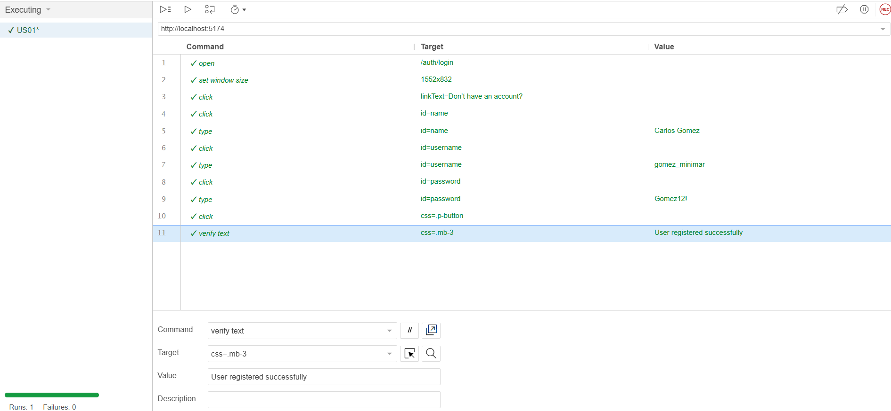

---

| ID    | Nombre del caso de uso | Descripción | 
| :---  | :--------------------- | :---------- | 
| US-03 | Gestionar equipos de refrigeración    | Como cliente, quiero gestionar mis equipos de refrigeración en la plataforma para mantener un registro y control detallado de cada uno. | 
                        

---

| ID    | Nombre del caso de uso | Descripción | 
| :---  | :--------------------- | :---------- | 
| US-04 | Solicitar y gestionar servicios de mantenimiento y reparación    | Como cliente, quiero solicitar servicios de mantenimiento (preventivo) y reparación (correctivo) para mis equipos, para asegurar su óptimo funcionamiento y recibir confirmación de mi solicitud.| 

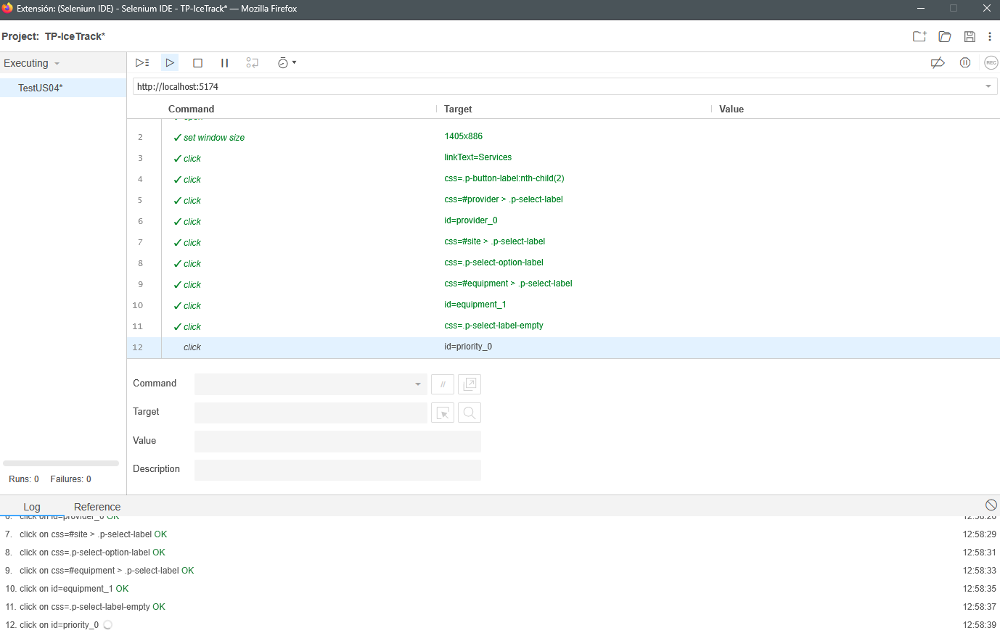

---

| ID    | Nombre del caso de uso | Descripción | 
| :---  | :--------------------- | :---------- | 
| US-16 | Conocer la misión y visión      | Como visitante, quiero conocer la misión y visión de la empresa para entender su enfoque y propuesta de valor.| 

---

| ID    | Nombre del caso de uso | Descripción | 
| :---  | :--------------------- | :---------- | 
| US-17 | Acceder a la plataforma web (Call to Action)     | Como usuario registrado, quiero acceder fácilmente a la plataforma web desde la página de inicio para gestionar mis operaciones y equipos.| 

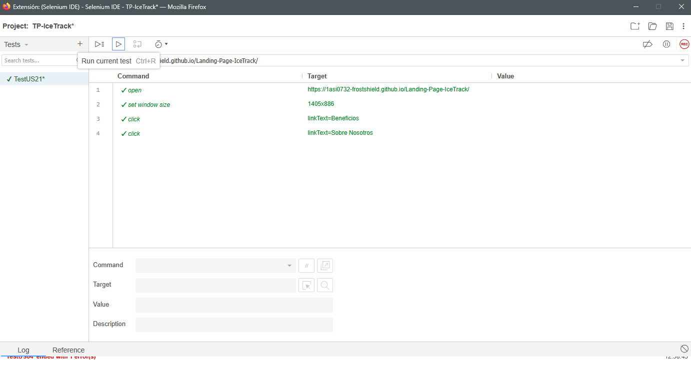

---

| ID    | Nombre del caso de uso | Descripción | 
| :---  | :--------------------- | :---------- | 
| US-21 | Crear solicitudes de servicio     | Como cliente, quiero registrar solicitudes de servicio técnico para reportar incidencias o mantenimientos.| 

---

| ID    | Nombre del caso de uso | Descripción | 
| :---  | :--------------------- | :---------- | 
| US-02 | Inicio de sesión      | Como usuario, quiero iniciar sesión con mi cuenta para acceder a la plataforma.| 

---

| ID    | Nombre del caso de uso | Descripción | 
| :---  | :--------------------- | :---------- | 
| US-20 |  Registrar nuevos sitios    |Como usuario, quiero registrar nuevos sitios para organizar las ubicaciones donde operan los equipos. | 

---

| ID    | Nombre del caso de uso | Descripción | 
| :---  | :--------------------- | :---------- | 
| US-23 |  Cambiar idioma del sistema    | Como usuario internacional, quiero cambiar el idioma del sistema para usar la plataforma en mi idioma preferido. |

---

| ID    | Nombre del caso de uso | Descripción | 
| :---  | :--------------------- | :---------- | 
| US-09 |  Asignar técnicos a servicios    | Como empresario, quiero asignar un técnico a una solicitud de servicio para asegurar que se realice el trabajo adecuadamente. |

## 6.2 Static testing & Verification

### 6.2.1 Static Code Analysis

Esta sección se centra en los métodos de prueba estática y verificación del código, asegurando que el software cumpla con los estándares de calidad y seguridad antes de su ejecución. Estos métodos permiten identificar defectos en una fase temprana del ciclo de vida del desarrollo.  

El análisis de código estático implica la revisión del código fuente sin necesidad de ejecutarlo, utilizando herramientas automatizadas y revisiones manuales. Este enfoque ayuda a detectar errores, vulnerabilidades de seguridad y oportunidades de mejora en el código, lo que contribuye a aumentar la calidad general del software y a reducir el costo de las correcciones en etapas posteriores del desarrollo.

### 6.2.1.1 Coding Standard & Code Conventions

Para garantizar la calidad y sostenibilidad de **IceTrack**, el equipo aplica estándares de codificación que aseguran un código limpio y legible.

#### Frontend

Se siguen las guías oficiales de estilo de **Vue.js** y **ESLint**:

* **Componentes:** Uso de **PascalCase** para archivos de componentes (e.g., `EquipmentCard.vue`) y **kebab-case** para su uso en plantillas HTML.
* **Propiedades y Métodos:** Uso de **camelCase** para definir *props* y funciones internas.

#### Backend

Se aplican las convenciones oficiales de Microsoft:

* **Nomenclatura:** **PascalCase** para clases y métodos; **camelCase** para parámetros y variables locales.
* **Arquitectura:** Separación de responsabilidades mediante controladores, servicios y repositorios.

#### 6.2.1.2 Code Quality & Code Security

La calidad del código y la seguridad son pilares esenciales para garantizar un software confiable y mantenible.  

- **Calidad del Código (Backend y Frontend):**  
  En el backend desarrollado en C# con Rider, utilizamos SonarQube Cloud para medir métricas clave como complejidad ciclomática, duplicación y mantenibilidad. El análisis continuo nos permite detectar problemas de fiabilidad y mantener un estándar de calidad alto. En el frontend construido en Vue.js, aplicamos ESLint junto con SonarQube para validar estilo, buenas prácticas y consistencia en el código, asegurando que cada commit cumpla con las reglas establecidas.  

- **Seguridad del Código:**  
  SonarQube también nos ayuda a identificar vulnerabilidades comunes como inyecciones SQL y Cross-Site Scripting (XSS). Además, se revisan los *security hotspots* para mitigar riesgos en etapas tempranas del desarrollo. En el frontend, ESLint contribuye a reducir errores que podrían derivar en fallos de seguridad, complementando la revisión manual y las prácticas de codificación segura.  

###### Prueba de SonarQube Cloud:
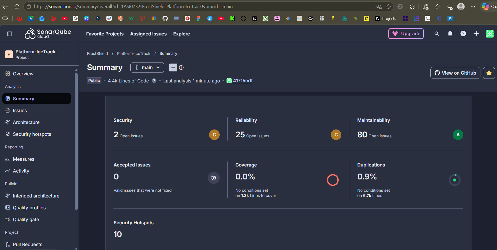

###### Prueba de ESLint:
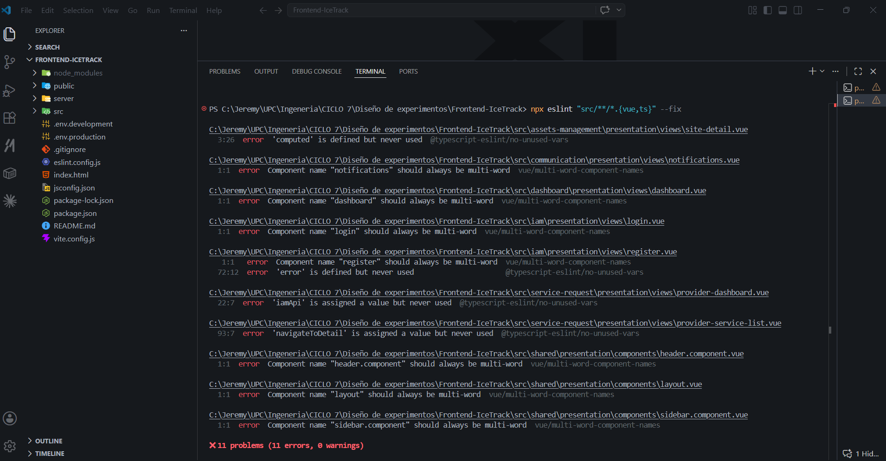

### 6.2.2 Reviews

Las revisiones de código son un proceso fundamental para garantizar la calidad y la conformidad con las normas establecidas. Este proceso implica tanto revisiones manuales como automáticas y debe seguir ciertas pautas:

#####  Tipos de Revisiones
- **Revisión de Código por Pares:** Un desarrollador revisa el código de otro desarrollador para garantizar que cumpla con los estándares y sea comprensible.  
- **Revisión de Código Formal:** Incluye una reunión estructurada donde se evalúa el código con un checklist, lo que permite detectar problemas en grupo.  
- **Revisión Automática:** Utilización de herramientas como SonarLint, SonarQube (backend C#) y ESLint (frontend Vue/TypeScript) para detectar errores y problemas de calidad en tiempo real.  

#####  Proceso de Revisión
- **Creación de Pull Requests:** Los desarrolladores deben crear un PR que incluya una descripción clara de los cambios realizados y las pruebas asociadas.  
- **Checklist de Revisión:** Debe existir una lista de verificación que cubra aspectos como la claridad del código, la cobertura de pruebas y el manejo de errores.  
- **Comentarios y Feedback:** Los revisores deben proporcionar comentarios constructivos y específicos, y cualquier problema identificado debe ser abordado antes de la aprobación final.  
- **Aprobación o Rechazo de PR:** El PR debe ser aprobado por al menos un revisor adicional antes de fusionarse en la rama principal.  

#####  Criterios de Aceptación
- **Calidad y Seguridad del Código:** El código debe cumplir con los estándares de calidad y no introducir vulnerabilidades de seguridad.  
- **Cobertura de Pruebas:** Se requiere una cobertura mínima de pruebas (por ejemplo, 80%) para asegurar que el código nuevo esté adecuadamente probado.  

##### Frecuencia de Revisiones
Las revisiones de código deben realizarse de forma regular, preferiblemente al final de cada sprint o en intervalos definidos, para asegurar que el código no se acumule y se mantenga la calidad.  

## 6.3 Validation Interviews

### 6.3.1 Diseño de Entrevistas

A continuación, se presentan las preguntas que se utilizarán en las entrevistas de validación para evaluar la usabilidad de la aplicación. Estas están diseñadas para explorar las heurísticas de usabilia y obtener información sobre las experiencas del usuario. 

1. ¿La aplicación proporciona información clara sobre lo que está sucediendo en cada momento?
2. ¿Hubo algún término, icono o frase que te resultara extraño o difícil de entender? ¿Cuál?
3. Si cometieras un error o quisieras retroceder, ¿qué tan fácil o difícil te resultó encontrar la salida?
4. ¿Las palabras, frases y conceptos en la aplicación son comprensibles y familiares para ti?
5. ¿Notaste cambios en los colores, botones o palabras que te hicieran dudar si seguías en la misma sección de la aplicación?
6. ¿Hay alguna pantalla que sientas que tiene demasiada información o elementos que te distraen de tu objetivo?
7. Si pudieras cambiar una sola cosa para que la app sea más fácil de usar, ¿qué sería?
8.  ¿Sientes que la aplicación tiene un diseño limpio y sin desorden?
9. ¿Te resulta fácil encontrar características y funciones en la aplicación sin tener que recordarlas?
10. ¿Consideras que el tamaño de los textos y los botones es adecuado para una interacción rápida, o sentiste alguna dificultad física al navegar?"

### 6.3.2 Registro de Entrevistas

**Segmento objetivo : Técnicos y empresas de mantenimiento**

**Entrevista 01**

**Nombres:** Hector

**Apellidos:** Rios 

**Edad:** 22 años

**Distrito:** San Miguel

**Evidencia de la reunión:**

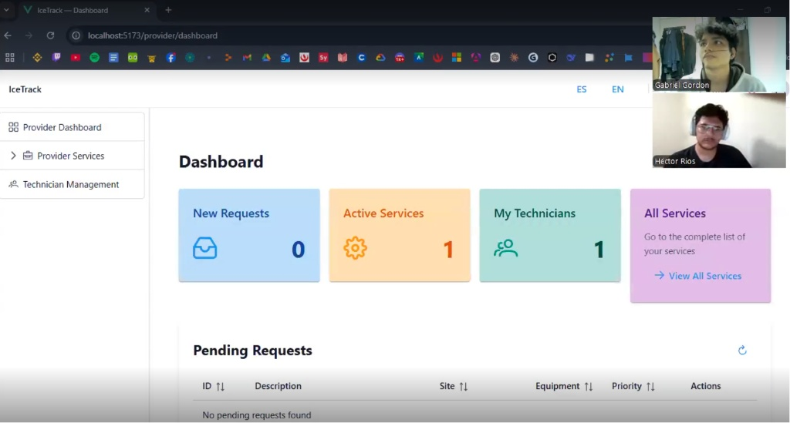

**Enlace de entrevista:** <a href="https://1drv.ms/v/c/e3ea863cec5de463/IQAZva0qO9J9Ro5XI4Crb4pnAT_L58E45u4_zQsSNuyMjU4?e=y3aUOh">Link</a>

**Resumen de la entrevista:**

Hector, nos comentó que no tuvo dificultades para regresar a pantallas anteriores o cancelar una
acción en curso, como cuando editaba información sobre sus recursos y activos dentro de la aplicación. También destacó que la estructura es sumamente limpia, lo que evita la sobrecarga cognitiva y permite que un técnico se enfoque en las tareas prioritarias, como las solicitudes pendientes. 

El entrevistado concluyó que IceTrack presenta una arquitectura de información sólida y un diseño minimalista que facilita la operatividad diaria. Calificó la herramienta como práctica y eficiente con las necesidades reales de un proveedor de servicios técnicos.

### 6.3.3 Evaluaciones según heurísticas

#### UX Heuristics & Principles Evaluation
#### Usability - Inclusive Design - Information Architecture

**CARRERA**: Ingeniería de Software  
**CURSO**: Diseño de Experimentos  
**NRC**: 12316 
**PROFESORES**: Julio Manuel Noriega Melendez
**AUDITOR**: FrostShield

**CLIENTE(S)**:

* Gonzales Alvarado, Javier Sebastian
* Gordon Salas, Gabriel Fernando
* Guillen Galindo, Julio Adolfo
* Jiménez Guerra, Gianmarco Fabian
* Melgarejo Gomez, Marcia Victoria
* Quijada Magro, Jeremy Alexander

**SITE O APP A EVALUAR**: IceTrack Platform

**TAREAS A EVALUAR**:

El alcance de esta evaluación incluye la revisión de la usabilidad de las siguientes tareas basadas en los módulos de Frontend implementados:

* Pantallas de Inicio de sesión y Registro 
* Dashboard Principal
* Gestión de Sedes
* Gestión y Monitoreo de Equipos 
* Gestión de Solicitudes de Servicio 
* Registro y Detalle de Intervenciones Técnicas 
* Configuración de Notificaciones y Ajustes de Administrador

**ESCALA DE SEVERIDAD**:
Los errores han sido puntuados tomando en cuenta la siguiente escala de severidad:

| Nivel | Descripción |
| :---- | :----------------------------------------------------------------------------------------------------------------------------------------------- |
| 1     | **Problema superficial**: puede ser fácilmente superado por el usuario o ocurre con muy poca frecuencia. No necesita ser arreglado a no ser que exista disponibilidad de tiempo. |
| 2     | **Problema menor**: puede ocurrir un poco más frecuentemente o es un poco más difícil de superar para el usuario. Se le debería asignar una prioridad baja resolverlo de cara al siguiente release. |
| 3     | **Problema mayor**: ocurre frecuentemente o los usuarios no son capaces de resolverlos. Es importante que sean corregidos y se les debe asignar una prioridad alta. |
| 4     | **Problema muy grave**: un error de gran impacto que impide al usuario continuar con el uso de la herramienta. Es imperativo que sea corregido antes del lanzamiento. |

#### TABLA RESUMEN:

| # | Problema | Escala de severidad | Heurística/Principio violada(o) |
| :- | :---------------------------------------------------------------------------------------------- | :------------------ | :------------------------------------ |
| 1 | Transición inmediata tras el registro sin confirmación visual persistente. | 3 | Visibilidad del estado del sistema |
| 2 | Duplicidad de lógica de validación de campos (teléfono/texto) en múltiples formularios. | 2 | Consistencia y estándares |
| 3 | El Dashboard no prioriza visualmente las alertas críticas sobre los KPIs generales. | 2 | Estética y diseño minimalista |
| 4 | Falta de retroalimentación inmediata al intentar registrar un equipo en una sede sin conexión. | 3 | Prevención de errores |

#### DESCRIPCIÓN DE PROBLEMAS

#### PROBLEMA #1:

* **Severidad**: 3
* **Heurística violada**: Visibilidad del estado del sistema (#1)
* **Problema**: Al completar el registro de un nuevo usuario, el sistema redirige casi instantáneamente a la pantalla de inicio de sesión. Aunque aparece un mensaje de éxito, la velocidad de la redirección impide que el usuario confirme con seguridad que su cuenta fue creada correctamente o que lea instrucciones adicionales.

**Recomendación**: Implementar una pantalla de confirmación intermedia o un "toast" de éxito con una duración de al menos 3 segundos antes de la redirección automática, permitiendo que el usuario procese el resultado de su acción.

 

#### PROBLEMA #2:

* **Severidad**: 2
* **Heurística violada**: Consistencia y estándares (#4)
* **Problema**: Se observa que las validaciones de entrada para teléfonos y nombres están codificadas de forma independiente en cada componente (`sites-list`, `technician-list`). Esto puede generar comportamientos divergentes si se actualiza la regla en un lugar y no en otro (ej. permitir 9 dígitos en uno y no validar longitud en otro).

**Recomendación**: Centralizar las funciones de validación (como `onPhoneInput` y `onTextInput`) en un archivo de utilitarios compartido para asegurar que todos los formularios de la plataforma IceTrack se comporten de manera idéntica.

 

#### PROBLEMA #3:

* **Severidad**: 2
* **Heurística violada**: Estética y diseño minimalista (#8)
* **Problema**: El Dashboard presenta múltiples tarjetas de KPI y gráficos de rosca con el mismo peso visual. Para un negocio que depende de la cadena de frío, la información sobre "Alertas Abiertas" debería tener una jerarquía visual superior a la cantidad total de sedes, ya que requiere acción inmediata.

**Recomendación**: Utilizar colores de contraste (como rojos o naranjas intensos) o un tamaño mayor para la tarjeta de alertas críticas en el Dashboard para que el usuario identifique lo urgente de un solo vistazo.

 

#### PROBLEMA #4:

* **Severidad**: 3
* **Heurística violada**: Prevención de errores (#5)
* **Problema**: En el formulario de "Nueva Solicitud de Servicio", el sistema permite seleccionar equipos que ya tienen una solicitud activa o en progreso. Esto puede causar duplicidad de órdenes y confusión tanto para el cliente como para el proveedor técnico.

**Recomendación**: Deshabilitar o filtrar los equipos que ya tienen un estado "In Progress" o "Accepted" en el desplegable de selección del formulario de nueva solicitud, evitando que el usuario cometa el error de duplicar el reporte.

# Capítulo VII: DevOps Practices

## 7.1 Continuous Integration

### 7.1.1 Tools and Practices
En el ámbito del desarrollo y pruebas de software, es esencial contar con herramientas y métodos que aseguren tanto la calidad del código como la productividad del equipo. En nuestro proceso de trabajo, empleamos una variedad de herramientas que optimizan tanto la creación como la validación de la funcionalidad y el comportamiento previsto de la aplicación. Estas herramientas abarcan distintas fases del ciclo de vida del software, desde la escritura del código hasta la ejecución de pruebas y la automatización de tareas. 
Algunas de las herramientas principales que utilizamos son:

| Herramienta  | Tipo                                        | Descripción                                                                                                | Propósito    |
| :----------- | :------------------------------------------ | :--------------------------------------------------------------------------------------------------------- | :----------- |
| **Cucumber** | Pruebas BDD                                 | Framework que permite escribir escenarios de prueba en lenguaje Gherkin y vincularlos con Steps en código. | Validar funcionalidades del sistema asegurando trazabilidad con las User Stories.                |
| **Mockito**  | Pruebas Unitarias (Backend C#)              | Librería de mocking para simular dependencias en pruebas unitarias.                                        | Asegurar que las clases y métodos del backend funcionen correctamente de forma aislada.            |
| **MS Test**  | Framework de pruebas unitarias (Backend C#) | Herramienta nativa de .NET para crear y ejecutar pruebas unitarias y de integración.                       | Validar el comportamiento esperado del código backend y asegurar la cobertura mínima requerida.     |

### 7.1.2 Build & Test Suite Pipeline Components

En esta parte colocamos cómo he estructuramos y automatizado los componentes, asegurando que cada etapa del flujo de integración continua se ejecute de manera confiable y trazable.

Nos enfocamos en dos aspectos principales:

**Pruebas (Test Suite):** Integro pruebas unitarias, de integración y de aceptación, verificando tanto el comportamiento interno de las clases como la interacción entre servicios.

**Pipeline Components:** Organizo los pasos en secuencia modular (compilación, ejecución de tests, generación de reportes, despliegue en entornos de prueba), lo que me permite detectar fallos tempranos y mantener la calidad del software.

    

## 7.2 Continuous Delivery
Su objetivo es el de automatizar la integración y pruebas del código, manteniendo todo listo para un despliegue cuando sea necesario.

### 7.2.1 Tools and Practices

El **Continuous Delivery** se diseñó para asegurar que el software estuviera siempre listo para producción, pero con un control humano en la etapa final. Esto permitió que el equipo mantuviera calidad y coordinación, evitando despliegues automáticos no deseados.

#### Tools:
| Herramienta        | Tipo                    | Descripción                                 | Propósito    |
| :----------------- | :---------------------- | :------------------------------------------ | :----------- |
| **GitHub Actions** | Automatización de CI/CD | Configuramos pipelines que ejecutan pruebas unitarias (MS Test, Mockito), pruebas BDD (Cucumber) y validaciones de calidad. La etapa de despliegue queda preparada pero pendiente de aprobación manual.           | Garantizar que cada commit y PR pase por validaciones automáticas antes de estar listo para producción. |
| **Jira**           | Gestión de aprobación   | Usado para coordinar la aprobación del despliegue. Después de que el pipeline valida el código, un responsable revisa y aprueba el paso a producción.                                    | Asegurar que el despliegue sea revisado por al menos un miembro del equipo antes de ejecutarse.         |

#### Practices
- **Feature Branching y Merge Requests:** Cada funcionalidad se desarrolla en ramas separadas. Tras pasar pruebas automáticas, se fusiona a la rama estable, pero el despliegue requiere aprobación manual.  
- **Pipeline de Validación en Staging:** Los cambios se prueban en un entorno staging similar a producción, donde se ejecutan pruebas automáticas y manuales antes de aprobar el despliegue.  
- **Despliegue Semiautomático:** El pipeline prepara la aplicación para producción, pero el despliegue final solo se realiza cuando un responsable lo aprueba.  
- **Aprobación Manual:** Antes de desplegar, un miembro del equipo revisa los resultados de pruebas y valida que el código cumpla los criterios de calidad.  
- **Rollback Manual:** En caso de errores, el equipo puede revertir manualmente el despliegue, asegurando control sobre la operación.  

Este enfoque permitió que el equipo mantuviera un balance entre automatización y control humano, asegurando calidad en cada sprint sin perder seguridad en el paso a producción.

### 7.2.2 Stages Deployment Pipeline Components

Nuestro equipose organizó en varias etapas que nos permitieron mantener control y calidad en cada despliegue. Como grupo, cada uno tuvo un rol en estas fases para asegurar que el código estuviera siempre listo, pero con supervisión antes de llegar a producción.

#### Integración Continua (CI)
Cuando hacíamos un commit en una rama de desarrollo, el pipeline ejecutaba automáticamente las pruebas unitarias (MS Test, Mockito) y las pruebas BDD (Cucumber). Esto nos garantizaba que el código estuviera en un estado “desplegable” y que no se rompiera la rama estable.

#### Despliegue Manual
Aunque el pipeline dejaba la aplicación lista para producción, el despliegue final requería aprobación manual. Un miembro del equipo revisaba los resultados y confirmaba que todo estuviera correcto. Esto nos daba mayor control y evitaba errores en producción.

#### Monitoreo y Feedback
Después de cada despliegue, utilizábamos herramientas de monitoreo para observar cómo el nuevo código afectaba el rendimiento. El feedback era compartido en Jira, donde cada integrante podía comentar y asignar tareas de corrección si era necesario.

#### Aprobación del Despliegue
El pipeline quedaba en espera hasta que uno de nosotros (desarrollador responsable o administrador) aprobaba el despliegue a producción. Esta práctica aseguraba que siempre hubiera supervisión humana y que el código cumpliera con los criterios de calidad definidos por el equipo.

## 7.3 Continuous deployment

La finalidad del Continuous Deployment (CD) consiste en automatizar el envío de modificaciones validadas del software desde el entorno de desarrollo hacia producción, permitiendo publicar nuevas versiones de manera automática siempre que cumplan satisfactoriamente con todas las verificaciones y pruebas requeridas.

### 7.3.1 Tools and Practices

En esta sección se describen las herramientas utilizadas para facilitar el despliegue y publicación de la aplicación.

| Herramienta | Función principal       | Descripción                                                                                  |
| :---------- | :---------------------- | :------------------------------------------------------------------------------------------- |
| GitHub      | Control de versiones    | Permitió almacenar y gestionar el código fuente del proyecto de manera colaborativa.         |
| Vercel      | Despliegue del frontend | Plataforma utilizada para publicar la aplicación frontend y permitir su acceso desde la web. |
| MySQL       | Base de datos           | Sistema gestor de base de datos utilizado para almacenar la información del sistema.         |
| Rider       | Desarrollo Backend      | IDE utilizado para el desarrollo y pruebas del backend de la aplicación.                     |
| WebStorm    | Desarrollo Frontend     | IDE utilizado para el desarrollo del frontend y validación de la interfaz de usuario.        |

Estrategias utilizadas:

| Estrategia        | Descripción                                                                                               |
| :---------------- | :-------------------------------------------------------------------------------------------------------- |
| Feature Branching | Cada integrante desarrolló funcionalidades en ramas separadas antes de integrarlas al proyecto principal. |
| Validación Manual | Antes de publicar cambios, el equipo realizaba pruebas funcionales y revisiones manuales.                 |
| Despliegue Manual | La publicación de nuevas versiones se realizaba manualmente mediante Vercel.                              |

### 7.3.2 Production Deployment Pipeline Components

En esta sección se describen los componentes utilizados durante el proceso de despliegue y publicación de la aplicación.

**Base de Datos (MySQL)**

La aplicación utilizó MySQL como sistema gestor de base de datos para almacenar y administrar la información del sistema.

| Componente                  | Función                                                                                     |
| :-------------------------- | :------------------------------------------------------------------------------------------ |
| Almacenamiento de datos     | Permitió guardar la información utilizada por la aplicación.                                |
| Gestión de registros        | Facilitó el manejo y consulta de los datos almacenados en el sistema.                       |
| Persistencia de información | Garantizó que los datos permanezcan disponibles durante el funcionamiento de la aplicación. |

**Backend (Rider + Backend)**

El backend de la aplicación fue desarrollado y probado utilizando Rider como entorno de desarrollo.

| Componente                       | Función                                                                                        |
| :------------------------------- | :--------------------------------------------------------------------------------------------- |
| Desarrollo del backend           | Rider permitió implementar la lógica y funcionalidades del sistema.                            |
| Pruebas y validación             | Se realizaron pruebas funcionales y validaciones del backend antes de su publicación.          |
| Integración con la base de datos | El backend permitió la comunicación entre la aplicación y MySQL para el manejo de información. |

**Frontend (WebStorm + Vercel)**

El frontend de la aplicación fue desarrollado en WebStorm y publicado mediante Vercel.

| Componente                   | Función                                                                                                |
| :--------------------------- | :----------------------------------------------------------------------------------------------------- |
| Desarrollo del frontend      | WebStorm permitió desarrollar y organizar la interfaz de usuario de la aplicación.                     |
| Publicación de la aplicación | Vercel facilitó el despliegue y acceso al frontend desde la web.                                       |
| Actualización de versiones   | Las nuevas versiones de la aplicación pudieron ser publicadas de manera rápida mediante la plataforma. |

**Control de Versiones y Colaboración (GitHub)**

GitHub fue utilizado como plataforma principal para el almacenamiento y gestión del código fuente del proyecto, permitiendo el trabajo colaborativo entre los integrantes del equipo.

| Componente           | Función                                                                                                    |
| :------------------- | :--------------------------------------------------------------------------------------------------------- |
| Control de versiones | Permitió registrar y administrar los cambios realizados en el código fuente.                               |
| Trabajo colaborativo | Facilitó la integración de funcionalidades desarrolladas por los distintos integrantes del equipo.         |
| Gestión de ramas     | Permitió organizar el desarrollo mediante ramas independientes para nuevas funcionalidades y correcciones. |

## 7.4 Continuous Monitoring

Mediante el monitoreo continuo, se pudo supervisar el funcionamiento correcto de la aplicación durante el desarrollo y durante las pruebas. Para ello, se usaron herramientas enfocadas en pruebas automatizadas, validación de APIs, control de versiones y seguimiento de incidencias. Con ello, se pudo mejorar la calidad de software.

### 7.4.1 Tools and Practices

Las herramientas utilizadas para el monitoreo y asegurameitno de calidad de la aplicación fueron las siguientes:

**Selenium:** Utilizado para realizar pruebas automatizadas sobre la interfaz web desarrollada en Vue y la interfaz de la landing page, validando funcionalidades críticas como formularios, navegación e inicio de sesión.
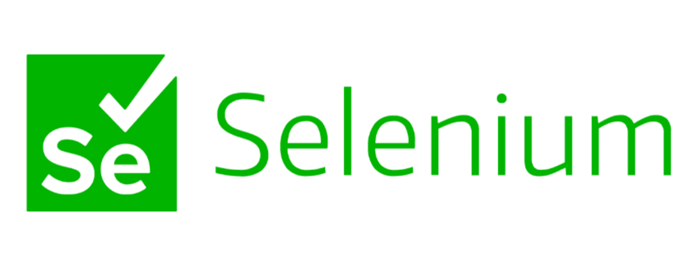

---

**Swagger UI:** Empleado para probar y validar los endpoints del backend desarrollado en C#, verificando respuestas HTTP, parámetros y funcionamiento de las APIs REST.
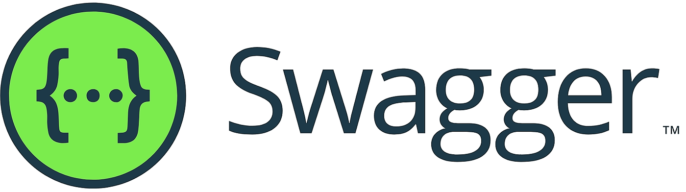

---

**MSTest:** Utilizado para desarrollar y ejecutar pruebas unitarias sobre la lógica de negocio del backend.
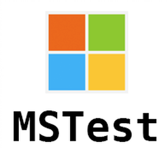

---

**GitHub:** Utilizado para el control de versiones, administración de cambios y colaboración entre los integrantes del equipo.
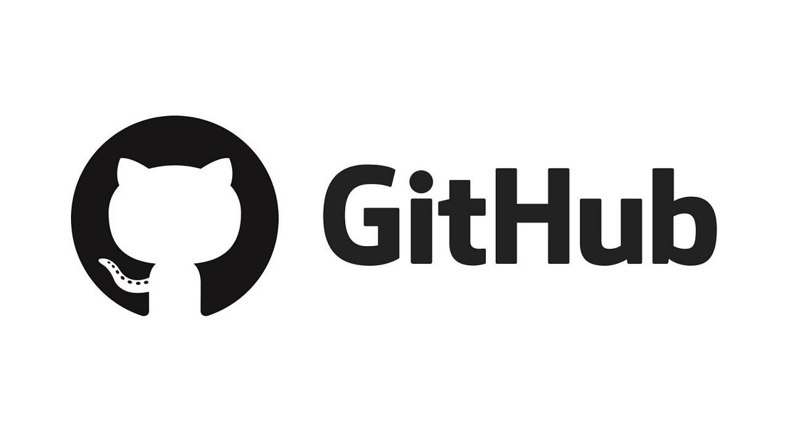

---

**Jira:** empleado para el seguimiento de tareas, incidencias y errores detectados durante las pruebas y el desarrollo del proyecto.
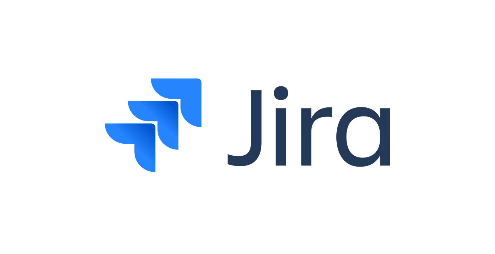

### 7.4.2 Monitoring Pipeline Components

El flujo de monitoreo estuvo conformado por diferentes componentes y etapas en las que nos encargamos de validar la calidad y funcionamiento del sistema.

Las pruebas unitarias realizadas en Rider con MsTest permitieron validar el comportamiento de los componentes internos y de la lógica del backend desarrollado en C#. Asimismo, Selenium automatizó pruebas funcionales sobre la interfaz web simulando acciones reales de los usuarios para detectar errores de funcionamiento.

Swagger UI permitió monitorear y validar continuamente el funcionamiento de las APIs REST, facilitando la integración entre frontend y backend mediante pruebas de endpoints y verificación de respuestas.

Finalmente, GitHub permitió mantener un registro y seguimiento de cambios realizados en el proyecto y nos ayudó en el manejo de versiones, mientras que Jira facilitó la supervisión del progreso y resolución de incidencias.

### 7.4.3 Alerting Pipeline Components

El componente de alertas estuvo basado principalmente en la detección de errores mediante pruebas automatizadas y el seguimiento de incidencias registradas durante el desarrollo.

Jira fue muy importante en la gestión de errores al realizar las pruebas unitarias automatizadas y en las mejoras del backend, permitiendo asignar responsables y realizar seguimiento hasta su resolución.

Adicionalmente, GitHub permitió identificar cambios realizados en el código fuente y facilitar la revisión colaborativa para prevenir errores antes de integrar nuevas funcionalidades al sistema.

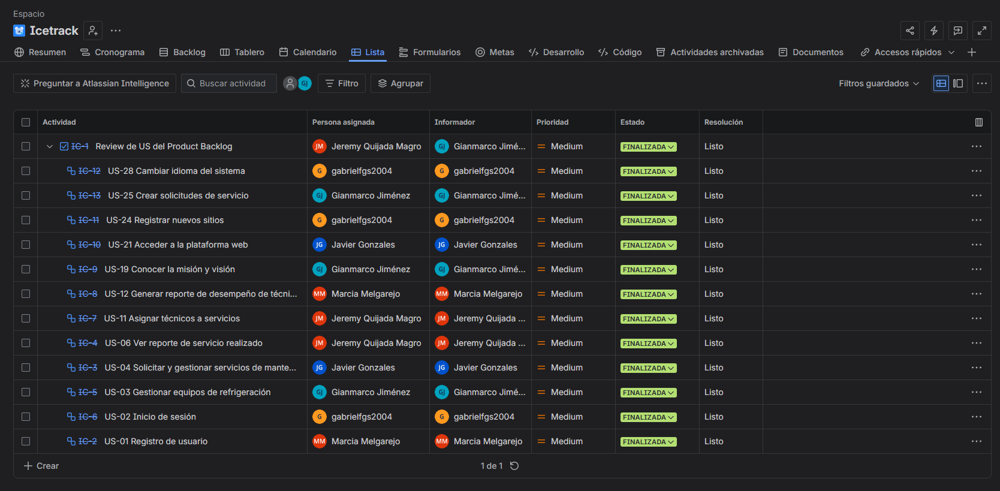

### 7.4.4 Notification Pipeline Components

El pipeline de notificaciones permitió mantener informado al equipo sobre el estado del proyecto, las modificaciones del mismo y los resultados de las pruebas realizadas.

GitHub fue de gran ayuda pues facilitó la notificación de cambios mediante commits, pull requests y actualizaciones del repositorio, permitiendo la colaboración continua entre los integrantes del equipo.

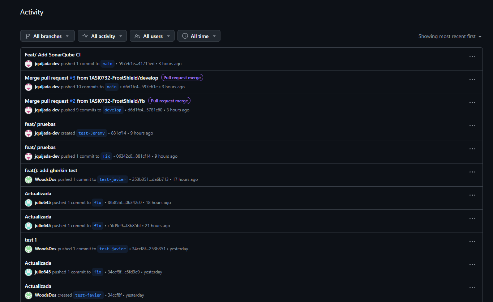

# Capítulo VIII: Experiment-Driven Development 
## 8.1. Experiment Planning 

### 8.1.1. As-Is Summary. 

La aplicación actual se centra en ofrecer una plataforma para la gestión de sitios y equipos de refrigeración, proporcionando funcionalidades básicas como la creación y seguimiento de solicitudes de servicio, el registro de intervenciones técnicas, la gestión de técnicos, la calificación de servicios mediante reviews y la visualización de dashboards con KPIs. Sin embargo, la plataforma carece de ciertas capacidades que limitan su valor percibido y la experiencia del usuario. La interfaz no ofrece opciones de personalización visual, y las funcionalidades de visualización geográfica y generación de documentos no están presentes, lo que restringe su utilidad en escenarios de campo y toma de decisiones.

**Problemas identificados:**
- **Visualización geográfica limitada:** La aplicación no cuenta con un mapa interactivo que permita a los usuarios ubicar geográficamente sus sitios y equipos registrados, dificultando la gestión visual de activos distribuidos en múltiples ubicaciones.
- **Ausencia de exportación de reportes:** No es posible generar documentación descargable en formatos como PDF del historial de servicios e intervenciones, lo que limita la capacidad de los dueños de compartir informes.
- **Falta de alertas de mantenimiento preventivo:** La plataforma no cuenta con un sistema de recordatorios automáticos programados que notifique a los dueños cuando un equipo se aproxima a su fecha de mantenimiento, dependiendo completamente de la acción manual del usuario.
- **Personalización visual insuficiente:** La interfaz carece de un modo oscuro y opciones de personalización de temas, lo que afecta la comodidad visual de los usuarios que trabajan en entornos con diferentes condiciones de luz.
- **Retroalimentación post-servicio no estructurada:** No existe un módulo automatizado de encuestas de satisfacción que se active al completar un servicio, perdiendo la oportunidad de recolectar retroalimentación sistemática y medible de los dueños.

**Objetivos de mejora:**
Para abordar los problemas identificados y mejorar la aplicación, se establecen los siguientes objetivos:

- **Implementación de mapa interactivo:** Integrar una vista geográfica con  que permita visualizar todos los sitios y equipos registrados en un mapa.
- **Exportación de reportes a PDF:** Desarrollar un módulo de generación de reportes descargables que incluya el historial de servicios, intervenciones y estado de equipos por sitio.
- **Sistema de alertas de mantenimiento preventivo:** Implementar un mecanismo de notificaciones automáticas programadas que recuerde a los dueños las fechas próximas de mantenimiento de sus equipos.
- **Personalización visual:** Agregar un modo oscuro y opciones de personalización de tema (colores) que permitan al usuario adaptar la interfaz a sus preferencias visuales y condiciones de entorno.
- **Módulo de encuestas de satisfacción post-servicio:** Incorporar un cuestionario automatizado que se active al completar una intervención, permitiendo recolectar calificaciones y comentarios estructurados de los dueños para medir la calidad del servicio.

### 8.1.2. Raw Material: Assumptions, Knowledge Gaps, Ideas, Claims. 

**Assumptions:**
* Se asume que los dueños de equipos de refrigeración se beneficiarían de una vista geográfica para gestionar sitios y equipos distribuidos en múltiples ubicaciones.
* Se asume que la posibilidad de exportar reportes en formato PDF aporta valor a los dueños al facilitar el intercambio de información con otros stakeholders.
* Se asume que una parte significativa de los dueños puede olvidar las fechas de mantenimiento preventivo cuando no dispone de recordatorios automáticos.
* Se asume que la incorporación de un modo oscuro mejoraría la experiencia de uso para usuarios que utilizan la plataforma durante períodos prolongados o en entornos con poca iluminación.
* Se asume que los dueños estarían dispuestos a proporcionar retroalimentación después de una intervención si el proceso de evaluación es simple y rápido.

**Knowledge Gaps:**
* Se desconoce si los dueños prefieren una vista geográfica, una vista de lista o una combinación de ambas para gestionar sitios y equipos.
* Se desconoce qué tan importante es para los dueños la exportación de reportes en PDF en comparación con la consulta directa de información dentro de la plataforma.
* Se desconoce con qué frecuencia los dueños programan mantenimientos preventivos y qué dificultades encuentran para realizar su seguimiento.
* Se desconoce si la ausencia de un modo oscuro representa una necesidad relevante para los usuarios de la plataforma.
* Se desconoce qué porcentaje de usuarios estaría dispuesto a responder encuestas post-servicio y cuál es la longitud de encuesta que consideran aceptable.

**Ideas:**
* Incorporar una vista geográfica interactiva que permita visualizar los sitios registrados mediante marcadores geolocalizados y representar el estado de los equipos utilizando indicadores visuales.
* Implementar una funcionalidad de exportación de reportes en formato PDF que incluya información sobre servicios realizados, intervenciones técnicas y estado de equipos.
* Desarrollar un sistema de alertas de mantenimiento preventivo que notifique automáticamente a los dueños antes de las fechas programadas de mantenimiento.
* Agregar opciones de personalización visual, incluyendo modo oscuro y configuración de temas de color.
* Incorporar un módulo de encuestas de satisfacción automatizadas que se active al finalizar una intervención y permita recopilar calificaciones y comentarios de los dueños.

**Claims:**
* Una vista geográfica interactiva permitirá a los dueños localizar y supervisar sus sitios y equipos de manera más eficiente que utilizando únicamente listas tradicionales.
* La disponibilidad de reportes descargables en formato PDF facilitará la distribución y presentación de información relacionada con los servicios e intervenciones realizadas.
* Las alertas automáticas de mantenimiento preventivo contribuirán a que los usuarios realicen mantenimientos programados con mayor regularidad.
* La incorporación de opciones de personalización visual mejorará la experiencia de uso y la satisfacción de los usuarios.
* Las encuestas de satisfacción automatizadas aumentarán la cantidad de retroalimentación recopilada después de cada intervención.

### 8.1.3. Experiment-Ready Questions. 

### 8.1.4. Question Backlog. 

### 8.1.5. Experiment Cards. 

## 8.2. Experiment Design 
### 8.2.1. Hypotheses. 
### 8.2.2. Domain Business Metrics 
### 8.2.3. Measures. 
### 8.2.4. Conditions. 
### 8.2.5. Scale Calculations and Decisions. 
### 8.2.6. Methods Selection. 
### 8.2.7. Data Analytics: Goals, KPIs and Metrics Selection. 
### 8.2.8. Web and Mobile Tracking Plan. 

## 8.3. Experimentation 
### 8.3.1. To-Be User Stories.
### 8.3.2. To-Be Product Backlog
### 8.3.3. Pipeline-supported, Experiment-Driven To-Be Software Platform Lifecycle 
#### 8.3.3.1. To-Be Sprint Backlogs 
#### 8.3.3.2. Implemented To-Be Landing Page Evidence 
#### 8.3.3.3. Implemented To-Be Frontend-Web Application Evidence 
#### 8.3.3.4. Implemented To-Be RESTful API and/or Serverless Backend Evidence 
#### 8.3.3.5. Team Collaboration Insights
### 8.3.4. To-Be Validation Interviews
#### 8.3.4.1. Diseño de Entrevistas
#### 8.3.4.2. Registro de Entrevistas
## 8.4. Experiment Aftermath & Analysis 
### 8.4.1. Analysis and Interpretation of Results 
### 8.4.2. Re-scored and Re-prioritized Question Backlog 
## 8.5. Continuous Learning 
### 8.5.1. Shareback Session Artifacts: Learning Workflow 
## 8.6. To-Be Software Platform Pre-launch 
### 8.6.1. About-the-Product Intro Video

# Conclusiones

## Conclusiones y Recomendaciones

* La implementación de una suite de pruebas integral, que abarca pruebas unitarias (xUnit, MSTest), pruebas de integración (Postman, Swagger), pruebas BDD (Cucumber) y pruebas de sistema (Selenium), permitió validar tanto la lógica de negocio del backend en C# como el comportamiento de la interfaz en Vue.js. Esto asegura que la plataforma IceTrack funcione de manera estable y cumpla con los requisitos del usuario final.

* La adopción de herramientas de análisis estático de código, como SonarQube Cloud para el backend y ESLint para el frontend, resultó fundamental para detectar vulnerabilidades de forma temprana, controlar la complejidad ciclomática y mantener estándares de codificación Microsoft y Vue.js. Esto eleva significativamente la mantenibilidad y seguridad del software.

* Las entrevistas de validación y la evaluación de heurísticas UX demostraron que IceTrack posee una arquitectura de información sólida y un diseño limpio que ayuda a los técnicos a no sobrecargarse cognitivamente.

* El monitoreo continuo mediante Jira y la trazabilidad de repositorios en GitHub facilitaron enormemente la asignación de roles, la gestión de incidencias y la rápida corrección de "bugs" detectados durante la ejecución de pruebas automatizadas, fomentando un entorno de trabajo ágil y colaborativo.

* Para asegurar la calidad sostenida a lo largo del tiempo, se recomienda incrementar y mantener la cobertura de pruebas unitarias por encima del umbral del 80%. Además, se sugiere integrar las pruebas automatizadas de interfaz (Selenium) de forma directa en el pipeline de GitHub Actions para bloquear automáticamente un *Pull Request* si se rompe la interfaz visual.

# Bibliografía

- Axios. (s.f.). *Axios: Promise based HTTP client for the browser and node.js*. https://axios-http.com/docs/intro

- Conventional Commits. (s.f.). *Conventional commits*. https://www.conventionalcommits.org/

- Google. (s.f.). *Google HTML/CSS style guide*. https://google.github.io/styleguide/htmlcssguide.html

- PrimeVue. (s.f.). *PrimeVue: The most complete UI component library for Vue.js*. https://primevue.org

- REST API Tutorial. (s.f.). *What is REST?*. https://www.restapitutorial.com/introduction/whatisrest

- RESTfulAPI.net. (s.f.). *REST API tutorial*. https://restfulapi.net

- W3Schools. (s.f.). *HTML style guide and coding conventions*. https://www.w3schools.com/html/html5_syntax.asp

# Anexos

## Recursos y enlaces del proyecto
  
- **URL de la organización del proyecto:** 
  https://github.com/1ASI0730-2520-7452-G1-FrostShield
   
- **URL del repositorio del reporte:** 
  https://github.com/1ASI0730-2520-7452-G1-FrostShield/Report
   
- **URL del repositorio de la Landing Page:** 
  https://github.com/1ASI0730-2520-7452-G1-FrostShield/IceTrack---Landing-Page
   
- **URL del repositorio del Frontend:** 
  https://github.com/1ASI0730-2520-7452-G1-FrostShield/IceTrack-Frontend
   
- **URL del repositorio del Backend:** 
  https://github.com/1ASI0730-2520-7452-G1-FrostShield/IceTrack-Platform
   
- **URL del Landing Page desplegado:** 
  https://1asi0730-2520-7452-g1-frostshield.github.io/IceTrack---Landing-Page/
   
- **URL del Frontend desplegado:** 
  https://ice-track-frontend.vercel.app/
   
- **URL del Backend desplegado:** 
  https://icetrack-platform.onrender.com
   
- **Video About-The-Team:** 
  - YouTube: https://www.youtube.com/watch?v=Au_UI13KXkM
   
- **Video About-The-Product:**
  - YouTube: https://youtu.be/hKL4tEhWjGE
