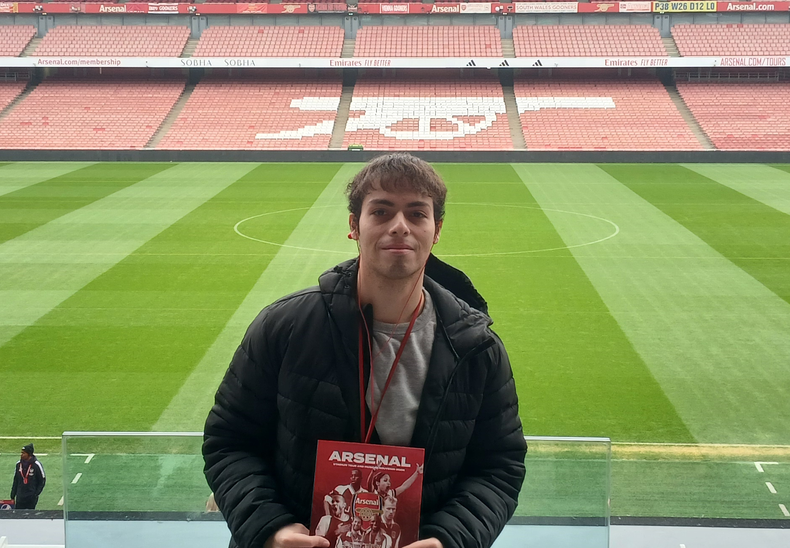

# Capitulo 1: Introducción

## 1.1 Startup Profile

### 1.1.1 Descripción de la Startup

Nuestra startup ofrece una plataforma SaaS de Inteligencia de Datos para optimizar la gestión y el mantenimiento de equipos de refrigeración en negocios que dependen de la cadena de frío. Nuestra plataforma se integra con los controladores y sistemas de monitoreo ya existentes en los negocios, transformando datos aislados en decisiones estratégicas.
Las funcionalidades clave de la plataforma incluyen el monitoreo en tiempo real de temperatura, consumo energético y tiempo de uso. Además, ofrece alertas automáticas ante fallos, informes técnicos detallados, historiales de rendimiento y programación inteligente de mantenimientos. Estas herramientas permiten a empresas, técnicos y proveedores mejorar la eficiencia operativa, prevenir costosas pérdidas por fallos inesperados y mantener un registro completo del estado y uso de sus equipos.

Misión: Queremos ofrecer una solución tecnológica inteligente que ayude a las empresas a proteger su inventario y a optimizar la gestión de sus equipos de refrigeración. Al mismo tiempo, proporcionamos herramientas especializadas para mejorar la eficiencia operativa de los técnicos y proveedores del sector.
Visión: Ser la empresa líder en la gestión y el mantenimiento de equipos de refrigeración en el mercado peruano, comenzando por consolidar nuestra posición en Lima.

### 1.1.2 Perfiles de integrantes del equipo

| **Integrante**            | **Quijada Magro Jeremy Alexander**        									    |
| :------------------------ | :-------------------------------------------------------------------------------- |
| **Código del Estudiante** | u202219657                                   										|
| **Carrera**               | Ingeniería de Software                       										|
| **Descripción**           | Mi nombre es Jeremy Alexander Quijada Magro, tengo 21 años y curso la carrera de Ingeniería de Software. Me considero una persona ordenada y responsable. En mis tiempos libres me gusta aprender cosas nuevas. En este proyecto apoyaré con todos los conocimientos que he adquirido en los cursos pasados con la meta de aprender a realizar pruebas de calidad sobre este proyecto  												|
| **Foto**                  |  |

---

| **Integrante**            | **Guillen Galindo Julio Adolfo**                                                   														 |
| :------------------------ | :----------------------------------------------------------------------------------------------------------------------------------------- |
| **Código del Estudiante** | u20241a352                                                                          														 |
| **Carrera**               | Ingeniería de Software                                                              														 |
| **Descripción**           | Actualmente curso la carrera de Ingeniería de Software en la UPC. Me considero una persona discreta, pero responsable y enfocada en cumplir los proyectos dentro de los plazos establecidos. Poseo conocimientos en C++ y Python; disfruto trabajar en equipo cuando existe colaboración y apoyo mutuo. Además, me motiva aplicar lo aprendido para afrontar los desafíos que puedan surgir en los próximos ciclos. |
| **Foto**                  |  															 |

---

| **Integrante**            | **Gianmarco Fabian Jiménez Guerra**                                        	  |
| :------------------------ | :------------------------------------------------------------------------------ |
| **Código del Estudiante** | u202123843																	  |
| **Carrera**               | Ingeniería de Software														  |
| **Descripción**           | Estudiante de Ingeniería de Software con conocimiento sobre desarrollo de aplicaciones web y análisis de datos. Estoy motivado por aprender nuevos temas relacionados a Software y por trabajar en equipo. Considero que mi conocimiento sobre las tecnologías: Java, Python, Angular y C# me permitirá desempeñarme de manera correcta para apoyar en este proyecto.|
| **Foto**                  |  |

---

| **Integrante**  | **Javier** |
|-----------------|--------------------------------|
| **Código del Estudiante** | U202312966 |
| **Carrera** | Ingeniería de Software |
| **Descripción** | Mi nombre es Javier Gonzales, soy estudiante de Ingeniería de Software de séptimo ciclo. Tengo conocimientos en diversos lenguajes de programación como C++, Python y JavaScript, entre otros. Además, he desarrollado proyectos de software utilizando distintos frameworks como Angular y Vue. Me considero una persona responsable, empática y analítica. Mi objetivo personal es desarrollar soluciones tecnológicas que contribuyan a mejorar la calidad de vida de las personas y aportar a la construcción de un mundo más innovador y conectado  |
| **Foto** |  |

---

| **Integrante**  | **Marcia Victoria Melgarejo Gomez** |
|-----------------|--------------------------------|
| **Código del Estudiante** | U20231C505 |
| **Carrera** | Ingeniería de Software |
| **Descripción** | Actualmente estoy cursando el séptimo ciclo de la carrera de Ingeniería de Software en la UPC. Opté por esta carrera debido a mi interés en el mundo de la tecnología y todo lo que este campo puede ofrecer a la sociedad. Me caracterizo por ser una persona curiosa, persistente y colaborativa. Tengo conocimientos en C++, HTML, CSS, JS, Pyhton |
| **Foto** |  |

---

| **Integrante**            | **Gabriel Fernando Gordon Salas**                                                    |
| :------------------------ | :---------------------------------------------------------------------------------- |
| **Código del Estudiante** | U20221E229                                                                         |
| **Carrera**               | Ingeniería de Software                                                              |
| **Descripción**           | Me considero una persona responsable, me gusta ayudar a mis compañeros en los trabajos y sé organizarme bien al momento de realizar mis cosas. Con esto mi objetivo es poder dar lo mejor en un ambiente de cooperación entre todos para que el proyecto dé una muy buena presentación													  |
| **Foto**                  |  |

## 1.2 Solution Profile

### 1.2.1 Antecedentes y Problematica

| **5W & 2H**                                     | **Descripcion**                                                                                                                                                                                                                                                                                                                                                                                           |
| :---------------------------------------------- | :-------------------------------------------------------------------------------------------------------------------------------------------------------------------------------------------------------------------------------------------------------------------------------------------------------------------------------------------------------------------------------------------------------- |
| **What: ¿Cuál es el problema?**                 			  | Los negocios que dependen de la refrigeración se enfrentan a una vulnerabilidad operativa significativa. La falta de control en sus equipos de congelación lleva a fallas inesperadas, alto consumo energético y falta de un mantenimiento proactivo. Como resultado, sufren grandes pérdidas económicas, tanto por productos dañados como por la interrupción de su servicio. 	   	 |
| **When: ¿Cuándo sucede este problema?**         			  | Este problema es una amenaza constante, especialmente durante la operación continua de los negocios. Se vuelve más crítico cuando no hay técnicos disponibles para una revisión inmediata o cuando se ha descuidado el seguimiento regular del estado de los equipos.																										   		   	 |
| **Where: ¿Dónde se produce este suceso?**      			  | El problema está presente en todo el país, afectando a negocios en diversas ciudades. Sin embargo, su impacto es particularmente notable en Lima, donde la cadena de frío es vital para sectores como la alimentación y la medicina. Las empresas de servicios que atienden a estos clientes también se ven afectadas al no tener una forma centralizada de gestionar sus operaciones. 	 |
| **Who: ¿Quiénes están involucrados?**          			  | Este problema afecta a una amplia gama de actores. Por un lado, están los dueños y administradores de negocios que sufren las consecuencias directas de las fallas. Por otro, los técnicos y empresas de servicio que se ven obligados a responder a emergencias sin las herramientas adecuadas. 																					   	 |
| **Why: ¿Cuál es la causa del problema?**        			  | La causa principal es la fragmentación de datos técnicos en sistemas aislados. La información crítica está atrapada en controladores que no se comunican entre sí, lo que impide una visión centralizada y obliga a los negocios a operar bajo una gestión reactiva e ineficiente, actuando solo cuando la falla ya ocurrió.									   				 |
| **How: ¿Qué llevó a la persona a llegar a esta situación?** | La situación actual es el resultado de la gestión reactiva y la falta de digitalización. Los negocios han dependido de una estrategia de "apagar incendios", esperando a que ocurra un problema crítico para actuar. Esta mentalidad ha generado un ciclo de costos elevados, tiempos de respuesta lentos y un desgaste operativo que se podría haber evitado con una planificación adecuada. |
| **How Much: ¿Cuánto es el impacto financiero?** 			  | El impacto económico es devastador y multidimensional. En el mercado peruano, una falla no detectada a tiempo en una cámara de frío puede generar pérdidas de inventario de entre S/ 5,000 y S/ 50,000 en una sola noche, dependiendo del sector. A esto se suman los costos de las reparaciones de emergencia y el daño a largo plazo en la reputación y la confianza del cliente, lo que hace que el costo total sea mucho mayor. 																 |

### 1.2.2 Lean UX Process

#### 1.2.2.1 Lean UX Problem Statements

En el sector de la refrigeración, las empresas se enfrentan a un desafío recurrente: la falta de una gestión inteligente para sus equipos. Los negocios que dependen de la cadena de frío operan con un alto riesgo de pérdidas económicas y desperdicio de energía, ya que su mantenimiento es reactivo. Aunque muchos ya cuentan con sensores y controladores, los datos permanecen aislados y son difíciles de interpretar para una toma de decisiones rápida.
Existe un vacío en el mercado que las soluciones actuales no han llenado: la falta de una capa de inteligencia que unifique los datos ya existentes. No hay una plataforma que centralice la información de distintos fabricantes y ofrezca una visibilidad completa. Esta ausencia de análisis predictivo y de un historial unificado dificulta la respuesta ante fallas y degrada la calidad del servicio técnico.
FrostShield ha sido creada para superar estos obstáculos. IceTrack establece una conexión digital entre los negocios y sus equipos, permitiendo un monitoreo constante de la temperatura y el consumo energético. Esto no solo previene fallas, sino que también optimiza el rendimiento y prolonga la vida útil de los equipos. Además, proporcionamos a los técnicos una herramienta centralizada para organizar sus tareas, acceder al historial de cada equipo y responder de manera más eficiente.
Inicialmente, nos enfocamos en los negocios de Lima que buscan una solución confiable para sus sistemas de refrigeración, así como en los proveedores de servicio que desean modernizar sus operaciones. 
Sabremos que hemos tenido éxito cuando se reduzcan las fallas críticas, mejore la eficiencia energética y aumente en la satisfacción y lealtad de nuestros clientes, demostrando así el valor de la tecnología en el sector.

#### 1.2.2.2 Lean UX Assumption

# Business Outcomes

-	**Reducir las pérdidas de inventario:** La plataforma de FrostShield previene fallas térmicas, minimizando el descarte de productos y aumentando la rentabilidad de los negocios.
- **Aumentar la eficiencia operativa:** Los técnicos pueden gestionar sus tareas de forma más inteligente y atender a más clientes en menos tiempo, lo que se traduce en una mayor productividad.
- **Mejorar la fidelización de clientes:** Un servicio proactivo y transparente fortalece la confianza con los clientes, lo que lleva a una mayor retención y a relaciones comerciales a largo plazo.
- **Optimizar los costos de mantenimiento:** La plataforma permite pasar de un modelo de mantenimiento reactivo, costoso e impredecible, a uno predictivo, que reduce los gastos en reparaciones de emergencia.
- **Posicionar el liderazgo en el mercado:** Al ofrecer una solución tecnológica innovadora, el proyecto permite a los proveedores de servicio diferenciarse de su competencia y captar nuevos clientes de manera más efectiva.
- **Generar ingresos recurrentes:** El modelo de negocio, basado en suscripciones y servicios de valor añadido, asegura un flujo de ingresos constante y escalable para la empresa.
- **Disminuir el consumo energético:** El monitoreo en tiempo real del consumo de energía permite identificar y corregir ineficiencias, lo que se traduce en ahorros significativos para los negocios.
- **Facilitar la toma de decisiones:** Los dueños de negocios tienen acceso a datos precisos y en tiempo real sobre el rendimiento de sus equipos, lo que les permite tomar decisiones más informadas para optimizar su operación.

# User Outcomes

## ¿Quién será nuestro usuario?

Nuestros usuarios clave son de tres tipos:
- Negocios que dependen de la cadena de frío, como restaurantes, supermercados y laboratorios, para quienes una falla es una amenaza directa a su rentabilidad.
- Técnicos especializados en refrigeración que necesitan herramientas para gestionar su trabajo de manera más eficiente.
- Proveedores de equipos que buscan diferenciarse ofreciendo un servicio postventa de vanguardia.

## ¿Dónde encaja nuestro producto en su vida?

La plataforma se integra como una herramienta esencial para la gestión diaria de nuestros usuarios. 
- Para los negocios, es una capa de seguridad que les garantiza la continuidad operativa y previene pérdidas. 
- Para los técnicos, se convierte en su asistente personal para organizar clientes y visitas. 
- Sirve como un registro centralizado y accesible que facilita auditorías y la toma de decisiones.

## ¿Qué problemas tiene nuestro producto y cómo se pueden resolver?

- Un desafío crítico es la precisión de los datos. Si las lecturas no son confiables, la plataforma pierde su valor. 
- Para resolverlo, implementaremos sensores certificados y algoritmos de validación de datos que corrijan lecturas erróneas. 
- Otro problema es la resistencia inicial de usuarios no tecnológicos. 
- Esto se abordará con una interfaz simple y un proceso de “onboarding” intuitivo, además de tutoriales en video para facilitar la adopción.

## ¿Cómo y Cuándo es usado nuestro producto?

- La plataforma es multiplataforma (web y móvil), lo que la hace accesible tanto desde una oficina como en el campo. 
- Negocios la consultan para monitorear el estado de sus equipos
- Los técnicos la utilizan para gestionar sus tareas.
- También funciona de manera automática en segundo plano, enviando alertas inmediatas al detectar una anomalía, lo que permite una respuesta rápida incluso fuera del horario laboral.

## ¿Qué características son importantes para la app?

Las características clave incluyen: 
- Monitoreo en tiempo real, alertas automatizadas y un historial técnico detallado. 
- La plataforma también integra un calendario de mantenimiento y un módulo exclusivo para técnicos. 
- Integración de IA para recomendaciones predictivas. 
- Sistema de gestión de roles para múltiples usuarios y ubicaciones son esenciales.

## ¿Cómo debe verse nuestro producto y cómo comportarse?

- El diseño de la plataforma debe transmitir confianza y claridad. 
- La interfaz será minimalista y centrada en la acción, mostrando la información más relevante de un vistazo. 
- La experiencia de usuario debe ser fluida, con una navegación intuitiva y notificaciones inmediatas que no saturen al usuario, sino que lo mantengan siempre informado y en control.

## ¿Qué valor busca el cliente?

- El cliente busca simplificar la gestión de sus equipos y pasar de ser un gestor reactivo a uno proactivo. 
- Los negocios desean seguridad operativa, saber que sus equipos están protegidos de fallas inesperadas y pérdidas. 
- También buscan optimizar sus costos a través de la eficiencia energética y una mejor trazabilidad del rendimiento de sus sistemas.

## ¿Qué beneficios adicionales obtendrá el cliente?

- Obtendrán visibilidad total y remota de sus activos.
- Soporte técnico más ágil gracias a la información centralizada
- Reducción significativa de los costos operativos.
- La plataforma proporcionará reportes personalizados que no podrían generar de forma manual.

## ¿Cómo atraeremos usuarios?

- Se implementará una estrategia de marketing de nicho que se dirija a la audiencia correcta a través de LinkedIn y correos.
- Exploraremos alianzas estratégicas con proveedores de equipos para ofrecer la plataforma como un valor añadido en sus ventas. 
- Prueba gratuita de 14 días para que los usuarios experimenten el valor del producto de primera mano, sin compromiso.

## ¿Cómo generaremos ingresos?

- Suscripción mensual, escalonada según el número de equipos y el nivel de funcionalidad. 
- Modelo freemium para captar a usuarios más pequeños
- Publicidad dirigida para marcas que deseen llegar a nuestra base de usuarios.

## ¿Cuál es nuestra competencia y cómo la superamos?

- Nuestra competencia son soluciones genéricas de gestión de mantenimiento y nuestra ventaja es la especialización. 
- La plataforma está diseñada exclusivamente para la refrigeración, lo que nos permite ofrecer funciones avanzadas como la detección de anomalías en tiempo real y la automatización de acciones, que ninguna otra herramienta genérica puede igualar.

## ¿Cuál es nuestro mayor riesgo?

- Resistencia al cambio del personal tradicional.
- Lentitud en la adopción inicial.
- Desconfianza en la precisión de los datos.

## ¿Cómo lo resolveremos?

- Implementaremos algoritmos de validación robustos para asegurar la precisión de los datos.
- Ofreceremos capacitación continua y soporte dedicado para facilitar la adopción.
- comenzaremos con una estrategia de integración progresiva, enfocándonos en los equipos más comunes y trabajando con sensores certificados para generar una base de confianza sólida.

#### 1.2.2.3 Lean UX Hypothesis Statements

**Hipótesis 1: Adopción del Producto**

Creemos que los negocios de alimentos y bebidas adoptarán nuestra plataforma para gestionar sus equipos de refrigeración, utilizándola regularmente para el monitoreo y la gestión de tareas.
Sabremos que hemos tenido éxito cuando la mayoría de nuestros usuarios activos semanales utilicen tanto la función de monitoreo en tiempo real como la de gestión de servicios durante los primeros meses de suscripción.

---

**Hipótesis 2: Mitigación de Pérdidas**

Creemos que, al proporcionar monitoreo en tiempo real y alertas tempranas, reduciremos significativamente las pérdidas de inventario de nuestros clientes relacionadas con fallos en la refrigeración.
Sabremos que hemos tenido éxito cuando una gran parte de nuestros clientes que reporten pérdidas de inventario confirmen que la alerta de nuestra plataforma les permitió actuar a tiempo para mitigar el daño, reflejándose en una notable reducción de pérdidas en sus registros.

---

**Hipótesis 3: Eficiencia del Servicio**

Creemos que nuestra plataforma optimizará la cadena de servicio, reduciendo sustancialmente el tiempo promedio de respuesta y resolución de un problema de refrigeración.
Sabremos que hemos tenido éxito cuando los técnicos de servicio registren que el tiempo desde la solicitud hasta la finalización de un servicio se ha acortado notablemente en comparación con sus procesos manuales, y esta mejora se refleje en los informes generados por nuestra plataforma.

---

**Hipótesis 4: Satisfacción del Cliente**

Creemos que la centralización de la gestión y la transparencia del proceso de servicio mejorarán la satisfacción de los clientes con el mantenimiento de sus equipos.
Sabremos que hemos tenido éxito cuando obtengamos una alta puntuación promedio en las encuestas de satisfacción del cliente relacionadas con la coordinación de servicios, y recibamos testimonios que resalten la facilidad y la claridad del proceso.

---

**Hipótesis 5: Retención y Valor a Largo Plazo**

Creemos que la propuesta de valor de nuestra plataforma, centrada en la automatización y el ahorro, incentivará la retención a largo plazo de los clientes.
Sabremos que hemos tenido éxito cuando la gran mayoría de nuestros clientes continúen utilizando la plataforma después de los primeros meses, y veamos que renuevan sus suscripciones de forma recurrente.

#### 1.2.2.4 Lean UX Canvas

<figure style="page-break-inside: avoid; text-align: center;">
  
  <figcaption style="font-size: 0.9em; color: #555;">
    <strong>Figura 1:</strong> Lean UX Canvas.
  </figcaption>
</figure>

## 1.3 Segmentos objetivos

**Segmento Objetivo 1: Negocios con equipos de refrigeración**

**Aspectos demográficos:**
- **Tipo de negocio:** Pequeñas y  medianas empresas.
- **Rubro:** Alimentario, farmacéutico, restauración y comercio minorista.
- **Nivel de necesidad:** Alta dependencia de sistemas de refrigeración.

**Aspectos geográficos:**
- **Nacionalidad:** Peruana.
- **Zona geográfica:** Urbana.
- **Departamento:** Lima.

**Aspectos psicográficos:**
- **Motivación:** Evitar pérdidas económicas por fallas en la refrigeración y reducir costos operativos.
- **Valores:** La eficiencia, la calidad del inventario y el control de las operaciones.
- **Intereses:** La adopción de tecnología para optimizar la gestión y asegurar la tranquilidad en la operación diaria.

---

**Segmento Objetivo 2: Técnicos y empresas de mantenimiento**

**Aspectos demográficos:**
- **Tipo de negocio:** Profesionales independientes y compañías de servicio técnico.
- **Rubro:** Mantenimiento y reparación de equipos de refrigeración.
- **Nivel de necesidad:** Alta demanda de organización y eficiencia en sus procesos.

**Aspectos geográficos:**
- **Nacionalidad:** Peruana.
- **Zona geográfica:** Urbana.
- **Departamento:** Lima.

**Aspectos psicográficos:**
- **Motivación:** Incrementar la productividad, reducir el tiempo en tareas administrativas y mejorar la calidad de su servicio.
- **Valores:** La profesionalidad, la eficiencia y la tecnología como herramienta para facilitar su trabajo.
- **Intereses:** Contar con una plataforma que centralice la información, automatice la generación de reportes y mejore la comunicación con sus clientes.
